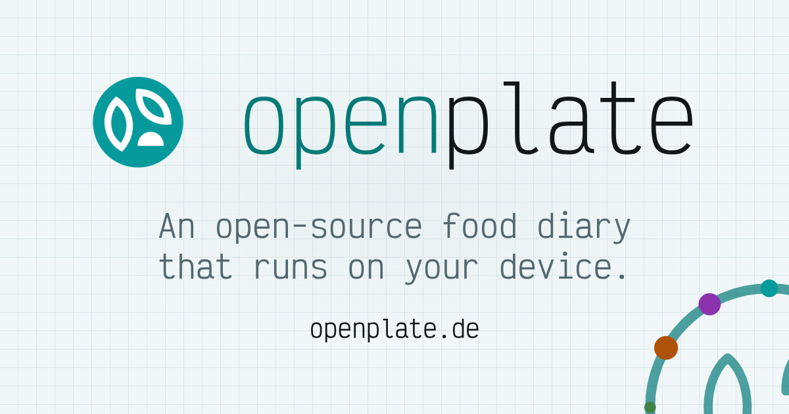

<p align="center"></p>

# openplate

An open-source, self-hosted food tracker with **BYOK (bring-your-own-key) AI plate identification**. Take a photo of your plate. Your chosen AI provider (OpenRouter, Mistral, any OpenAI-compatible endpoint, or Anthropic) estimates the macros. You keep your key, your provider, and your data.

**By default, there are no accounts.** There is no sign-up, no login, and no password. Open the app and start logging. Your diary lives in IndexedDB in your browser on your device. The app server has no database. An operator can run a managed instance instead, with `INSTANCE_MODE=managed`. There, an administrator invites people, each person gets an account and signs in, and accounts carry a shared AI allowance. Device sync is optional on either setup. A separate service handles it. The diary is encrypted on the device before upload. Whoever runs the core server keeps a backup key to reset forgotten passwords, and that key lets them read the diary.

Find guides, screenshots, and full documentation on [openplate.de](https://openplate.de), or see the repository [Documentation](#documentation) section.

## Try it

The maintainers run a hosted version from this code at **<https://app.openplate.de>**. Sign up to receive either 10 free AI scans or 14 days, whichever finishes first. No credit card is required. Continuing after the trial requires a paid plan. See [Pricing](https://openplate.de/pricing) for details. Your diary is encrypted on your device before syncing. Like any managed instance, the operator holds a backup key that can read your data. To self-host openplate for free, follow the Quickstart below.

## Quickstart

```bash
curl -O https://raw.githubusercontent.com/LowCarbCheck/openplate/main/docker/compose.yml
docker compose -f compose.yml up -d
```

This deployment uses one container, no database, and no `.env` configuration step. The app is reachable at `http://localhost:3000`. [`docker/topologies/`](docker/topologies/README.md) contains larger setups for sync, self-hosted AI, and running all services together.

## What is in this repository

Each app has its own folder, README, releases, and container image. Only the app is required. You can run any subset of the remaining services.

| App | What it is | Run it | Docs |
| --- | --- | --- | --- |
| [app](apps/app) | The app. Accountless, local-first, stateless, boots with no required secrets. Image `ghcr.io/lowcarbcheck/openplate`, release tags `v*`. | `make dev APP=app`, port 3000 | [README](apps/app/README.md) |
| [core](apps/core) | The account service. Includes encrypted sync with an operator-held backup key, and the AI allowance of a managed instance. Image `ghcr.io/lowcarbcheck/openplate-core`, release tags `core-v*`. | `make dev APP=core`, port 3000. Needs Postgres and an `apps/core/.env` first. | [README](apps/core/README.md) |
| [inference](apps/inference) | A self-hosted, OpenAI-compatible plate-photo endpoint: open-weight models, your own hardware. Image `ghcr.io/lowcarbcheck/openplate-inference`, release tags `inference-v*`. | `make dev APP=inference`, port 8300. Needs a model runtime. | [README](apps/inference/README.md) |
| [website](apps/website) | [openplate.de](https://openplate.de), the project site and the rendered documentation. No image, no release tags. | `make dev APP=website`, port 3000 | [README](apps/website/README.md) |

[`docker/`](docker) holds the compose files and Podman units that run the apps together.

Until 2026-09-28, the three services lived in separate repositories: `openplate-core`, `openplate-inference`, and `openplate-website`. Those repositories are now archived, and their full history is here.

## Documentation

Start with [Architecture](apps/app/docs/architecture.md) and [Self-hosting](apps/app/docs/self-hosting.md). The app [README](apps/app/README.md) lists every guide, and [openplate.de](https://openplate.de) renders all of them.

## Development

The sections through [License](#license) cover contributing to the codebase; to only run the app, jump to [Quickstart](#quickstart).

### First ten minutes

Prerequisites: Node 24 or newer, pnpm 11, git, and make. Make, Node, and pnpm are all required.

```bash
git clone https://github.com/LowCarbCheck/openplate.git && cd openplate
make install
make test
make dev APP=app
```

`make install` sets up the pre-push hook and installs each app. `make test` runs the unit tests for all four apps. `make dev APP=app` serves the app at `http://localhost:3000`. The table above shows how to run the other apps. Each app keeps its own lockfile and scripts. The root `Makefile` only runs them.

### Before you push

The pre-push hook is the only test gate. There is no cloud test runner. `make check` runs the drift check, then this gate for all four apps, without pushing. The gate and its hooks run without nix and without the toolbox. Node, pnpm, and make suffice for most stages.

```bash
make check
```

Some stages need extra tools. Each stage stops the push and names any missing tool:

- **podlet** (app, core, inference): checks the Podman units under `docker/quadlet/`. Install it with `brew install podlet`, or run `apps/app/scripts/quadlet.sh --install <dir>` and add that directory to your `PATH`. The script also needs `python3`.
- **Chromium** (app, website): runs browser tests. Run `pnpm exec playwright install chromium` in the app directory. On Linux, `pnpm exec playwright install --with-deps chromium` also installs system libraries.
- **Postgres** (core): runs integration tests. In `apps/core`, run `docker compose -f docker/compose.dev.yml up -d`, or point `TEST_DATABASE_URL` to another Postgres instance. `SKIP_INTEGRATION=1 git push` skips these tests once.
- **The network** (website): checks documentation by cloning three repositories. `SKIP_SYNC=1 git push` skips this check once if you are offline.

### Optional environments

These environments are optional. They offer alternative ways to run Node and pnpm.

- **toolbox**: if the `toolbox` command exists, every hook runs its Node stages inside a container named `ts-dev`. Maintainers use this setup because their host lacks build tools. Browser tests always run on the host.
- **nix**: running `nix develop` at the repository root opens a shell with Node 24 and pnpm 11 from the root `flake.nix`. It also provides git and make. It works on x86_64-linux, aarch64-linux, and aarch64-darwin.

The browser tier does not run in the nix shell or in the toolbox. It runs on the host with the Chromium that Playwright downloads. The flake does not set `PLAYWRIGHT_BROWSERS_PATH`, because nixpkgs browsers belong to Playwright 1.63.0 while the apps pin 1.62.1. The flake can set it once the versions match.

`make drift` checks that the flake, `.nvmrc` files, `engines` and `packageManager` fields, Dockerfiles, and the release workflow agree on Node and pnpm.

### Four independent apps

The repository holds four independent apps. It has no root pnpm workspace and no shared lockfile. Each app has its own lockfile, pnpm settings, and release. Each image builds from its own app folder, and corepack installs the pnpm version from that app's `packageManager` field. All four apps use Node 24 and pnpm 11.5.1. Two conditions would change this setup:

- Trigger 1: two apps really import the same package.
- Trigger 2: a dependency bump that must change in four places and really hurts.

### Contributing

[`CONTRIBUTING.md`](CONTRIBUTING.md) explains how to submit a pull request, and [`SECURITY.md`](SECURITY.md) explains how to report a vulnerability. Each app builds, tests, and releases independently. Start with [First ten minutes](#first-ten-minutes), then use the scripts in each app's README.

## License

MIT license, see [LICENSE](LICENSE). You can run, read, modify, fork, redistribute, and host it for others, commercially or non-commercially. The only requirement is keeping the copyright and license notice attached to any copy you distribute.
