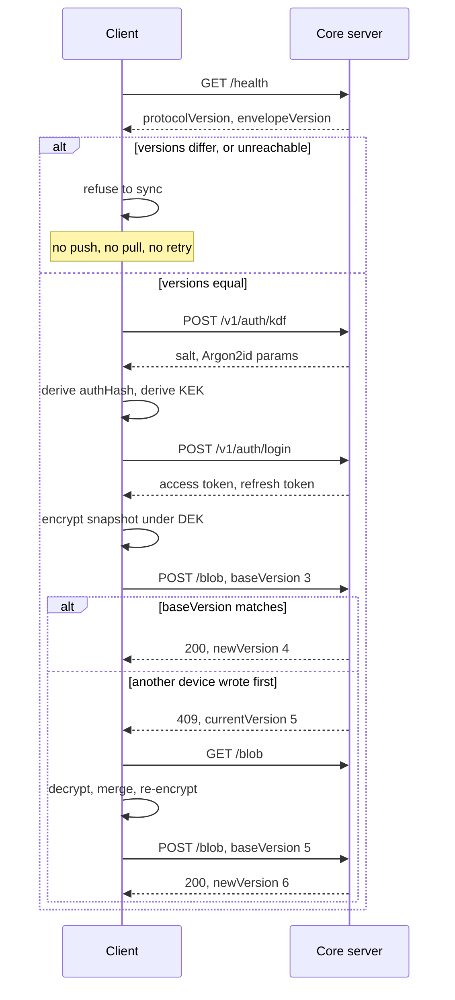

# openplate sync protocol

**Protocol version: 2** · **Envelope version: 1** · Status: pre-1.0, nothing shipped

This is the normative specification of the wire protocol between an openplate client and a core server. It is written so a third party can implement **either side** without reading our code: an alternative client that syncs against our hosted service, or an alternative server that an openplate client can be pointed at with `CORE_URL`.

The machine-readable counterpart lives in two files that are hand-maintained duplicates of each other:

| Repo             | File                              |
| ---------------- | --------------------------------- |
| `openplate-core` | `src/protocol.ts`                 |
| `openplate`      | `app/lib/sync/engine/protocol.ts` |

Each repo has a unit test asserting its constants against transcribed literals (`tests/unit/protocol.test.ts` and `tests/unit/sync-engine/protocol.test.ts`). There is no shared CI between the repos, so those tests are the only thing standing between us and a silent protocol split. **This document is normative; the TypeScript is its transcription.**

---

## 1. The one-paragraph summary

The client holds all the keys. It serializes its whole local store, gzips it, encrypts it with AES-256-GCM under a key the server has never seen, and pushes the result as one opaque blob. The server stores bytes, versions them, and refuses writes that would clobber another device's. It also stores two small **key records** (the same data-encryption key wrapped under two different key-encryption keys, one derived from the user's passphrase and one from a recovery code) so a second device can bootstrap. No code path on the server decrypts any of it. The server does keep each account's recovery code, sealed under a secret of its own (§3.1), so the operator of a managed instance holds what it takes to open a diary. §9 states exactly what the server knows.

The picture below is one whole session. The version handshake runs first, and it is not
advisory: on a mismatch, or on a service it cannot reach, the client stops there rather than
pushing an envelope the other side may frame differently. §6 states that rule, §5.7 to §5.9
are the sign-in it guards, and §5.1 is the push, including the compare-and-swap loss that a
client must recover from.



## 2. Terminology

| Term              | Meaning                                                                                      |
| ----------------- | -------------------------------------------------------------------------------------------- |
| **DEK**           | Data-encryption key. Random 32 bytes. Encrypts the blob. Never leaves the client unwrapped.  |
| **KEK**           | Key-encryption key. Wraps the DEK. Two exist: passphrase-derived and recovery-code-derived.  |
| **Envelope**      | The encrypted blob's wire format: `iv ‖ AES-256-GCM(gzip(JSON(payload)))`.                   |
| **Key record**    | One wrapped DEK, plus (passphrase kind only) the KDF parameters needed to re-derive its KEK. |
| **`blobVersion`** | Monotonic per-account counter. The compare-and-swap token.                                   |
| **Account**       | The unit of isolation. One account has at most one current blob and at most two key records. |
| **Email**         | The account identifier: a canonical address (NFKC, trimmed, lowercased). Unique per server.  |
| **Invite**        | A single-use capability ADDRESSED to one email, minted by an operator. The only way in.      |
| **Escrow**        | The account's recovery code, sealed on the server under a subkey of `SERVER_SECRET`.         |
| **Role**          | `admin` or `member`. An admin's own access token authenticates `/v1/admin`.                  |

**Protocol 2 replaced the handle with an email** (ADR-0005). Version 1's
`Handle`, an opaque per-server identifier that could not contain an `@`, is
gone: the column, the parser and the rule. A client speaking version 1 must
refuse to talk to a version 2 service rather than half-work; see §6.

## 3. Cryptography (client-side; the server implements none of it)

A conforming server needs none of this section; it is here so an alternative _client_ can interoperate, and so a reviewer can check the claims.

### 3.1 Key derivation

```
                          ┌─HKDF-SHA-256(salt, info=PASSPHRASE_KEK)──► KEK_p   (never sent)
passphrase ─Argon2id(salt, m, t, p)─► hash ─┤
                          └─HKDF-SHA-256(salt, info=AUTH)───────────► authHash (sent to the server)

                                     ┌─HKDF-SHA-256(salt="", info=RECOVERY_KEK)──► KEK_r            (never sent)
recovery code ───────────────────────┤
                                     └─HKDF-SHA-256(salt="", info=RECOVERY_AUTH)─► recoveryAuthHash (sent)
```

- **Argon2id** parameters (recorded per account in the passphrase key record's `kdfDescriptor` and in the account's own KDF descriptor, so they can be raised later without breaking existing accounts): `memorySizeKib: 65536` (64 MiB), `iterations: 3`, `parallelism: 1`, `hashLength: 32`. Salt: 16 random bytes.
- **HKDF `info` labels** are frozen byte strings, UTF-8 encoded. They provide domain separation so the derived values are cryptographically independent:
  - `openplate-sync:passphrase-kek:v1`
  - `openplate-sync:recovery-kek:v1`
  - `openplate-sync:auth:v1`
  - `openplate-sync:recovery-auth:v1`
- **The `auth` branch is what the client sends as its password.** It is a sibling of `KEK_p`, not a parent and not a child: both are HKDF outputs over the same Argon2id hash under different `info` labels, so possession of one gives no information about the other. This is the whole reason the server can authenticate a user it cannot decrypt for. `authHash` is 32 bytes, base64 on the wire.
- **The `recovery-auth` branch is what the client sends to prove possession of the recovery code** (§5.14). It is a sibling of `KEK_r` in exactly the sense `authHash` is a sibling of `KEK_p`, and it is 32 bytes, base64 on the wire.
- **The `recovery-auth` label is never the `recovery-kek` label.** That domain separation is load-bearing, not tidiness. The KEK branch derives the key that opens the diary; were the same output also sent to the server, this service would store an HMAC of the material that unwraps a DEK, and "the operator cannot read your data" (a claim that holds only while the operator lacks the escrowed recovery code, §9.1) would rest on SHA-256 being one-way rather than on the operator never having held the value. Both labels are frozen, neither is derived from the other, and a future change to either is a new `:v2` label rather than a redefinition (ADR-0004).
- The server never stores `authHash` or `recoveryAuthHash` either. It stores `HMAC-SHA-256(serverPepper, ...)` of each, with the pepper held outside the database. See §5.8.
- The recovery path deliberately skips Argon2id and uses an **empty HKDF salt**. That is correct, not an oversight: RFC 5869 §3.1 permits it when the input key material is already high-entropy, which a 160-bit random code is by construction. Only low-entropy human passphrases need a memory-hard stretch and a real salt.
- **Recovery code**: 20 random bytes (160 bits), rendered in a Crockford-style base32 alphabet (`0123456789ABCDEFGHJKMNPQRSTVWXYZ`, no `O`, `I`, `L` to survive transcription) in groups of 5. Canonically, 32 characters with the grouping removed and uppercased; that is the form the server seals.
- **The recovery code is ESCROWED on the server** (protocol 2, ADR-0005). The client no longer shows it to the person: it sends the raw code once in the signup body, and the server stores `iv(12) ‖ AES-256-GCM(escrowKey, code) ‖ tag(16)` in `accounts.recovery_code_escrow`, where `escrowKey` is a third frozen HMAC subkey of `SERVER_SECRET` (`openplate-sync:escrow-key:v1`, beside the verifier pepper and the dummy-descriptor key). A mailed reset (§5.12) hands the code back to the account holder, who then runs the ordinary §5.14 rotation with it. **The operator of a managed instance therefore holds what it takes to open a diary.** That is a real change to what this service is, it is stated here rather than buried, and it is argued in full in [`docs/adr/0005-organization-accounts-and-escrowed-recovery.md`](./docs/adr/0005-organization-accounts-and-escrowed-recovery.md).
- The escrow is over the CODE, not over `KEK_r` and not over the DEK. Nothing on the server derives a KEK, unwraps a DEK, or holds one; the code becomes a key only after a client runs HKDF over it. That buys no secrecy from the operator, who can run HKDF too; it buys a server whose code path contains no decryption of user data, which is what makes the claim checkable rather than promised.
- KEKs are 256-bit AES-GCM keys, imported non-extractable.

### 3.2 The envelope

```
build:  payload ─► JSON ─► UTF-8 ─► gzip ─► AES-256-GCM(key=DEK, iv=random 12B, aad=AAD) ─► iv ‖ ciphertext‖tag
parse:  split(iv, rest) ─► AES-256-GCM decrypt ─► gunzip ─► UTF-8 ─► JSON ─► payload
```

- **IV**: 12 random bytes, fresh per encryption, packed as the **leading bytes of `ciphertext`**. There is no separate IV field anywhere in this protocol.
- **Tag**: the 16-byte GCM authentication tag is appended to the ciphertext (WebCrypto's convention).
- **AAD** is the UTF-8 encoding of a canonical, fixed-key-order JSON object:

  ```json
  {"accountId":<int>,"blobVersion":<int>,"payloadSchemaVersion":<int>}
  ```

  Binding these defeats cut-and-paste (replaying a blob into a different account) and rollback (replaying an older version, or a payload from an incompatible local-store schema). A client must present the identical triple when decrypting or the tag check fails, which is the intended behaviour, not an error to work around.

- **Compression** (`gzip`, RFC 1952) is applied to the plaintext **before** encryption. Ciphertext is incompressible, so it is compress-first or not at all. See §8 for why this matters and §9.2 for the honest statement of what it leaks.

- **Payload** shape (everything inside `snapshot` is opaque to this protocol):

  ```json
  {
    "snapshot": { "...": "the client's local-store snapshot, protocol-opaque" },
    "syncMeta": {
      "perEntity": { "<entityId>": { "lamport": 3, "deviceId": "abc" } },
      "tombstones": [{ "entityId": "x", "entityType": "foodLog", "lamport": 4, "deviceId": "abc" }]
    }
  }
  ```

- **Wrapped DEK**: `iv ‖ AES-256-GCM(key=KEK, plaintext=DEK)`, **no AAD**: a wrapped DEK is not bound to any particular blob version. Length is always `12 + 32 + 16 = 60` bytes.

### 3.3 Merge semantics (client-side)

Conflicts are resolved per entity by `(lamport, deviceId)`: higher Lamport counter wins; ties break on lexicographic `deviceId`. Device wall-clock is explicitly **not** an ordering authority; it drifts and is trivially wrong across devices. A tombstone participates in the same comparison as a live value. Accepted v1 trade-off: whole-record last-writer-wins, so a concurrent offline edit to the _same_ entity on two devices loses the older write silently. No field-level merge, no conflict UI.

### 3.4 The share wrap (ADR-0002)

A **share** is a third wrapping of the same DEK, addressed to another account's
public key. The server stores it, serves it to the one account it is addressed
to, and holds no key for it; §9.1 is unchanged by this feature.

```
sender (grantor, holding recipientPub):
  (ephPriv, ephPub) ← ECDH P-256, fresh per wrap, discarded after
  Z         ← ECDH(ephPriv, recipientPub)
  KEK_share ← HKDF-SHA-256(salt = empty, IKM = Z,
                           info = "openplate-sync:share-kek:p256:v1")
  AAD       ← UTF-8 of canonical fixed-key-order JSON:
              {"grantorAccountId":<int>,"recipientKeyFingerprint":"<base64>"}
  wrap      ← ephPub(65, uncompressed SEC1) ‖ iv(12) ‖ AES-256-GCM(KEK_share, DEK, aad=AAD)
```

- **Length is 125 bytes**, always. Note this is a _different_ invariant from
  §3.2's 60-byte wrapped DEK: 60 for a key record, 125 for a share. They live in
  different tables and no shared validation path branches on length.
- **P-256**, and the curve is named in the label rather than only the version, so
  a future construction is a new label instead of an ambiguity about `:v1`.
- **The empty HKDF salt is correct**, on the same RFC 5869 §3.1 grounds §3.1
  already records for the recovery code: the IKM is a fresh, high-entropy ECDH
  output, not a human secret needing a memory-hard stretch.
- **This wrap carries AAD; the §3.2 wrapped DEKs do not.** A key-record wrap is
  scoped by an owner-only row and cannot be confused with anyone else's. A share
  wrap sits in a server-controlled association table, where it could be: binding
  it means a spliced row fails its tag check rather than decrypting into the
  wrong diary.
- **The AAD binds the recipient's key fingerprint, not the grantee's account id.**
  Substitution attacks the key, so the key is what the binding names, and the
  grantee reconstructs the AAD from a fingerprint computed locally, so no
  server-supplied value enters the trust path.
- `recipientKeyFingerprint` is `SHA-256` of the raw uncompressed public key. The
  server stores it as pinning metadata and **never** endorses, serves or
  generates a public key; the authoritative pinned key lives inside the
  grantor's own encrypted snapshot.

**A grantee must trial-decrypt.** §3.2's blob AAD binds `payloadSchemaVersion`,
which §7 defines as an opaque integer that never appears on the wire. An owner
knows its own; a grantee does not know the grantor's. So a grantee attempts
decryption across the schema versions its build supports and takes the one whose
GCM tag verifies. This is cheap, and it is the intended behaviour; do not add a
plaintext schema-version field to solve it.

### 3.5 The research contribution envelope (ADR-0003)

A **contribution** is a reduced, date-bounded slice of the diary, encrypted to a
study's public key. It is a different artifact from a share, not a narrower one:
different payload, different key, different lifecycle, and **no DEK is involved**;
the wrap is over the payload directly.

**The pseudonym.** A per-account random 256-bit root lives in the owner-private
compartment, so it survives a recovery restore and reaches a second device.

```
pid = HMAC-SHA-256(root, "openplate-sync:study-pseudonym:v1" ‖ uint64be(studyAccountId))
      truncated to the leading 128 bits, Crockford base32, 26 characters
```

**The bytes are fixed, because an underspecified concatenation is two
implementations that disagree in one deployment.** The label is its UTF-8
bytes with no terminator; `studyAccountId` is **8 bytes, unsigned,
big-endian, always eight**, never its decimal text and never a
minimal-length encoding. The output is the MAC's leading 16 bytes in the
Crockford base32 alphabet `0123456789ABCDEFGHJKMNPQRSTVWXYZ` (no check
symbol, no hyphens), which is exactly 26 upper-case characters. A client
deriving over the id's ASCII digits produces a well-formed pseudonym that
joins up with nothing.

Stable across a contributor's submissions, unlinkable across studies (HMAC
outputs under different messages are independent), and underivable by anyone
holding both the account table and a cohort. `H(accountId ‖ studyId)` would
_not_ have that last property: with public inputs it reverses by enumeration.

The pseudonym defends against the **researcher**, not the server. The server
authenticates the push by bearer token and therefore knows the account behind
every row regardless; see §9.2.

**The envelope.**

```
  (ephPriv, ephPub) ← ECDH P-256, fresh per contribution
  Z         ← ECDH(ephPriv, studyPub)
  KEK       ← HKDF-SHA-256(salt = empty, IKM = Z,
                           info = "openplate-sync:research-kek:p256:v1")
  AAD       ← UTF-8 of canonical fixed-key-order JSON:
              {"studyAccountId":<int>,"pseudonym":"<string>",
               "contributionVersion":<int>,"schemaTier":"<string>",
               "studyKeyFingerprint":"<base64>"}
  body      ← ephPub(65) ‖ iv(12) ‖ AES-256-GCM(KEK, payload, aad = AAD)
```

A new frozen label rather than a version of the share label: different purpose,
same reasoning that put the curve in the name.

**The AAD carries no account id, and neither does any study-side response.**
This is the deliberate inversion of §5.16, where `grantorAccountId` is required
because §3.2's AAD binds it. Every AAD field here is reconstructible by the
researcher before decryption: four ride in the response, and the fingerprint she
computes locally from her own key.

**The payload is a fixed tier**, selected by name. A study chooses a tier and a
window; it never supplies a field list. v1 defines one:

`daily-intake:v1`: one row per calendar day in the window, with `date` (day
granularity, no timestamps), `energyKcal`, `proteinG`, `carbsG`, `fatG`,
`fiberG`, `loggedEntryCount`. The count exists because a researcher cannot
otherwise tell "ate nothing" from "did not log"; it is a count, never the
entries.

A new field is a protocol revision, never a configuration. See ADR-0003.

## 4. Transport conventions

- All request and response bodies are `application/json`.
- Binary fields (`ciphertext`, `wrappedDek`) are **base64** strings (standard alphabet, with padding). They are not sent as a binary content type, deliberately: every field of every request should be readable by a self-hoster debugging their own instance.
- Timestamps are ISO-8601 UTC strings, e.g. `2026-08-04T10:11:12.000Z`.
- **A recovery code on the wire is Crockford base32 TEXT**, wherever it appears
  (`signup.recoveryCode`, `recover-rotate.recoveryCode`,
  `rotate-dek.recoveryCode`, and `reset/open`'s response). A server MUST accept
  it grouped or ungrouped and in either case, canonicalise it to **32 uppercase
  characters** with spaces and hyphens removed, seal THAT, and return that same
  canonical form from `reset/open`. One code therefore has one sealed form, so
  a re-escrow after a rotation is comparable with what was there before, and a
  client that renders the code in groups of five can post back what it rendered.
  A conforming client accepts both forms too.
- Every non-2xx response body is `{"error": "<human-readable text>"}`. The text is diagnostic only; clients must branch on the **status code**, never on the message.
- Requests exceeding the body limit are rejected with `413`. Each route family under `/v1/sync` has its own limit, and no family inherits another's: the blob and key records take the blob cap in base64 plus 4 KiB, `rotate-dek` the blob cap in base64 plus 64 KiB, the share family 8 KiB, and the research family 512 KiB.
- An authenticated route checks the bearer token before it reads the body. A caller with no valid token gets `401`, never `413`, however large the body.
- **A source address is an IPv4 address or an IPv6 /64.** Every throttle this document calls per IP or per source address counts an IPv6 caller by the first 64 bits of its address, because one home connection holds a whole /64. An IPv4-mapped IPv6 address (`::ffff:a.b.c.d`) counts as the IPv4 address it carries. An IPv4 address counts as itself. A request whose address the server cannot determine shares one bucket with every other such request.

### 4.1 Authentication

A bearer token in an `Authorization: Bearer <token>` header. **No cookies, in either direction.**

- `Access-Control-Allow-Origin: *`, and `Access-Control-Allow-Credentials` is never sent. Any openplate client (ours, a self-hoster's on their own domain, or a third-party implementation) can therefore talk to any instance of this service regardless of origin.
- That combination is safe precisely _because_ there is no ambient credential. A hostile page can issue a cross-origin request and will get a `401`, because the browser has nothing to attach automatically. This is the CSRF property cookies lack, and it is the reason the wide-open origin is a considered choice rather than a shortcut.
- Unauthenticated callers get `401`. Authenticated-but-not-permitted callers get `403`. A conforming server must not conflate them.
- Two `403`s carry a **fixed machine code** a client branches on: `account-suspended` on any bearer route, and `health-consent-required` on any data route §5.15.1 does not list as open. They are the exception to "branch on the status, never on the message", because `403` alone cannot tell them apart from each other or from an ordinary refusal:

  | Status | Body                                  | Meaning                                                                                                 | What the client does                            |
  | ------ | ------------------------------------- | ------------------------------------------------------------------------------------------------------- | ----------------------------------------------- |
  | `401`  | any                                   | No valid access token                                                                                   | Refreshes once, then asks the person to sign in |
  | `403`  | `{"error":"account-suspended"}`       | An operator suspended the account (§5)                                                                  | Says so; signing in again will not help         |
  | `403`  | `{"error":"health-consent-required"}` | The instance asks for a health-data consent and the account does not hold its current version (§5.15.1) | Asks for the consent, then retries              |
  | `403`  | anything else                         | Authenticated, not permitted for this one request                                                       | Reads the endpoint's own table                  |

- Every custom request header a route reads is named in `Access-Control-Allow-Headers`: `Authorization`, `Content-Type`, `Idempotency-Key` (§5.23) and `X-Intake-Id` (§5.19). Every custom response header a client reads is named in `Access-Control-Expose-Headers`: `Retry-After`, `X-Trial-Scans-Left`, `X-Quota-Used` and `X-Quota-Limit`. A browser refuses to send a header the first list omits, and hides one the second list omits, with nothing in any log.

This replaced a same-origin session cookie that existed while the handler cores were mounted inside the openplate app. That change, and the move of the sync routes from `/api/sync` to `/v1/sync`, are **pre-1.0 and do not bump `PROTOCOL_VERSION`**: zero production blobs exist, there are no third-party implementations, and no deployed client can be broken by them. Once this document is published alongside a public release, that latitude ends; see §7.

### 4.2 Token lifecycle

Two token kinds, both opaque random strings, both stored **only as SHA-256 digests**. A dumped token table yields nothing replayable, and unstretched SHA-256 is correct here because the pre-image is 256 bits of randomness; there is no dictionary to run.

| Token     | Lifetime | Purpose                                                                               |
| --------- | -------- | ------------------------------------------------------------------------------------- |
| `access`  | 15 min   | Sent on every request. Short, because a leaked one is useful for as long as it lives. |
| `refresh` | 30 days  | Exchanged for a new pair. Rotating: every use spends it.                              |

**Why an opaque pair and not a JWT.** Revocation is load-bearing in this protocol: a passphrase change and a recovery-code rotation must invalidate every outstanding session _immediately_, and a user changing their passphrase under suspicion expects exactly that. A stateless token can only be made to expire, never to stop working, without adding the same server-side denylist that a database-backed opaque token already is.

**Why a pair at all.** The client must never persist the passphrase, so it cannot silently re-derive an auth-hash to log in again. A long-lived rotating refresh token is the only thing that makes silent re-authentication possible in a design where the server never sees the passphrase.

**Rotation and reuse detection.** Each pair carries a _family_ identifier that survives rotation.

- `POST /v1/auth/refresh` with a valid refresh token revokes it and returns a fresh pair in the same family.
- Presenting a refresh token that is **already revoked** is the reuse signal: the legitimate client rotated it, so whoever is presenting it now holds a copy they should not. The whole family is revoked. This logs out the attacker _and_ the real user, which is the correct outcome; the alternative leaves a thief with a working session.
- **The spend decides, not the read.** Two requests carrying one refresh token can both find it live. Only one of them can spend it (a conditional update from "live" to "revoked"), and the other is answered as reuse: `401`, and the family is revoked. So exactly one of two concurrent refreshes with one token gets a `200`, and that pair does not survive the other's reuse answer. A client must serialise its own refreshes (§11); a second holder racing the first is exactly the case reuse detection exists for.
- Access tokens minted by earlier rotations are deliberately left alone; they expire within minutes on their own, and revoking them at rotation time would break a request that is legitimately in flight.

**Revocation triggers.** Every one of these revokes **all** outstanding `access` and `refresh` tokens for the account:

- `POST /v1/auth/change-passphrase`
- `POST /v1/auth/recover-rotate`
- `POST /v1/sync/rotate-dek`, except the caller's own family (§5.17)
- suspension by an operator
- account deletion (by row cascade)

`POST /v1/auth/logout` revokes one family (that device) and leaves the account's other sessions alone.

**Session tokens are the only kind in `account_tokens`.** Until 0.5.0 that table also held two single-use LINK kinds, minted to be put in a message: one confirmed an address, the other redeemed a mailed recovery link. Both went with the mailer, and neither came back. Protocol 2 has no address confirmation at all (the invitation is the verification, §5.8) and its reset link **replaces no credential** (§5.12).

**Two capability tokens live outside that table**, and both wear a prefix so one cannot be posted where the other belongs:

| Token          | Prefix | Lifetime | Stored in         | What it buys                                          |
| -------------- | ------ | -------- | ----------------- | ----------------------------------------------------- |
| Signup invite  | `si_`  | 7 d      | `signup_invites`  | Creates ONE account, at the address the invite names. |
| Password reset | `sr_`  | 60 min   | `password_resets` | Returns the account's escrowed recovery code, once.   |

Both are 256 bits of randomness, both are stored only as a SHA-256 digest, and both are single-use. Neither is ever accepted as an `Authorization: Bearer` credential, and a session token is never accepted in their place: the prefix is a shape gate applied before any lookup, and its rejection is the same generic failure a wrong token gets, so it adds no oracle.

**Suspension revokes too.** `accounts.suspended_at` being set revokes every outstanding `access` and `refresh` token in the same transaction, so a suspension takes effect immediately rather than when the current access token expires.

## 5. Endpoints

Two families, under one versioned namespace:

| Family                  | Prefix                         | Auth                       |
| ----------------------- | ------------------------------ | -------------------------- |
| Sync (§5.1 to §5.5)     | `/v1/sync` (`SYNC_API_PREFIX`) | Bearer, always             |
| Handshake (§5.6)        | `/health`                      | None                       |
| Account (§5.7 to §5.15) | `/v1/auth`                     | Mixed: stated per endpoint |

**A suspended account is refused everywhere.** `POST /login`, `POST /refresh`, `POST /recover`, `POST /recover-rotate`, every bearer-guarded route and the admin tree answer `403 {"error":"account-suspended"}`, that exact string, so a client can recognise it and say what happened. On `login` and the recovery paths the check runs AFTER the credential is verified, so an unknown address still gets the ordinary indistinguishable `401`.

**An account without the instance's consent is refused every data route.** Where `instance.healthConsent` is non-`null` (§5.6), an account that does not hold exactly that version gets `403 {"error":"health-consent-required"}` on every route that stores, sends or spends something for it, and keeps the routes it needs to agree, to leave and to read back its own copy. §5.15.1 lists both. A suspension is checked first, so a suspended account hears `account-suspended`.

Paths in §5.1 to §5.5 are written relative to `SYNC_API_PREFIX`; everything else is absolute.

### 5.1 `POST /blob`: push (compare-and-swap)

Request:

```json
{ "baseVersion": 3, "envelopeVersion": 1, "ciphertext": "<base64>", "shrinkAcknowledged": false }
```

- `baseVersion`: the `blobVersion` the client believes is currently stored. `0` asserts "this account has no blob yet".
- The write is accepted **only if** `baseVersion` equals the account's current version. This is the entire concurrency model. There is no force-push and no `If-Match`-less write.
- `shrinkAcknowledged`: OPTIONAL, and absent means `false`. See **the shrink guard** below.

Responses:

| Status      | Body                                                                | Meaning                                                                                                                                                                          |
| ----------- | ------------------------------------------------------------------- | -------------------------------------------------------------------------------------------------------------------------------------------------------------------------------- |
| `200`       | `{"newVersion": 4}`                                                 | Accepted. The blob is now at `newVersion`.                                                                                                                                       |
| `409`       | `{"currentVersion": 5}`                                             | Lost the race. Another device wrote first.                                                                                                                                       |
| `400`       | `{"error": "..."}`                                                  | `baseVersion` not a non-negative integer, `envelopeVersion` not a positive integer, `ciphertext` absent/not base64, or empty, or `shrinkAcknowledged` present and not a boolean. |
| `400`       | `{"error": "...", "currentSizeBytes": 5310, "nextSizeBytes": 1588}` | An unacknowledged large shrink. **Nothing was written.** See below.                                                                                                              |
| `413`       | `{"error": "..."}`                                                  | Blob exceeds `MAX_BLOB_BYTES`.                                                                                                                                                   |
| `401`/`403` | `{"error": "..."}`                                                  | Not authenticated / not permitted.                                                                                                                                               |

**The shrink guard (M224).** A push whose decoded `ciphertext` is **strictly under half** of the stored version's `size_bytes` (`BLOB_SHRINK_ACK_RATIO`) is REFUSED with `400` unless the request carries `"shrinkAcknowledged": true`. An account with no blob yet is never refused; a first push is not a deletion.

It is an ACKNOWLEDGEMENT, not a verdict. A client sets it `true` exactly when it emits deletions from state it positively trusts, and a client that cannot make that claim omits the field and takes the refusal. The service holds ciphertext and cannot tell a deliberate deletion from a client that lost its local store and believes everything was deleted; those are the same bytes. So it asks, and a client that says nothing gets a refusal rather than a wipe.

When an acknowledged shrink IS accepted, the version immediately before it is held against pruning for `BLOB_PRE_SHRINK_PIN_DAYS` (§8).

The CAS is checked FIRST: a push off a stale `baseVersion` is the ordinary `409`, whatever its size, because that client's job is to pull and merge and it is usually not shrinking once it has. The guard speaks only about a push that would otherwise have been accepted.

The refusal is `400` and deliberately NOT `409`: a `409` on this route means "another device wrote first" and obliges the recovery loop below, which would push the same bytes again. `413` was not used either: the request is not too large.

`shrinkAcknowledged` is a BODY FIELD and must never become a header. A new custom request header has to be named in the service's CORS `Access-Control-Allow-Headers`, or a browser reads the preflight, sees a header it may not send, and never sends the request at all, with no log line anywhere and nothing a non-browser test can observe. Reasoning: [`docs/adr/0009-a-shrinking-blob-is-acknowledged-or-refused.md`](./docs/adr/0009-a-shrinking-blob-is-acknowledged-or-refused.md).

**The 409 recovery loop is mandatory client behaviour**, not an optimization: pull `currentVersion`, decrypt it, merge it with local state (§3.3), re-encrypt with the AAD bound to the _new_ `blobVersion`, and push again with `baseVersion: currentVersion`. A client that treats `409` as a fatal error will strand the user's device permanently out of sync.

### 5.2 `GET /blob`: pull

| Status | Body                                                                                                               |
| ------ | ------------------------------------------------------------------------------------------------------------------ |
| `200`  | `{"blobVersion": 4, "envelopeVersion": 1, "ciphertext": "<base64>", "createdAt": "<iso>"}`                         |
| `404`  | `{"error": "..."}`: this account has never pushed a blob. Not an error condition; it is how a fresh account looks. |

### 5.3 `GET /key-records`: list

```json
{
  "records": [
    {
      "kind": "passphrase",
      "kdfDescriptor": { "salt": "<base64>", "params": { "memorySizeKib": 65536, "iterations": 3, "parallelism": 1 } },
      "wrappedDek": "<base64>",
      "updatedAt": "<iso>"
    },
    { "kind": "recovery", "kdfDescriptor": null, "wrappedDek": "<base64>", "updatedAt": "<iso>" }
  ]
}
```

Returns `{"records": []}` for an account that has not completed setup. At most one record per `kind`.

### 5.4 `PUT /key-records/:kind`: create or rotate (compare-and-swap)

`:kind` is `passphrase` or `recovery`; anything else is `400`.

Request:

```json
{
  "kdfDescriptor": { "...": "..." } | null,
  "wrappedDek": "<base64>",
  "expectedUpdatedAt": "<iso>" | null,
  "currentAuthHash": "<base64, 32 bytes>"
}
```

- `expectedUpdatedAt: null` asserts **"no record of this kind exists yet"** (first-time setup).
- Any other value asserts **"the record I last read had exactly this `updatedAt`"** (rotation).
- **The key must be present.** An absent `expectedUpdatedAt` is a `400`, deliberately: a caller must not be able to skip the concurrency check by forgetting a field.
- **An overwrite proves the passphrase.** When `expectedUpdatedAt` is not `null`, `currentAuthHash` (the current passphrase's auth branch, §3.1) is REQUIRED: absent or malformed is a `400` that names it, and one that does not match the account is `401 {"error":"current passphrase is incorrect"}`, the body `change-passphrase` sends, with nothing written. A create (`null`) stays bearer-only and ignores the field: it fills an empty slot during setup, and the CAS refuses it once a record exists. Replacing a wrap replaces what opens the account, and a bearer token alone must not be able to do that.
- **Guesses are throttled per account**, in one bucket with `change-passphrase`, `delete` and `rotate-dek`: a locked account gets `429` with `Retry-After` on all four, from any address. A match clears the bucket.

Validation, all `400`:

- empty `wrappedDek`
- `kind: "recovery"` with a non-null `kdfDescriptor` (the recovery path is HKDF-only; there are no parameters to record)
- `kind: "passphrase"` with a null `kdfDescriptor`

Responses:

| Status | Body                                                                                                |
| ------ | --------------------------------------------------------------------------------------------------- |
| `200`  | The stored record, same shape as a `GET /key-records` entry.                                        |
| `400`  | `{"error": "..."}`: the validation above, or an overwrite without a well-formed `currentAuthHash`.  |
| `401`  | `{"error": "current passphrase is incorrect"}`: an overwrite whose `currentAuthHash` did not match. |
| `409`  | `{"currentUpdatedAt": "<iso>" \| null}`: the CAS assertion did not hold.                            |
| `429`  | `{"error": "..."}` with `Retry-After`: this account's passphrase guesses are locked.                |

### 5.5 `DELETE /key-records/:kind`: removed, and not restored

Removed in 2026-09. The path now answers as any unknown path under the prefix does: `401` without a token, `403` where the account lacks the instance's consent, and the ordinary `404` otherwise. No client called it, and deleting the only remaining key record made every stored blob permanently undecryptable on a bearer token alone.

A key record is replaced through §5.4, which proves the passphrase, or through a rotation (§5.14, §5.17), and is removed only with the account (§5.15).

> **A share (§5.16) does not count as a key record.** It is cryptographically a third wrap of the same DEK, but it is another person's capability, revocable by them, unverifiable by you, and dependent on their continued cooperation and honesty. No client may ever offer "recover your data through your dietician" as a recovery path.

### 5.6 `GET /health`: version handshake

Unauthenticated, deliberately: a client must be able to discover that it is incompatible _before_ it has credentials, and a healthcheck that needed a token would be reporting on the token.

```json
{
  "protocolVersion": 2,
  "envelopeVersion": 1,
  "serviceVersion": "0.20.0",
  "instance": {
    "name": "openplate",
    "language": "de",
    "mail": true,
    "memberInvites": true,
    "openSignup": true,
    "signupCaptcha": { "provider": "turnstile", "siteKey": "0x4AAAAAAAexample" },
    "trial": { "scans": 10, "days": 14 },
    "plans": true,
    "push": false,
    "healthConsent": { "version": "2026-09-28" },
    "nutrientReferenceBasis": "dge",
    "ai": { "model": "vendor/model-name" },
    "defaultCapabilities": null
  }
}
```

`instance` describes what this deployment is and what it can do, and it is **optional**: a service older than the field omits it, and a client that requires it would refuse to talk to every such instance. `name` is the operator's label for the instance, `language` is one of `en`, `de`, `fr`, `it`, `es`, `tr` (the six languages its mail is written in; a client shows it and never branches on it, so a seventh is not a protocol change), `mail` says whether it can send a letter at all, `memberInvites` says whether an ordinary member may invite people here (§5.21), `openSignup` says whether a person may ask for an account here (§5.8.3), `signupCaptcha` says what that request needs, `trial` promises the free scans a new account gets (§5.19), `plans` says whether a biller stands behind this instance so `/v1/plans/*` exists (§5.22), `push` says whether this instance can send web push so `/v1/push/*` exists (§5.24), `healthConsent` names the health-data consent it asks of every account (§5.15.1), `nutrientReferenceBasis` says whose micronutrient reference values it shows, and `ai` is `null` when no upstream key is configured. `ai.model` is the model of the instance's default tier (§5.19): the model the proxy sends a request to unless the operator routed that request's schema to another tier. It is `null` when the operator named none and the caller's own model is sent.

`defaultCapabilities` is the list of capabilities (§5.19, "Capabilities") an account holds when it has no record of its own, for example `["scan", "recipes"]`. It is **always present**: `null` means this instance checks no capability at all, so every feature is open, which is what a self-hosted instance that sets nothing has, and `[]` means an account holds none until a record says so. A client that finds no key (every service older than the field) reads it as `null`. It is descriptive, never a grant: the proxy decides per request from the account's own record and this default.

`healthConsent` is the explicit consent to health data this instance asks of every account, `{"version": "<v>"}`, or `null` when it asks for none, which is the self-hosted default. It is `null` rather than absent, like `ai`, and a client that finds no key (every service older than the field) reads it as `null`. Unlike the rest of this block, the service **enforces** it: while it is non-`null`, account creation needs the matching consent (§5.8), and **every data route refuses an account that does not hold this exact version** with `403 {"error":"health-consent-required"}` until it agrees on §5.15.1. A client that finds a version asks before it syncs, and treats that `403` as the same question asked late. A client that finds `null` draws no consent checkbox, and the service refuses nothing for it.

`push` follows `plans` exactly: a boolean that says only whether a door exists. `false` means the whole `/v1/push` subtree answers the ordinary unknown-path `404`, so a client draws no notification settings. It says nothing about what a push contains, because a push contains a kind and nothing else (§5.24).

`plans` is a **boolean and not an optional promise**, which is the opposite of the choice `instance.feedback` makes below, on purpose. That field is a promise about what happens to a photograph, and an instance with nothing to promise omits it. This one promises nothing: it says only whether a door exists, which is the same kind of statement `mail` and `memberInvites` make, so `false` is the honest answer both for an instance with no biller and for a service built before the field existed.

`openSignup` is a **boolean**, like `memberInvites` and `plans`: it says only whether a door exists. `true` means `POST /v1/auth/signup-request` takes an address (§5.8.3); `false`, and a service built before the field, means the path answers the ordinary unknown-path `404`, and a client shows its invite wording instead of a sign-up form. It is descriptive, never a grant: the throttles, the captcha, the refused domains and the one letter per mailbox per day stay on the service.

`signupCaptcha` is present only while `openSignup` is `true` and the operator runs a captcha. `provider` is `turnstile` today; `siteKey` is Cloudflare Turnstile's public site key, which a client renders the widget with and which grants nothing. The token the widget produces travels as `captchaToken` in the sign-up request. Absent means the request needs no token.

`trial` is a **promise, like `feedback` below, so it is absent rather than `null`** on an instance that runs no scan trial. `scans` is the number of free AI scans a new account gets there (§5.19, "The scan trial"). `days` is the number of days after the sign-up day at whose end that trial ends even with scans left, whichever comes first (§5.8 says where that end falls); it is **absent, never `null`**, on an instance whose trial has no end date, and a client that finds no `days` states the scans exactly as before and **MUST NOT state a number of days**. A client that finds no `trial` **MUST NOT state a number of free scans**. Both numbers are the ones every trial door writes, published from the same settings (`TRIAL_SCANS`, `TRIAL_DAYS`), so the sentence a person reads before signing up and the limits the proxy keeps cannot drift apart.

`memberInvites` is **descriptive, never a grant**, like everything else in this block. A client reads it to decide whether to draw an invite card at all; it never reads it to decide whether it may mint. `false` means `POST /v1/auth/invites` answers the ordinary unknown-path `404`, and `true` still leaves the lifetime cap, the re-invite rule and the throttle to the service.

It is **descriptive, never authoritative**. `mail: true` does not promise a letter arrives, and `ai` reports what the operator configured rather than granting anything; an account with `dailyAiLimit: 0` gets a `403` whatever this says.

`nutrientReferenceBasis` is `dge`, `efsa` or `us`: which body's micronutrient reference values every client on this instance shows, the German DGE, the EU's EFSA, or the US NASEM figures. It is **optional**, so a service built before the field omits it and a client that has never heard of it ignores it. It is **one basis per instance, never per language and never per person**: language and reference body are orthogonal, and a locale-following default would be a per-person basis in disguise.

It is also the **one field in this block an administrator can change while the service runs**. Everything else here is the operator's environment, fixed until a redeploy; this one is stored, and `PATCH /v1/admin/settings` (§5.20) writes it. A client therefore reads it on every connect rather than caching it for the life of an install. A service MUST serve this path from a process-local copy of the value and MUST NOT read its store to answer `/health`: this is the container healthcheck path, polled continuously, and a store read there turns a database hiccup into a restart.

`instance.feedback` is the one field here that is a **promise rather than a description**, and it is the exception to the paragraph above. An instance that accepts reported estimates keeps a photograph of somebody's food, and it publishes how long for:

```json
{
  "protocolVersion": 2,
  "envelopeVersion": 1,
  "serviceVersion": "0.6.0",
  "instance": { "name": "openplate", "language": "en", "mail": true, "ai": null, "feedback": { "retentionDays": 30 } }
}
```

`retentionDays` is the number the service's own retention sweep deletes on, published from the same binding, so the sentence a client shows a person before they hand over a photograph and the deletion that follows cannot drift apart.

The field is **absent, never `null`**, on an instance that accepts no reports. `ai: null` is a statement every instance makes; this is a promise, and an instance with the feature off has none to make, so it adds no key at all and stays indistinguishable from one built before the field existed, exactly as its `/v1/feedback` tree stays indistinguishable from one where the feature was never written.

A client that finds no window advertised **MUST NOT state one**. It offers no report, or wording that names no period; printing a number from a local default publishes a promise the service never made, to a person deciding whether to send a photograph.

`signupMode` is **gone** in protocol 2, along with the setting it described: an account is created only by redeeming an invite, and `openSignup` says whether a person may ask for one (§5.8). A service that still publishes `signupMode` is speaking version 1.

`notice` is the operator's message to every client, and it is **optional** in exactly the same sense as `instance`: an instance with nothing to say omits the field, and a client that has never heard of it ignores it.

```json
{
  "protocolVersion": 2,
  "envelopeVersion": 1,
  "serviceVersion": "0.6.0",
  "notice": { "text": "This instance moves to a new address on 1 March.", "url": "https://example.org/moving" }
}
```

`text` is required when the field is present; `url` is optional and, when present, is an absolute `https:`/`http:` URL. The service caps `text` at 280 characters and refuses to boot on a longer one, because `/health` is also the container's HEALTHCHECK path and is polled continuously.

This is a **pull** channel and nothing more. It cannot know who read a notice: a person who opens the app sees it, and a person who does not, does not. It is not a notification mechanism and must not be relied on as one. Protocol 2 does give the service two letters it can send (an invitation and a password reset, §5.8 and §5.12), and neither is a channel for anything else: an operator who needs to announce something to their users keeps that contact list themselves, outside this service.

A client MUST treat `text` and `url` as hostile input. They come from whatever server the user pointed at. Render `text` as text and never as markup, and follow `url` only after checking its scheme explicitly.

---

### 5.7 `POST /v1/auth/kdf`: pre-login KDF descriptor

Unauthenticated, IP-throttled. Returns the Argon2id salt and parameters a device needs to derive `authHash` before it can log in.

POST rather than GET, for what is a read: a GET puts the address in the request line, and from there into access logs, proxy logs, `Referer` headers and browser history. An endpoint whose whole purpose is not disclosing who has an account should not scatter the identifier it was asked about. That argument was already true for a handle; with an address back on the wire it is the difference between a leak and a mailing list.

Request: `{"email": "anna@example.org"}` · Response `200`:

```json
{
  "kdfDescriptor": {
    "salt": "<base64, 16 bytes>",
    "params": { "memorySizeKib": 65536, "iterations": 3, "parallelism": 1 }
  }
}
```

**An unknown address gets a descriptor too.** It is derived deterministically as `HMAC(serverSecret, email)` over the canonical address (§5.8), so it is stable across requests, identical in shape, and produced by the same code path. A `400` is returned only for input that could not be an address at all. Neither the M181 move to handles nor the M192 move back to addresses changed a line of the derivation: it runs over an opaque string, and both are one.

This matters more than it looks. A login in which the server never sees the passphrase _requires_ an unauthenticated, identifier-keyed endpoint that answers before authentication; done naively it is a free, silent, unthrottleable list of which addresses hold accounts. Stability is as load-bearing as the shape: a random dummy would be distinguishable by asking twice.

A conforming server MUST NOT return `404`, an empty body, or a different shape for an unknown address. It must also:

- **Do the same work on both branches.** Derive the dummy unconditionally, including for accounts that exist and will never use it, so a hit and a miss cost the same lookup and the same HMAC. Deriving it lazily leaves a timing delta: the response says nothing, but how long it took to produce does.
- **Derive it over the canonical address**, so two spellings of one unknown address cannot be told apart by their descriptors.
- **Rate-limit by source address**, returning `429` with `Retry-After`. This is the other half of the same defence: the residual timing signal is statistical, and only emerges from many samples per address. Denying the samples is what closes it. Keying the limit by the submitted address would be worse than nothing, because probing many addresses _is_ the attack, so a per-address bucket hands out a fresh allowance for every address the attacker wants to test.

### 5.8 `POST /v1/auth/signup`

Unauthenticated, IP-throttled. **An invite is still the only thing that creates an account**, on every instance. On an instance with `instance.openSignup: true`, a person may ASK for an invite addressed to themselves (§5.8.3); what they receive is an ordinary invite, redeemed here exactly like one an operator minted. `SIGNUP_MODE` is a boot failure, because there is no mode to set: the only switch is whether the request door of §5.8.3 exists.

```json
{
  "inviteToken": "si_…",
  "authHash": "<base64, 32 bytes>",
  "kdfDescriptor": { "...": "..." },
  "displayName": "optional or null",
  "recoveryAuthHash": "<base64, 32 bytes>",
  "recoveryCode": "ABCDE-FGHJK-MNPQR-STVWX-YZ012-3456",
  "keyRecords": [
    { "kind": "passphrase", "kdfDescriptor": { "...": "..." }, "wrappedDek": "<base64>" },
    { "kind": "recovery", "kdfDescriptor": null, "wrappedDek": "<base64>" }
  ],
  "healthConsent": { "version": "2026-09-28" }
}
```

`healthConsent` is **required where `instance.healthConsent` is non-`null`** and ignored everywhere else (§5.15.1). Its `version` must equal the instance's byte for byte. Without it the answer is `400 {"error":"health-consent-required"}` and **nothing is created or spent**: the invite stays redeemable, so the person ticks the box and posts again. The check runs after every other field, so a malformed invite still answers the `403` below first. An account created with it holds the consent from its first request, so no data route refuses it; a client that creates accounts on such an instance (a study console, a seeding tool) sends the field too, or its account is refused every data route (§5.15.1).

**There is no `email` field, and that is the point.** The address comes from the invite row, inside the transaction. A body cannot claim a mailbox the operator did not write to, which is what makes the invitation itself the address verification: the person who received the letter is the person redeeming it, so there is no confirmation link and nothing left to confirm afterwards. `role` and `dailyAiLimit` come from the invite for the same reason: an account never asks for its own standing.

`recoveryAuthHash`, `recoveryCode` and BOTH key records are **required**. Each was optional in protocol 1 and none is now:

- The client no longer shows the recovery code to the person (§3.1), so an account created without an escrow is one no reset can ever restore, and its owner was never warned.
- A `passphrase` record is what lets the passphrase decrypt anything; without it the account logs in and reads nothing, and the client has discarded the passphrase by the time it would find out.
- A `recovery` record is what lets the escrowed code unwrap; without it a mailed reset delivers a credential that authenticates and opens nothing, discovered on the day it is needed.

`recoveryCode` is validated as Crockford base32 of 20 bytes (32 characters once spaces and hyphens are stripped and the value is uppercased) and canonicalised to that form before it is sealed. It is never logged, in any form, on any path.

| Status | Meaning                                                                                                                                                                                                                                                                                                                 |
| ------ | ----------------------------------------------------------------------------------------------------------------------------------------------------------------------------------------------------------------------------------------------------------------------------------------------------------------------- |
| `201`  | `{"account": AccountView, "tokens": {...}}` (§5.15). A session is always issued; there is nothing left to confirm.                                                                                                                                                                                                      |
| `400`  | An `authHash`, `recoveryAuthHash` or `recoveryCode` of the wrong shape; a descriptor without a 16-byte salt and positive Argon2id params; or `keyRecords` missing a kind. `{"error":"health-consent-required"}`: the instance asks for a consent and the body has none, or another version; the invite is NOT consumed. |
| `403`  | `{"error":"invite-invalid"}`: the invite is missing, malformed, of another service, unknown, expired, revoked or already redeemed. All seven, one answer.                                                                                                                                                               |
| `409`  | An account already exists for the invite's address. The invite is NOT consumed.                                                                                                                                                                                                                                         |
| `429`  | Throttled. `Retry-After` in seconds.                                                                                                                                                                                                                                                                                    |

The server stores `HMAC-SHA-256(serverPepper, authHash)`, and the same construction over `recoveryAuthHash`, **not** a second slow KDF over either. The client has already paid the memory-hard cost; hashing again server-side would add no brute-force resistance (an attacker holding the auth-hash has already skipped Argon2id) while creating a login-flood DoS in which every attempt pins 64 MiB. Peppering still defeats what peppering is for: with the pepper outside the database, a dumped table cannot be replayed against a live instance or checked offline against guesses.

**The whole submission commits in one transaction**: the invite redemption, the account row (with the consent, where the instance asks for one), the sealed escrow and both key records. Every half-state is a distinct disaster the user cannot see until they try to read their own diary.

**The `409` is the one enumeration oracle in this protocol, and protocol 2 made it almost nothing.** It is reachable only by somebody holding a live invite that was ADDRESSED to the very address it reports as taken, so it confirms only what the operator wrote on the letter. In protocol 1 an invite holder could probe arbitrary handles with one invite; they cannot now, because the address is not theirs to choose. It does not consume the invite, so an operator who invited somebody twice by mistake has not destroyed the live invitation. Full reasoning: [`SECURITY.md`](./SECURITY.md).

#### 5.8.1 Invites

An invite is a single-use, expiring capability **addressed to one person**. It carries the address the account will be created with, the operator's guess at a name, the role and the daily AI allowance. Unknown, malformed, missing, wrong-service, expired, revoked and already-redeemed tokens all produce the SAME `403` and the same body, `{"error":"invite-invalid"}`: telling them apart would let a caller probe which tokens exist, and would disclose that a token had once been real.

**What redemption grants** (2026-09-30), decided by the invite row, in this order: a row with a scan trial gives that trial (below); a row a member caused gives the member door's grant (§5.21), the scan trial or the day pair, even when the inviter has since deleted their account, and **no AI at all** when the instance has switched member invitations off since the letter went out; every other row, an operator's mint without a trial or an open sign-up on an instance that runs none, gives its daily allowance as the account's **standing free grant** (`freeDailyAiLimit`, §5.15) with a paid `dailyAiLimit` of `0`. Before, that last case wrote a `dailyAiLimit` with no date, the shape §5.19 no longer grants anything for.

**An invite token begins with `si_`, and the service refuses anything that does not.** The prefix binds the token to this service and to this endpoint. A person is handed an invite in a mail, beside a password-reset token that begins with `sr_`; without the prefixes the two are interchangeable strings and one can be posted to the wrong endpoint. The check is a **shape gate before the lookup**, refused with the same status and the same body as every other bad invite, so the gate adds no oracle. Session tokens carry no prefix and are unchanged.

Minting is `POST /v1/admin/invites`. An older PENDING invite for the same address is revoked by a new one, so there is never more than one live capability per address; an address that already has an account cannot be invited at all (`409`). The one exception is the request door of §5.8.3, which leaves a pending invite from the operator or a member alone rather than withdraw it on a stranger's say.

An invite may carry a **scan trial** (`trialScans`, §5.19): open sign-up, an admin mint with `"trial": true` and, where the instance runs it, a member invite write the instance's number on the row, and redemption copies it to the account. Where the instance also sets a day limit (`instance.trial.days`), the row carries that too, and **redemption starts the clock**: the day of the redemption does not count, and the account's `trialEndsAt` is local midnight at the end of the `days`-th day after it, in the instance's time zone (`TRIAL_TIME_ZONE`, UTC unless the operator set one). A redemption on 2026-09-29 in `Europe/Berlin`, at 10:00 or at 23:30, with fourteen days, ends at 2026-10-14 00:00 Berlin time, `2026-10-13T22:00:00.000Z`. It is a calendar rule, not a duration: across a change of the clocks the last day still ends at local midnight. The zone is read at redemption and is not written on the row, because it moves the boundary between two days and never the number of days. A row minted before the day limit existed carries none, and the account it creates has no end date.

An instance may also let an ordinary member mint one, on the instance's terms and with none of the disclosure this paragraph's `409` makes. That is `POST /v1/auth/invites`, §5.21.

#### 5.8.2 `POST /v1/auth/invite-lookup`

Unauthenticated, IP-throttled. Request `{"inviteToken": "si_…"}`.

```json
{ "email": "anna@example.org", "displayName": "Anna", "expiresAt": "2026-09-11T10:00:00.000Z" }
```

The client calls it when a person opens the link in their mail, so the sign-up form can SHOW the address the letter went to instead of asking them to type it. That is the whole point of an addressed invite: they cannot mistype their own address into an account nobody can reach.

It shows nothing else. The role and the allowance the invite grants are deliberately absent: a person who has not signed up has no business learning that the operator made them an admin, and a caller holding a stranger's link has less business still.

Unknown, malformed, wrong-service, expired, revoked and spent tokens are ONE `404 {"error":"invite-invalid"}`, after identical work: the token is hashed and the table is queried on every branch. A valid lookup consumes nothing, so a person who opens the link twice still has an invitation.

#### 5.8.3 `POST /v1/auth/signup-request`: a person asks for an account

Unauthenticated. **Present only where `instance.openSignup` is `true`**; everywhere else the path answers the ordinary unknown-path `404`. An instance needs mail configured to open it, because the letter is the address check.

Request: `{"email": "anna@example.org", "captchaToken": "…", "plan": "yearly", "tier": "tier-a", "locale": "de"}`. `captchaToken` is required when `instance.signupCaptcha` is present and ignored otherwise. `plan`, `tier` and `locale` are optional and say what the person picked on the sign-up screen before they asked; nothing else in the body is read.

- `plan` is `"monthly"` or `"yearly"`. When it is one of those, the mailed link carries `&plan=<key>` after the invite.
- `tier` is the id of the biller's tier the plan belongs to (§5.22). The service knows no list of tiers, so it judges the **shape** and nothing else: a lowercase label of 1 to 32 characters, a letter first, then letters, digits and hyphens (`^[a-z][a-z0-9-]{0,31}$`), matched exactly with no trimming and no case folding. When it fits, the mailed link carries `&tier=<id>` after `&plan=` (or after the invite when there is no plan). The service does not check that the biller sells the tier, or that a plan came with it; a client decides that when it reads the link.
- `locale` is one of the six instance languages (`en`, `de`, `fr`, `it`, `es`, `tr`), the same list the push `locale` (§5.24) accepts. When it is one of those, the mailed link carries `&lang=<code>`, and the letter, or the account-holder note, is written in that language. Without a valid `locale`, both are written in the instance's language (`instance.language`).
- A missing value, `null`, a value of another type and any other string are **dropped silently**: never a `400`, and the answer below does not change. For `tier` that covers `Alpha` (case), ` alpha` (padding), a label of 33 characters, `42`, an object, an array and `a&plan=monthly` (which has no `&` or `=` to offer the fragment). No field is stored; each rides in the link, so a link opened on another device still knows the plan and the tier. The account-holder note carries no link, so it carries none of them; only its language follows `locale`.

A link with all three reads `<client>/join#server=…&invite=si_…&plan=yearly&tier=tier-a&lang=de`.

```json
{}
```

→ `202` with that body, empty and fixed.

**For a new address the service mints an ordinary addressed invite and mails it**: role `member`, the default invite lifetime, no inviter, and the instance's terms, which are its scan trial when it runs one (§5.19) and no AI otherwise. The mailed link leads to §5.8.2 and §5.8, unchanged. **The response MUST NOT vary with what is true about the address**, as in §5.21: a new address, an address that holds an account, an address that already holds a pending letter from the operator or a member, and a mailbox that already got a letter today are one `202` with one body. The letters are the door's own, never the invitation or the note of §5.21, which say somebody invited the reader: a new address gets a letter saying that it, or someone using it, asked to create an account, with the one link, its expiry, and that ignoring the mail changes nothing; an account holder gets a note saying the same and that no second account was made, with no link. A pending letter from another door is left alone, so a stranger cannot withdraw an operator's invitation by posting the address. Only the letters differ.

| Status | Meaning                                                                                                                                                                                                                                                                |
| ------ | ---------------------------------------------------------------------------------------------------------------------------------------------------------------------------------------------------------------------------------------------------------------------- |
| `202`  | `{}`. Accepted, whatever is true about the address                                                                                                                                                                                                                     |
| `400`  | `{"error":"email-invalid"}`: not an address. `{"error":"email-domain-refused"}`: an address at a known throwaway mail service, matched on the domain and every parent of it. `{"error":"captcha-failed"}`: the captcha token is missing or was refused; solve it again |
| `404`  | The instance runs no open sign-up                                                                                                                                                                                                                                      |
| `429`  | More than five requests from one source address in an hour. `Retry-After` in seconds                                                                                                                                                                                   |
| `503`  | `{"error":"captcha-unavailable"}`: the captcha provider could not be asked. Retry later                                                                                                                                                                                |

The `400`s describe the request, never the instance's accounts: a domain says nothing about who holds an account, so refusing one is not an oracle.

**Two throttles.** Per source address, five requests an hour with every attempt counted, which bounds one script. Per mailbox, one letter a day: further requests still answer `202` and send nothing, so the bound cannot say which addresses somebody else asked about. The mailbox key is the **trial key**: the canonical address (§5.8) with a `+tag` removed from the local part, and for `gmail.com` and `googlemail.com` with every dot removed and the domain written `gmail.com`. `anna+x@gmail.com`, `a.n.n.a@gmail.com` and `anna@gmail.com` share one key; `a.nna@example.org` and `anna@example.org` do not.

**One mailbox, one trial, ever.** A mailbox whose key already redeemed an invite that carried free scans, under any spelling, or whose account held a trial and was deleted, gets an invite whose trial is `0`: the person still gets an account, and the first scan answers `403 trial-scans-spent`. The service recognises the mailbox by a keyed hash of its trial key, never by a stored address (§9.2).

**No address is logged, on any branch.** A server MUST NOT log the submitted address or the captcha token.

### 5.9 `POST /v1/auth/login`

Unauthenticated, with two throttles. Both count a `401` and nothing else, and a success clears both.

- **Per IP and email.** Five failures are free. This slows a single-source brute force without letting anyone lock a victim out of their own account from another address.
- **Per email, from any address.** Twenty failures are answered; the twenty-first request is refused for one minute, and each further failure doubles the lock up to fifteen minutes. A bucket with no failure for fifteen minutes starts again. This bounds a guesser who rotates addresses. An address with no account is counted the same way, so the refusal does not say whether the account exists. The address is folded as the account lookup folds it (§2), so another spelling of it is the same bucket.

Either lock is the same `429` with `Retry-After`, the longer of the two waits.

Request `{"email": "...", "authHash": "..."}` → `200` `{"account": AccountView, "tokens": {...}}`.

`400` when `email` is not a plausible address or `authHash` is not 32 base64-decoded bytes: the request never reaches the credential check, so this status carries no information about whether the account exists. `401` for an unknown account and for a wrong auth-hash, with **identical** body text and after **identical work**, because the verifier comparison runs on both branches against a full-width stand-in. `403 {"error":"account-suspended"}` when the account is suspended, checked AFTER the credential, so only somebody who has proved they own the account is told why the door is shut. `429` when throttled.

### 5.10 `POST /v1/auth/refresh`

Unauthenticated (the refresh token is the credential). Request `{"refreshToken": "..."}` → `200` `{"tokens": {...}}`. See §4.2 for rotation and reuse detection. Every failure is `401`, except a suspended account, which is `403 {"error":"account-suspended"}` and does NOT spend the presented token: a suspension may be lifted, and burning it would log the person out of a device they are getting back. The distinct status is what stops a client looping on this endpoint forever.

### 5.11 `POST /v1/auth/logout`

Bearer. `204`. Revokes the caller's token family: this device only.

### 5.12 `POST /v1/auth/reset/request` and `POST /v1/auth/reset/open`: the mailed reset

These numbers were retired in 0.5.0, when `verify-email` and `request-reset` went with the mailer. Protocol 2 reuses them, and reusing them rather than taking two new ones is deliberate: what stands here now is the answer to what stood here before, and a reader following a `§5.12` reference from a source comment should land on the resolution rather than on a tombstone.

**§5.12.1 `POST /v1/auth/reset/request`**: unauthenticated, throttled per (IP, email), NEVER cleared on success.

Request `{"email": "anna@example.org"}` → `202 {}`, always.

`202` for a known address, an unknown one and a malformed one alike. A conforming server MUST do the same work on both branches before it answers: look the address up, mint the token, digest it. The store write and the send, which only a known address gets, MUST NOT delay the response: the reference server runs them after the `202` is sent (since 2026-09), and a failure there is logged, never returned. That symmetry is the whole anti-enumeration argument, and it is the one this document previously recorded as MISSING: the old `request-reset` did the expensive work only for addresses that existed, so its timing said what its body did not. Before 2026-09 this server still awaited one write and one send on the known branch only.

A `400` is never returned, not even for a value that is obviously not an address: the status code would become a free oracle for the shape of the addresses this instance holds, and there is nothing a caller could usefully do with the distinction.

The token is 32 random bytes, base64url, prefixed `sr_`. Only its SHA-256 digest is stored, in `password_resets`, with a **60-minute** TTL. **One live token per account**: a new request marks every older unconsumed row consumed, in the same transaction, so a person scrolling up in their inbox cannot redeem yesterday's letter. Those transactions are serialised per account (a row lock on the account), so requests that overlap still leave exactly one live token.

When mail is not configured the send is a no-op and the endpoint still answers `202`. A self-hoster's users then have no reset; the operator's remedy is `POST /v1/admin/accounts/:id/reset-mail`, which returns the link.

**§5.12.2 `POST /v1/auth/reset/open`**: unauthenticated, IP-throttled.

Request `{"resetToken": "sr_…"}` → `200`:

```json
{ "email": "anna@example.org", "recoveryCode": "ABCDEFGHJKMNPQRSTVWXYZ0123456789" }
```

The token is consumed in the SAME statement that reads it (`UPDATE … WHERE consumed_at IS NULL AND expires_at > now RETURNING`), so two requests carrying one token cannot both be answered. Unknown, spent and expired tokens are ONE `404 {"error":"reset-invalid"}` after identical work.

**THIS ENDPOINT WRITES NOTHING TO THE ACCOUNT**, and that sentence is the whole difference from the flow §5.13 used to document. It hands back the recovery code the server already holds in escrow (§3.1); the client then runs the ORDINARY §5.14 `recover-rotate` ceremony with it: prove the code, set a new passphrase, re-wrap the DEK, mint a new code, re-escrow it, one transaction. Without the key records, what this returns is a string. A future change that let this path touch a verifier or a key record would have rebuilt the account-takeover flow ADR-0004 deleted, whatever it was called.

**What it costs, stated rather than implied.** The reset works because the operator holds the recovery code. Read §3.1 and [`docs/adr/0005-organization-accounts-and-escrowed-recovery.md`](./docs/adr/0005-organization-accounts-and-escrowed-recovery.md) before deciding to trust a hosted instance; the decision is about the operator, not about the cryptography.

### 5.13 `POST /v1/auth/verify-email`: removed in 0.5.0, and not restored

Gone with the mailer in 0.5.0, and protocol 2 does not bring it back even though this service mails again.

There is nothing left to confirm: an account is created by redeeming an invite ADDRESSED to a mailbox (§5.8), so the person who received the letter is the person who signed up. The invitation is the verification, and a second link would only ask somebody to prove twice what they have already demonstrably done once.

### 5.14 `POST /v1/auth/recover`, `POST /v1/auth/recover-rotate` and `POST /v1/auth/change-passphrase`

The recovery-code authenticator, and the two credential rotations. `recover-rotate` and `change-passphrase` take the same submission shape because they do the same thing; only the proof differs.

**`POST /v1/auth/recover`**: unauthenticated, throttled per IP **and** email. Request `{"email": "...", "recoveryAuthHash": "<base64, 32 bytes>"}` → `200` `{"account": AccountView, "tokens": {...}}`.

What comes back is an ordinary session, deliberately not a lesser one: the holder of the recovery code is the account owner by construction, and a restricted "recovery mode" token would add a second authorization surface carrying no property the code does not already carry.

```jsonc
// POST /v1/auth/recover-rotate: unauthenticated, proof is the recovery code
{
  "email": "...",
  "recoveryAuthHash": "<the current recovery proof>",
  "newAuthHash": "<new>",
  "kdfDescriptor": {...},
  "keyRecords": [ ... ],
  "newRecoveryAuthHash": "<a new recovery proof>" | null,  // optional: rotate the code too
  "recoveryCode": "<the new code, in the clear>"           // REQUIRED whenever newRecoveryAuthHash is present
}

// POST /v1/auth/change-passphrase: bearer, proof is the current passphrase
{ "currentAuthHash": "...", "newAuthHash": "...", "kdfDescriptor": {...}, "keyRecords": [ ... ] }
```

`keyRecords` entries are `{"kind": "passphrase" | "recovery", "kdfDescriptor": {...} | null, "wrappedDek": "<base64>"}`, at most one per kind, obeying the same rules as §5.4 (a `recovery` record's descriptor must be `null`; a `passphrase` record's must not be).

`change-passphrase` returns `200` `{"tokens": {...}}`. `recover-rotate` returns `200` `{"account": AccountView, "tokens": {...}}`, because the caller arrived without a session and needs to know which account it just re-entered. Both hand back a fresh pair.

**The whole submission is applied atomically.** New verifier, new account KDF descriptor, an optionally new recovery verifier, the re-sealed escrow, upserted key records, revocation of every outstanding session, and the caller's new pair either all commit or none do. This is not an implementation detail. Every half-state is a distinct disaster the user cannot see until they try to read their own diary: a verifier without its re-wrapped record logs in and decrypts nothing, a record without its verifier cannot log in at all, and a rotated recovery verifier without its record leaves a code that authenticates and then unwraps nothing.

**`keyRecords` must be present**, even as `[]`. An absent key is a `400`, for the same reason `expectedUpdatedAt` is required in §5.4: silence must never be read as consent on a path that can strand data.

Kinds _not_ submitted are left untouched. A passphrase change re-wraps the DEK under a new `KEK_p`; the `recovery` record still wraps the same, unchanged DEK and remains valid.

Four rules apply to `recover-rotate` alone:

- **A `passphrase` key record is required**, and `[]` is a `400`. Unlike a passphrase change, this path necessarily changed `KEK_p`, so accepting a submission without the re-wrap would mint an account that logs in perfectly and decrypts nothing.
- **Rotating the recovery code is all-or-nothing, and in protocol 2 that is a THREE-way rule.** `newRecoveryAuthHash`, a `recovery` key record, and `recoveryCode` must arrive together or not at all; any subset is a `400`. Each missing piece is its own disaster: a verifier without the record leaves a code that authenticates and unwraps nothing; a record without the verifier leaves one that unwraps and cannot log in; and an ESCROW still holding the old code turns the next mailed reset (§5.12) into a letter carrying a credential the account no longer accepts, discovered on the day it is needed.
- **The write is a compare-and-swap on the recovery verifier the proof matched**, re-asserted inside the transaction. It is not the authentication, which already happened; it is what stops two concurrent recoveries from overwriting a credential the user has already been told is theirs.
- **One failure, four causes.** An unknown address, an account that never set a recovery code, a wrong code, and a rotation that lost that compare-and-swap race all answer `401` with identical text, after identical work. A race must not be distinguishable from a bad guess, and a missing second authenticator must not be distinguishable from a missing account. A SUSPENDED account is the one exception: it answers `403 {"error":"account-suspended"}`, and only after the proof succeeded.

`change-passphrase` is throttled **per account**, from any address, in the bucket `delete`, `rotate-dek` and a key-record overwrite share (§5.4): its caller already holds a token, and `currentAuthHash` is a guess that token cannot prove. A locked account gets `429` with `Retry-After`; a success clears the bucket.

Both recovery endpoints share **one** throttle bucket per (IP, email), and neither clears it on success. They authenticate the same secret, so a separate allowance for each would halve the cost of guessing it, and a legitimate recovery happens once, so no honest client needs its allowance back. `POST /v1/auth/reset/request` is throttled under the same rule.

**What a rotation can and cannot do.** It restores **login**. It cannot restore **data**, because the server never held a key. A `change-passphrase` submitting `keyRecords: []` leaves a working account whose blob is permanently undecryptable, which is exactly why `recover-rotate` refuses that submission outright. A conforming client must say so, in those terms, before the user commits to the flow.

**If the passphrase is lost, §5.12 is the way back**, and it works because the operator holds the code in escrow (§3.1). Protocol 1 said here that a lost passphrase and a lost code together ended an account permanently, with nobody able to open it. That sentence is now true only of an instance whose `SERVER_SECRET` is also lost, which is why that secret must be backed up WITH the database, and why losing it is worse than it looks.

**The honest form of the old warning is about the operator, not the mathematics.** A managed instance can open any account on it. A self-hosted instance is its own operator, so the old promise holds for the personal case. A conforming client says which of the two it is talking to, before a person puts a diary in it.

### 5.15 `GET /v1/auth/account`, `PATCH /v1/auth/account` and `POST /v1/auth/delete`

All three bearer.

**`AccountView` is the ONE account shape in this protocol.** It comes back from `POST /signup`, `POST /login`, `GET /account`, `PATCH /account`, `POST /recover`, `POST /recover-rotate` and the admin account endpoints, so a client has exactly one account decoder:

```json
{
  "id": 1,
  "email": "anna@example.org",
  "displayName": null,
  "role": "member",
  "dailyAiLimit": 200,
  "aiUsedToday": 3,
  "allowanceExpiresAt": null,
  "freeDailyAiLimit": 0,
  "capabilities": null,
  "trialScans": { "granted": 10, "left": 7 },
  "trialEndsAt": "2026-09-19T00:00:00.000Z",
  "suspendedAt": null,
  "invitesLeft": 5,
  "invitesNeedAPlan": false,
  "healthConsent": { "version": "2026-09-28", "at": "2026-09-04T10:11:12.000Z" },
  "createdAt": "2026-09-04T10:11:12.000Z"
}
```

Nothing secret is in it and nothing can be: no verifier, no KDF descriptor, no wrapped DEK, no escrow, no token. Every field is either the person's own information or the standing an operator granted them. `aiUsedToday` counts against `dailyAiLimit` on the current UTC day; `suspendedAt` is non-`null` while every authenticated call answers `403 account-suspended`.

`invitesLeft` is how many invitations this account may still send through `POST /v1/auth/invites` (§5.21), or `null` when that cap is not about it. **`null`, never `0`, for an administrator**: `0` reads as "you have used them all", and an administrator has used none, because they mint through the admin API, which is exempt from the cap and from the re-invite rule. An instance with `instance.memberInvites: false` sends `null` for the same reason: there is no cap there, because there is no route, and a `0` would announce a spent allowance that never existed. A client may render it and MUST NOT authorize on it; the service refuses a sixth mint whatever a client believes.

`invitesNeedAPlan` is `true` when `invitesLeft` is `0` only because the account is a scan trial nobody has paid for yet (§5.21), and `false` in every other case, an administrator and an instance with `instance.memberInvites: false` included. An account is such a trial when it carries `trialScans` and its `allowanceExpiresAt` is `null` or already past; a future `allowanceExpiresAt`, which is what the biller writes on payment, opens invitations again and leaves `trialScans` in place. The field is additive: a client that ignores it reads `invitesLeft: 0`, which is still true, and a client that reads it can say that invitations open with a plan instead of saying they are all used.

`allowanceExpiresAt` is an ISO instant or `null`, and `null` means the AI allowance has no end date, which is what a self-hosted instance keeps. From that instant on, the proxy of §5.19 answers `403 allowance-expired`. **It gates AI and nothing else**: sync keeps working past the date, because the diary belongs to the account and a new device must be able to pull it. A client may render the date and must not authorize on it; the proxy is where the rule lives.

`freeDailyAiLimit` is the account's **standing free grant**: AI units per UTC day (§5.19) that apply whenever no paid window is live, with no end date and no scan gate. `0` is none. The proxy's order (§5.19) is a live paid window (`allowanceExpiresAt` in the future, at `dailyAiLimit`), then this grant, then the scan trial, so an account with a free grant falls back to it when a paid window ends instead of losing AI. A client that shows a daily limit shows this one whenever no paid window is live. **The value in the view is the one the proxy enforces**: the account's own limit when it is above `0`, otherwise the instance default (§5.19), otherwise `0`. Only an operator writes it (§5.20); the biller's credential cannot. A client may render it and **MUST NOT authorize on it**. The field is additive: a client that ignores it decodes the view unchanged.

`capabilities` is the list of capabilities the proxy checks this account against (§5.19, "Capabilities"): the account's own record, otherwise the instance's `defaultCapabilities` (§5.6), otherwise `null`. **`null` means no check, not "nothing"**: every feature is open, which is every account on an instance that sets no default and no record. `[]` means no feature at all. A client that finds `null` MUST treat every feature as available. A client may render it and **MUST NOT authorize on it**: the proxy answers `403 capability-required`. The field is additive: a client that ignores it decodes the view unchanged. The admin and biller views carry the account's own record instead (§5.20), where `null` means no record.

`trialScans` is `{"granted": n, "left": n}` for an account with a scan trial, and `null` for one without, which is every account on an instance that runs none. `left` is `granted` minus the scans used, never below `0`. A client may render it and **MUST NOT authorize on it**: the proxy counts (§5.19), `left` is a snapshot taken when this view was built, and every proxied response carries the fresh number in `X-Trial-Scans-Left`. A future `allowanceExpiresAt` lifts the scan gate, so a paying account may still carry this field.

`trialEndsAt` is an ISO instant, or `null` for a scan trial with no end date and for an account with no trial at all. It is written once, when the trial starts at redemption (§5.8), on an instance that sets a day limit, and it is always a local midnight in that instance's time zone; **an account created before its instance set one keeps `null`**, and its trial is never shortened after the fact. From that instant on the proxy answers `403 trial-expired` (§5.19), unless the free scans ran out first. A client may render it and **MUST NOT authorize on it**. A future `allowanceExpiresAt` lifts it exactly as it lifts the scan count. The field is additive: a client that ignores it decodes the view unchanged.

`healthConsent` is `{"version": "<v>", "at": "<ISO instant>"}` for an account with a health-data consent on record, and `null` for one without: every account created before its instance asked, and every account on an instance that asks for none. `version` is the wording the person agreed to and `at` is the service's own clock at that moment. A client compares `version` with `instance.healthConsent.version` (§5.6) and asks once when they differ or this is `null` on an instance that asks (§5.15.1). The field is additive: a client that ignores it decodes the view unchanged.

The admin account endpoints return the same shape plus two operator fields, `blob` and `keyRecordKinds` (ADR-0001). A client decoding an `AccountView` from an admin response therefore works unchanged and reads two fields it did not ask for.

**`GET /v1/auth/account`** → `200` `{"account": AccountView}`.

**`PATCH /v1/auth/account`** takes `{"displayName": string | null}` → `200` `{"account": AccountView}`. The key MUST be present, even as `null`: an absent key is a `400`, the same rule `keyRecords` and `expectedUpdatedAt` follow, because a PATCH that quietly did nothing over a misspelled field name is a change the client believes it made.

That is the only field an account may change about itself. `email` is the identity and moves only through an operator; `role` and `dailyAiLimit` are standing an account must not be able to raise for itself; everything authentication-shaped moves through §5.14.

**`POST /v1/auth/delete`** takes `{"authHash": "..."}` and returns `204`. **Re-authentication is required even though the caller already holds a valid token**: a session left behind on a shared device must not be enough to destroy someone's data irreversibly. A wrong `authHash` is `401`; guesses are throttled per account in the bucket §5.4 describes, and a locked account gets `429` with `Retry-After`. On an instance with a biller (§5.22), once both checks pass, the service sends `POST <PLANS_UPSTREAM_URL>/erase` with `X-Plans-Secret` and `X-Account-Id` and no body, so the biller cancels the account's subscriptions before the account is gone. It waits five seconds at most and deletes whatever the biller answers; `DELETE /v1/admin/accounts/:id` does the same. On an instance whose mail API is Pigeon (`MAIL_API_URL` ends in `/v1/emails`), once the account is deleted the service also sends `POST <base>/v1/recipients/erase` with `{"email": "<address>"}` and the mail API's Bearer key, so Pigeon erases every copy it holds of the address. That call never changes the answer: it makes up to three attempts, delays the `204` by two seconds at most, continues any attempt still owed after the response, and on a final failure logs one line with a count and a status or error code and no address. Nothing stores the address to try again later; Pigeon's retention limit is the backstop. `DELETE /v1/admin/accounts/:id` does the same.

Deletion removes the account and, by cascade, every blob, key record, reset token and usage row it owns. There is no soft delete and no grace period. This is the self-serve erasure path, and it is complete by construction rather than by a cleanup job someone has to remember to run.

The same transaction also **withdraws every invitation the account sent that is still pending** (§5.21). An invitation a person sent carries the terms of that person's door; one left pending after they are gone could still be redeemed, and on a day-trial door its allowance only starts at redemption.

On an instance that runs a scan trial, the same transaction also **removes the address and the name from every invitation row about that mailbox**, and, when the account held a trial, **keeps one keyed one-way hash of the mailbox** so the one trial per mailbox rule of §5.8.3 survives the deletion. The hash is kept for `TRIAL_HASH_RETENTION_DAYS` (365 by default) after the deletion and is then deleted by an hourly sweep, after which the same mailbox can have a trial again. An instance that grants no scan trial keeps no hash at all. Nothing else about the person is kept (§9.2). The basis and the period are written down in `docs/adr/0010-the-mailbox-hash-has-a-basis-and-an-end.md`.

#### 5.15.1 `POST /v1/auth/account/health-consent`: explicit consent to health data

Bearer. **Present only where `instance.healthConsent` is non-`null`**; everywhere else the path answers the ordinary unknown-path `404`, to everybody, signed in or not.

**Why an instance asks.** A diary is health data: foods, weight, fasting. On a managed instance the operator holds the escrowed recovery code (§3.1, ADR-0005) and so can open the diary, and its privacy notice names explicit consent under Art. 9(2)(a) GDPR as the legal basis. The operator must be able to show that consent was given, when, and to which wording. A self-hosted instance whose operator is the person asks nobody anything and leaves `HEALTH_CONSENT_VERSION` unset.

**Two ways a consent reaches an account, one version.** The operator sets `HEALTH_CONSENT_VERSION`, a short string of 1 to 32 letters, digits, `.`, `_` or `-` (a date such as `2026-09-28`), and `/health` publishes it as `instance.healthConsent.version`.

- **A new account** agrees on the account-creation step: `POST /v1/auth/signup` carries `"healthConsent": {"version": "<v>"}` and records it in the same statement as the account (§5.8).
- **An existing account** without it, or with an older version, is asked once and agrees here.

**Required on every data route.** Until it agrees, an account that does not hold the instance's current version is refused `403 {"error":"health-consent-required"}`, the same body on every route, after the bearer check and before anything is stored, counted or sent:

| Refused to an account without the consent                                                                                          | Why                                                                                               |
| ---------------------------------------------------------------------------------------------------------------------------------- | ------------------------------------------------------------------------------------------------- |
| Every route under `/v1/sync` but the two reads below: the blob push, key-record writes and deletes, `rotate-dek`, shares, research | They store or hand on the diary                                                                   |
| `POST /v1/chat/completions` (§5.19), after the suspension and before the allowance                                                 | The body is a plate photograph                                                                    |
| `POST /v1/feedback` (§5.25), `/v1/pulse/*` (§5.23), `/v1/push/*` (§5.24)                                                           | Each stores something drawn from the diary                                                        |
| `/v1/plans/*` (§5.22), except the anonymous `GET /v1/plans/prices`                                                                 | Using the account, not agreeing or leaving                                                        |
| `PATCH /v1/auth/account`, `POST /v1/auth/invites` (§5.21)                                                                          | Using the account, not agreeing or leaving                                                        |
| `POST /v1/auth/change-passphrase` (§5.14)                                                                                          | Its second half rewrites the compartment on the blob, which is refused, so the whole change waits |

| Open to an account without the consent                                                                                    | Why                                                                                                                                       |
| ------------------------------------------------------------------------------------------------------------------------- | ----------------------------------------------------------------------------------------------------------------------------------------- |
| `POST /v1/auth/login`, `POST /v1/auth/refresh`, `POST /v1/auth/logout`                                                    | Signing in and out                                                                                                                        |
| `GET /v1/auth/account`                                                                                                    | The client reads it to learn that it must ask                                                                                             |
| `POST /v1/auth/account/health-consent` (this route)                                                                       | Where the account agrees                                                                                                                  |
| `POST /v1/auth/delete` (§5.15)                                                                                            | Deletion is how a consent is declined or withdrawn                                                                                        |
| `GET /v1/sync/blob` (§5.2), `GET /v1/sync/key-records` (§5.3)                                                             | Its own copy. Signing in on a new device needs both before a client can ask, and an export on a new device is the pull. Nothing is stored |
| `/health`, `GET /v1/plans/prices`, `POST /v1/legal/declarations`, the unauthenticated `/v1/auth/*` routes (§5.7 to §5.14) | No session, so no account to ask                                                                                                          |
| `/v1/admin/*` (§5.20)                                                                                                     | The operator's own credential; an administrator's diary routes are refused like anybody's                                                 |

A consent to an older wording is refused like none. The refusal lifts on the very next request after this route answers `200`, on the same access token: the service reads the account row on every authenticated request, as it does for a suspension, and the consent with it. On an instance where `instance.healthConsent` is `null` nothing here refuses anything.

The push sender reads the subscription table rather than a route, so it applies the same rule on its own: a device subscribed before the instance asked keeps its row and receives nothing until the account agrees (§5.24).

Request: `{"version": "2026-09-28"}` → `200 {"account": AccountView}` (§5.15), with `healthConsent` set.

| Status | Meaning                                                                                                                          |
| ------ | -------------------------------------------------------------------------------------------------------------------------------- |
| `200`  | `{"account": AccountView}`. The consent is on record, now or from an earlier call with the same version                          |
| `400`  | `{"error":"health-consent-required"}`: the body has no string `version`, or not the one `/health` publishes; nothing is recorded |
| `401`  | No valid access token                                                                                                            |
| `403`  | `{"error":"account-suspended"}`                                                                                                  |
| `404`  | The instance asks for no consent                                                                                                 |

Four rules a conforming server MUST hold:

1. **The stored version is the instance's, never the caller's.** The body's `version` is compared byte for byte with the instance's, with no trim and no case fold, and what is written is the instance's string.
2. **The instant is the server's clock.** A client sends no time, and none would be read.
3. **Idempotent, and the first instant wins.** A second call with the version already on record changes nothing and answers the same `200`; `at` stays the moment the person first agreed. A different version replaces both, so a new wording carries its own instant.
4. **Withdrawal is deletion.** No route clears a consent. A person who withdraws deletes the account (`POST /v1/auth/delete`, §5.15), which takes the diary and the consent with the row. The operator reads the consent in the admin account view and no admin route writes it: a consent an operator could set on somebody's behalf would prove nothing.

`health-consent-required` is the one refusal of every consent check, in two statuses: `400` on account creation and on this route, where the client shows its checkbox again, and `403` on a data route, where the client sends the person to it. Changing `HEALTH_CONSENT_VERSION` asks every account again, and from that moment every data route refuses the accounts that agreed to the old wording until they agree to the new one; an operator changes it when the wording changes and not otherwise.

### 5.16 Shares: `/v1/sync/shares` and `/v1/sync/shared` (ADR-0002)

**Present only when the deployment sets `SYNC_SHARING`.** Without it every path
below answers the ordinary unknown-route `404`, to every caller, credentialed or
not; the terminator is mounted _ahead_ of authentication, so an unconfigured
instance is indistinguishable from one where the feature was never written.

Both sides address a share by the **counterpart's account id**, never by a
synthetic share id: the stable identity of a share is the (grantor, grantee)
pair, and that is what survives a DEK rotation.

**Grantor side.**

| Verb     | Path                        | Notes                                                                                                                                                                                                                                                                                                                        |
| -------- | --------------------------- | ---------------------------------------------------------------------------------------------------------------------------------------------------------------------------------------------------------------------------------------------------------------------------------------------------------------------------- |
| `PUT`    | `/shares/:granteeAccountId` | `{"wrappedDek": "<base64>", "recipientKeyFingerprint": "<string>", "expectedUpdatedAt": "<iso>" \| null}`. CAS exactly as §5.4: `null` asserts no share exists yet, any other value asserts the row last read had this `updatedAt`, and an **absent** key is a `400`. `409` returns `{"currentUpdatedAt": "<iso>" \| null}`. |
| `GET`    | `/shares`                   | The grantor's own grants. **Never returns `wrappedDek`**: a blob addressed to somebody else's key has no use here, so it does not travel where nobody needs it.                                                                                                                                                              |
| `DELETE` | `/shares/:granteeAccountId` | `204`, idempotent. A **hard delete**; there is no tombstone.                                                                                                                                                                                                                                                                 |

**Grantee side.**

| Verb     | Path                             | Notes                                                                                                                                                                                                                                  |
| -------- | -------------------------------- | -------------------------------------------------------------------------------------------------------------------------------------------------------------------------------------------------------------------------------------- |
| `GET`    | `/shared`                        | Shares addressed to this caller, each with its `wrappedDek`; only this caller can open it.                                                                                                                                             |
| `GET`    | `/shared/:grantorAccountId/blob` | `{"grantorAccountId": <int>, "blobVersion": <int>, "envelopeVersion": <int>, "ciphertext": "<base64>", "createdAt": "<iso>"}`. **`grantorAccountId` is required**: §3.2's AAD binds it, so a grantee without it cannot decrypt at all. |
| `DELETE` | `/shared/:grantorAccountId`      | `204`, idempotent. Lets a grantee drop a share aimed at them.                                                                                                                                                                          |

- **The grantee surface has no write verbs against the grantor**, and serves only
  the caller's own share row, the grantor's current blob, and `grantorAccountId`.
  Never the grantor's key records, KDF descriptor, verifier, escrow, email or
  display name. A grantee who could pull the grantor's `recovery` wrapped DEK would be
  one brute-forced recovery code away from rotation authority over that account.
- **Only the current blob.** The retained version ring is an owner-recovery
  mechanism, not a grantee timeline.
- **Authorisation is a live row read on every request, never cached.** That is
  what makes a `DELETE` effective on the very next call.
- Unknown, foreign and never-pushed all answer the **same** `404`. Absence of a
  share must not confirm that an account exists.

### 5.17 `POST /v1/sync/rotate-dek`: atomic DEK rotation (ADR-0002)

Bearer, as the account **owner**. One submission, one transaction:

```json
{
  "blob": { "baseVersion": 3, "envelopeVersion": 1, "ciphertext": "<base64>" },
  "keyRecords": [{ "kind": "passphrase", "kdfDescriptor": { "...": "..." }, "wrappedDek": "<base64>" }],
  "newRecoveryAuthHash": "<base64, 32 bytes>",
  "recoveryCode": "ABCDE-FGHJK-MNPQR-STVWX-YZ012-3456",
  "currentAuthHash": "<base64, 32 bytes>",
  "shares": [{ "granteeAccountId": 7, "wrappedDek": "<base64>", "recipientKeyFingerprint": "<string>" }]
}
```

The client generates a new DEK, re-encrypts its whole snapshot under it,
re-wraps it under both KEKs, and re-wraps it to every share it is keeping. The
service stores the result **all or nothing**.

**Present on every deployment**, unlike §5.16. Rotation is not part of the
sharing surface: it rewrites the caller's own blob and their own two key
records, rows that exist on every account everywhere, and it is the answer to
any belief that a DEK leaked (a restored backup, a lost device) on an
instance that has never shared anything. Gating the only mechanism that can
retire a compromised DEK behind an unrelated flag would leave such an operator
with no way to retire one.

- **`currentAuthHash` is REQUIRED, and a bearer token alone never rotates.**
  It is the current passphrase's auth branch (§3.1), matched as
  `change-passphrase` matches it. Absent or malformed is a `400` that names it;
  one that does not match is `401 {"error":"current passphrase is incorrect"}`
  and nothing is written. A rotation writes the recovery verifier
  `POST /v1/auth/recover` accepts, so before this field a stolen token could
  plant a code of its own and sign in with it for good, whatever the owner did
  to their passphrase afterwards. Guesses are throttled per account in the
  bucket §5.4 describes (`429` with `Retry-After`). The transaction
  re-checks that the account's passphrase verifier is still the one matched; a
  passphrase change that committed in between makes the rotation a `401`, and
  nothing is written.
- **Every other session is revoked in the same transaction.** The caller's
  own token family survives, so the rotating device stays signed in; every
  other `access` and `refresh` token of the account stops working. A rotation
  is run when a key is believed leaked, and a session that outlived it would
  be the leak.
- **All-or-nothing, in one database transaction.** ADR-0002 prohibition 8: a
  rotation is atomic or it does not exist, and no sequence of individually
  committing endpoints may be documented or used as one. A partial application
  is the "logs in fine, decrypts nothing" brick §5.14 already refuses to
  permit, with one more participant: a key record re-wrapped while the blob
  write lost its CAS strands the owner, and a share re-wrapped while the blob
  write lost its CAS strands the clinician.
- **`blob` is compare-and-swapped on `baseVersion`**, exactly as §5.1. A stale
  value is a `409` `{"currentVersion": n}` and nothing at all is written.
- **`newRecoveryAuthHash` AND `recoveryCode` are REQUIRED**, and a submission
  missing either is a `400` that names the field. A rotation always mints a
  fresh recovery code, because the `recovery` key record it re-wraps is sealed
  under a KEK derived from that code; the server therefore replaces
  `accounts.recovery_verifier` and the escrow (§3.1) **inside the same
  transaction** as the blob, the key records and the shares. A rotation that
  left those two on the OLD code produced an account whose escrowed code
  authenticated and then unwrapped nothing, latent from the moment the
  recovery code became the second authenticator, and fatal once a mailed reset
  (§5.12) began handing that code to people. The client does not show the new
  code to the person; it goes into the escrow and stays there.
- **The server derives the recovery proof itself.** It runs §3.1's recovery
  auth branch over the canonical `recoveryCode` and computes the new
  verifier from THAT, so the verifier and the escrow always describe the same
  code. `newRecoveryAuthHash` is still required and must equal the derived
  proof; a mismatch is a `400` naming it, and nothing is written.
- **`keyRecords` must carry BOTH kinds.** A missing kind is a `400`, never a
  silent partial rotation: submitting only the `passphrase` wrap would leave
  the `recovery` record wrapping a DEK that no longer opens anything, so the
  recovery code would still log the account in and never again decrypt it.
  Each entry obeys §5.4's rules (a `recovery` descriptor must be `null`, a
  `passphrase` descriptor must not). There is no per-record
  `expectedUpdatedAt`: the submission itself is the concurrency unit.
- **`shares` is the KEEP list, and every share row not named in it is deleted
  in the same transaction.** This inverts §5.14, where an untouched key record
  is kept, deliberately, because these rows are somebody else's capability on
  the caller's diary and silence must be the safe default. `shares: []`
  therefore revokes everything, and is valid; an **absent** `shares` key is a
  `400`, for the reason §5.4 requires `expectedUpdatedAt` to be written out.
  On a deployment without `SYNC_SHARING` the list must be empty; a non-empty
  one is a `400`, since it asserts state that instance cannot hold.
- **A named share that does not exist is a `400`**, rolled back whole, never
  treated as a grant. The grantee may have dropped their side; re-read
  `GET /v1/sync/shares` and resubmit.
- **The retained older blob versions (§8) stay sealed under the OLD DEK** and
  become dead weight the moment a rotation commits, unreadable to everyone,
  including their owner. They are not deleted here: pruning clears them within
  five further pushes, and dropping them during a rotation would throw away
  the owner's only defence against a bad client write in the same operation.

| Status | Body                                                                                                                                                                            |
| ------ | ------------------------------------------------------------------------------------------------------------------------------------------------------------------------------- |
| `200`  | `{"newVersion": 4, "keptShares": 1, "revokedShares": 2}`                                                                                                                        |
| `400`  | `{"error": "..."}`: a missing key-record kind, a malformed or absent field, a `newRecoveryAuthHash` that is not the code's proof, a keep list naming a share that is not there. |
| `401`  | `{"error": "current passphrase is incorrect"}`: `currentAuthHash` did not match, or the passphrase changed during the rotation. Nothing was written.                            |
| `409`  | `{"currentVersion": 5}`: the blob CAS did not hold. Nothing was written.                                                                                                        |
| `413`  | `{"error": "..."}`: the new blob exceeds `MAX_BLOB_BYTES`.                                                                                                                      |
| `429`  | `{"error": "..."}` with `Retry-After`: this account's passphrase guesses are locked.                                                                                            |

**Rotation is Tier 2 revocation, and the wording rules of §5.16 still bind.**
Deleting a share row stops the server serving; rotating adds that future
entries are sealed with a key the revoked party never had. Neither repossesses
what was already downloaded, and no client may say otherwise.

### 5.18 Research contributions: `/v1/sync/contributions` and `/v1/sync/study` (ADR-0003)

**Present only when the deployment sets `SYNC_RESEARCH`.** Absent, every path
below answers the ordinary unknown-route 404 to every caller, credentialed or
not, with the terminator mounted ahead of authentication. Independent of
`SYNC_SHARING`; neither flag implies the other.

**Contributor side**, authenticated as the contributor:

| Verb     | Path                             | Notes                                                                                                                                                                                                                                                                                  |
| -------- | -------------------------------- | -------------------------------------------------------------------------------------------------------------------------------------------------------------------------------------------------------------------------------------------------------------------------------------- |
| `PUT`    | `/contributions/:studyAccountId` | `{"pseudonym","schemaTier","body","contributionVersion"}`. CAS on a monotonic `contributionVersion`. The contribution is the cumulative dataset for the window, recomputed and re-pushed whole; the client always holds the source, so this row is a projection, never a primary copy. |
| `GET`    | `/contributions`                 | The contributor's own enrolments. Never returns `body`.                                                                                                                                                                                                                                |
| `DELETE` | `/contributions/:studyAccountId` | **Withdrawal.** One transaction: hard-delete the row, insert a pseudonym-keyed tombstone. `204`, idempotent.                                                                                                                                                                           |

**Study side**, authenticated as the study account:

| Verb  | Path                   | Notes                                                                                                                 |
| ----- | ---------------------- | --------------------------------------------------------------------------------------------------------------------- |
| `GET` | `/study/contributions` | `{"pseudonym","contributionVersion","schemaTier","body","createdAt"}` per row. **No account id, ever.**               |
| `GET` | `/study/withdrawals`   | Pseudonyms that withdrew, with timestamps. The study client must purge these before presenting or exporting anything. |

`GET /study/contributions` echoes `studyAccountId` **once, at the top level of
the envelope**, not on every row: it is the caller's own id, it authenticated as
it, it is identical for every row, and it is not a contributor identifier. The
researcher needs it to rebuild §3.5's AAD, and per-row it would be noise.

**The `contributionVersion` compare-and-swap.** The submitted value **is the new
version**, not a base; it binds into the AAD, so it must be the value the
ciphertext was sealed under. The rule is **strictly greater than the stored
one**: a client that recomputes and re-pushes the whole projection must never be
wedged by a version that never left the device. A losing write is `409
{"currentVersion": <int>}`, matching §5.1's shape.

**The server validates `schemaTier` against the tiers this protocol defines.**
The tier name is metadata, not content (it travels in the clear and the server
already stores it) and without this check ADR-0003's prohibition 1 has no teeth
anywhere but the client. An unknown tier is `400`.

**The server does not validate the pseudonym's shape**, only that it is present
and bounded. It cannot verify one (that would need the contributor's root) and
a structural check would imply an authority it does not have.

| Status | When                                                                        |
| ------ | --------------------------------------------------------------------------- |
| `400`  | malformed body, unknown `schemaTier`, absent `contributionVersion`          |
| `404`  | unknown study, unknown contribution, and any other not-found: one code path |
| `409`  | `contributionVersion` not strictly greater than the stored one              |
| `413`  | contribution exceeds `MAX_CONTRIBUTION_BYTES` (256 KiB)                     |

**One pseudonym per study, enforced by the database.** Two contributors
submitting the same pseudonym would silently merge into one participant series,
and a researcher would analyse two people as one with nothing failing. An
accidental collision is about 2^-128, so the constraint should never fire,
which is the point: it makes the corruption impossible rather than improbable.

**Withdrawal is genuinely erasing on this side.** A contribution the study has
not yet pulled reaches nobody. What the study already pulled cannot be
repossessed: the tombstone carries the instruction, and honouring it is an
ethics obligation this system states and cannot enforce.

### 5.19 `POST /v1/chat/completions`: the AI proxy

**Present only when the operator configured an upstream key.** Without one the
path answers the ordinary unknown-path `404`, to everybody, credentialed or
not, and `instance.ai` is `null` on the handshake (§5.6). An implementation of
this protocol MAY omit the route entirely; a client MUST read `instance.ai`
before offering a scan rather than probing the path.

Authenticated with the account's ordinary **access token** (§4.1), checked
**before the body is read**: a request without a valid token is `401` whatever
its size or shape, and the service neither buffers nor parses it. The body is
an OpenAI-compatible chat-completion request. The service checks that it is a
JSON object, forwards only the fields on an allow list (below), rewrites the
few that set what one request costs, bounds what one request may carry in, and
refuses nothing for a field it does not know: it drops it. The response is the
provider's, relayed with its status.

**The instance decides what one request may cost.** One upstream key may serve
every account on an instance, and a daily count of requests says nothing about
what one request costs. So the service rewrites these fields before it
forwards, for every account, and never refuses a request for them.

**Only these top-level fields are forwarded**: `model`, `messages`, `stream`,
`stream_options`, `temperature`, `top_p`, `response_format`, `max_tokens`,
`max_completion_tokens`, `reasoning` and `n`. Any other field is dropped, and
its name (never its value) is logged, so a client that sends a field the
service does not know keeps working. Inside `messages`, a message keeps `role`,
`content` and `name`; a content part is `text` (with `text`) or `image_url`
(with `url` alone, so `detail` is dropped), and an `image_url` whose `url` is
not a `data:image/...;base64,` URI is dropped, because a remote URL or a
document behind a data URI is input nobody measured. Every other part type is
dropped.

| Field                                 | What the provider receives                                                                                                                                                                                                                                                                                                                                                                                |
| ------------------------------------- | --------------------------------------------------------------------------------------------------------------------------------------------------------------------------------------------------------------------------------------------------------------------------------------------------------------------------------------------------------------------------------------------------------- |
| `model`                               | the model of the request's tier, the operator's choice: the tier whose route matches the request's `response_format.json_schema.name`, else the instance's default tier. The default tier's model is what `instance.ai.model` publishes (§5.6). An instance with no tier file has one tier, whose model is `AI_ADVERTISED_MODEL`. When the operator named none, the caller's `model` is sent unchanged.   |
| `max_tokens`, `max_completion_tokens` | at most `AI_MAX_OUTPUT_TOKENS` (default 8192), or the request's tier's own lower cap when it has one. A value above it, or one that is not a number, becomes the cap. A body with neither gets `max_tokens` written in.                                                                                                                                                                                   |
| `reasoning.max_tokens`                | at most the same cap. `reasoning.effort` is kept, unless the request's tier sets its own effort: then the service writes that effort and drops the caller's `reasoning.max_tokens`, because a provider takes one of the two.                                                                                                                                                                              |
| `n`                                   | `1`, when present.                                                                                                                                                                                                                                                                                                                                                                                        |
| `usage`, on an OpenRouter upstream    | written as `{"include":true}`, so the answer reports its token counts and price (below). Any other upstream gets none. The caller's own `usage` is removed.                                                                                                                                                                                                                                               |
| `usage`, on an OpenRouter upstream    | written as `{"include":true}`, so the answer reports its token counts and price ("What a completion cost", below). Any other upstream gets none. The caller's own `usage` is removed.                                                                                                                                                                                                                     |
| any field not on the allow list above | removed, for example `models`, `route`, `plugins`, `web_search_options`, `prediction`, `tools`.                                                                                                                                                                                                                                                                                                           |
| `provider`, on an OpenRouter upstream | written back as `{"data_collection":"deny"}`: only endpoints that do not store or train on the request. The operator can add `"zdr":true` and `"only":[...]` with `"allow_fallbacks":false`, through the request's tier (`routing`) or through `UPSTREAM_ZDR` and `UPSTREAM_PROVIDER_ONLY`. The caller's own `provider` is never forwarded. Any other upstream gets no `provider` field, whatever is set. |

**The tier is the operator's, never the caller's.** The operator writes the
tiers in a file (`AI_TIERS_FILE`, see the README): each holds a model, its
provider routing and optionally a lower output cap and a reasoning effort, and a
`routes` map sends a structured-output schema name to a tier. A request whose
schema is routed gets that tier, every other request gets the default tier. A
caller can only name a schema, so it can reach a tier the operator defined and
no other, and it never sets a model or a provider. The handshake
(`instance.ai.model`, §5.6) names the default tier's model.

The ceiling applies with or without a model. A client that needs a longer
answer than the ceiling allows gets a truncated one, and the operator raises
`AI_MAX_OUTPUT_TOKENS`. A self-hosted instance that wants its people to pick
the model leaves `AI_ADVERTISED_MODEL` and `AI_TIERS_FILE` unset.

```
POST /v1/chat/completions
Authorization: Bearer <accessToken>
Content-Type: application/json
X-Intake-Id: 2f9d0b416c3a4e579f10a1b2c3d4e5f6

{ "model": "…", "messages": [ … ], "stream": true }
```

Three properties a conforming implementation MUST hold, and each exists because
the request body is a photograph of somebody's food:

1. **The caller's credential is replaced, never merged.** The upstream request's
   headers are BUILT rather than copied from the inbound request and
   overwritten. A copy-then-overwrite forwards cookies, `x-api-key`, and
   whatever the next provider decides to read.
2. **No body is logged, in either direction.** Not a prefix, not a decoded
   buffer, not an error document. What may be logged: an account id, the
   upstream status, byte counts, a duration, and, read off a successful
   answer, the token counts and price the provider reported and a model name
   that looks like a model name (below).
3. **Every string that came off the upstream wire is scrubbed** before it
   reaches a log line **or a response**. A provider that rejects a request
   routinely echoes the request back inside its error body, image and all.

#### What a completion cost

A provider that reports usage puts it in the answer. On an OpenRouter upstream
the service writes `"usage": {"include": true}` into the forwarded body (never
taken from the caller, whose own `usage` field is dropped like any field off the
allow list), and any other upstream gets no such field, so its bodies stay what
they were. After the answer has been **relayed** the service logs, on its
`Proxied a completion` line, `model`, `promptTokens`, `completionTokens` and
`costMicroUsd` (the provider's `usage.cost`, a price in dollars, as a whole
number of millionths of a dollar), each `null` when the answer did not say. It
also adds `costMicroUsd` to the instance's total for the UTC day,
`ai_instance_days.cost_micro_usd`, a sum with no account in it, which stays `0`
for a provider that reports no price. The numbers are read as the answer passes
by, JSON or a server-sent stream, without delaying or changing a byte. A body
larger than 1 MiB, a stream line larger than 64 KiB and any field that is not a
plausible number are not read and give `null`. Never the text of the answer. A
failure to record the cost is logged and never fails a request that was served.

#### What one request may carry in

Output is capped above; input is bounded here. Measured on the body the
provider receives (after the allow list), a request is refused with `400`
before any scan claim, any reservation and any upstream call, so it spends
nothing, when it carries:

| Bound               | Default | `limit`       |
| ------------------- | ------- | ------------- |
| `image_url` parts   | 1       | `image-parts` |
| UTF-8 bytes of text | 49152   | `text-bytes`  |
| messages            | 4       | `messages`    |

Text is the `content` strings, every `text` part, every message `name`, and
the serialised `response_format`: a schema is input the model reads. The
image's own bytes are not text. The operator sets the bounds with
`AI_MAX_IMAGE_PARTS`, `AI_MAX_TEXT_BYTES` and `AI_MAX_MESSAGES`, and the
refusal names the bound and its value:

```json
{ "error": "ai-request-too-large", "limit": "text-bytes", "max": 49152 }
```

The defaults are openplate's largest real request with room to spare: one
photograph, two messages and about 12 KB of text.

#### The body limit

The request body carries a photograph, so the limit is sized for one:
**`AI_MAX_REQUEST_BYTES`, default 8,000,000 bytes**. Base64 inflates an image
by 4/3, so that carries a JPEG of about 5.7 MiB, a modern phone camera at
default quality, which is what the client sends after downscaling.

It is deliberately **unrelated to `MAX_BLOB_BYTES`** (§8). That bounds a diary
this service stores; this bounds an image it only forwards, and deriving one
from the other refuses every real photograph.

A body over the limit is `413`, for a caller with a valid token; an
unauthenticated body is `401` before it is read. **The error body on this route is
OpenAI-shaped, not the `{"error": "<sentence>"}` of §4**, because the caller is
an OpenAI-compatible client that reads `error.message` off an object:

```json
{
  "error": {
    "message": "Request body exceeds the maximum accepted size of 8000000 bytes. The operator can raise AI_MAX_REQUEST_BYTES.",
    "type": "invalid_request_error",
    "code": "request_too_large"
  }
}
```

A body that is not valid JSON is `400` in the same envelope with
`"code": "invalid_json"`. **Neither quotes the input back**, for the reason
hard rule 2 gives. An implementation MAY answer §4's shape instead, but a
client written against an OpenAI provider will then display nothing at all
rather than an error.

**Streaming is pass-through.** When the request asks for it, the response body
is relayed as it arrives, with `Cache-Control: no-cache, no-transform` and no
`Content-Length`. A service that buffered would still deliver every byte, so a
client cannot detect the difference except by the latency it was trying to
avoid.

#### The allowance

Each account carries two daily limits, each in **units** per **UTC day** and
each defaulting to `0`: `dailyAiLimit`, the paid window's, and
`freeDailyAiLimit`, the standing free grant's (§5.15). **Which one applies**
is decided per request, in this order:

| The account holds                                                    | Grant       | Limit reserved against  |
| -------------------------------------------------------------------- | ----------- | ----------------------- |
| `allowanceExpiresAt` after the request's instant, `dailyAiLimit` > 0 | paid window | `dailyAiLimit`          |
| otherwise `freeDailyAiLimit` > 0                                     | free grant  | `freeDailyAiLimit`      |
| otherwise the instance's `DEFAULT_FREE_DAILY_AI_LIMIT` > 0           | free grant  | that default            |
| otherwise `dailyAiLimit` is `0`                                      | none        | `403 ai-not-allowed`    |
| otherwise `allowanceExpiresAt` is set (so it has passed)             | none        | `403 allowance-expired` |
| otherwise `trialScans` is set                                        | scan trial  | `dailyAiLimit`          |
| otherwise (a limit, no date, no trial, no free grant)                | none        | `403 ai-not-allowed`    |

**The instance default (2026-10-05).** An operator can set
`DEFAULT_FREE_DAILY_AI_LIMIT`. It is the free grant of every account whose own
`freeDailyAiLimit` is `0`: the same grant in the same place of the order, so a
live paid window still wins, an own limit is kept whatever the default is, and
an account that holds a scan trial falls under the default instead of spending
a scan. It never ends and has no scan gate. It is not written onto any row, so
an operator who lowers or removes it changes every account at once. A day used
up is the `429` below, with `Retry-After`, and never the `403 ai-not-allowed`
of an account that has no grant. A service with no default behaves exactly as
before. The default cannot be set beside the scan trial: that instance refuses
to boot.

The last row changed on 2026-09-30. That shape used to be a standing grant with
no end; every account that held it was moved to `freeDailyAiLimit` by a
migration, and nothing writes it any more. The free grant is never scan gated
and never ends, so a scan trial with a free grant is not counted.

A request reserves `max(1, ceil(estimated input tokens /
AI_UNIT_INPUT_TOKENS))` units against the limit the order above picked, where
the estimate, made before the call, is the text bytes above divided by 4 plus
`AI_IMAGE_INPUT_TOKENS` (default 1500) per image. With the default
`AI_UNIT_INPUT_TOKENS` of 8192, openplate's plate scan weighs 1 unit and a
request near the text bound weighs 2, so for the app a unit is a request. The
same weight is taken from the instance ceilings below, and given back, where it
is given back, in full. Every proxied response carries the account's position
in the limit that applied:

| Header               | Meaning                                                                                              |
| -------------------- | ---------------------------------------------------------------------------------------------------- |
| `X-Quota-Used`       | Units spent today, after this one                                                                    |
| `X-Quota-Limit`      | The limit the order above picked: `dailyAiLimit`, `freeDailyAiLimit` or the instance default         |
| `X-Trial-Scans-Left` | Free scans left after this request, on an account the scan gate applies to (below). Absent otherwise |

| Status | `error`                                | When                                                                                                                                                                                                               |
| ------ | -------------------------------------- | ------------------------------------------------------------------------------------------------------------------------------------------------------------------------------------------------------------------ |
| `401`  | `authentication required`              | No access token, or one that is expired or revoked                                                                                                                                                                 |
| `403`  | `ai-not-allowed`                       | The account holds no grant (the order above). Refused before anything leaves the host                                                                                                                              |
| `403`  | `allowance-expired`                    | `allowanceExpiresAt` is set and not after the instant the request arrived, and there is no free grant. Refused before anything leaves the host, and before a usage row is written                                  |
| `403`  | `trial-scans-spent`                    | The account's free scans are used up and it has no allowance date. Refused before anything leaves the host, and before a usage row is written. `X-Trial-Scans-Left: 0`. The body carries `"endedBy": "scans"`      |
| `403`  | `trial-expired`                        | The account's `trialEndsAt` is set and not after the instant the request arrived, its scans are not used up, and it has no allowance date. Refused before any row is written. The body carries `"endedBy": "days"` |
| `403`  | `capability-required`                  | The request names a feature the account does not hold (below). The body carries `capability`, the missing label. Refused before anything is counted and before anything leaves the host                            |
| `403`  | `account-suspended`                    | The account is suspended (§5.9 uses the same code)                                                                                                                                                                 |
| `403`  | `health-consent-required`              | The instance asks for a health-data consent and the account does not hold its current version (§5.15.1). Refused before anything leaves the host, and before a usage row is written                                |
| `400`  | `request body must be a JSON object`   | The body is not an object. The input is never quoted back                                                                                                                                                          |
| `400`  | `ai-request-too-large`                 | The body carries more image parts, text bytes or messages than the instance allows (above). The body names `limit` and `max`. Refused before any row is written                                                    |
| `400`  | `feature-header-invalid`               | `X-Openplate-Feature` is present and not a label, on an account that is checked (below). Refused before any row is written                                                                                         |
| `400`  | `intake-id-invalid`                    | `X-Intake-Id` is present and not 16 to 64 characters of `A-Z a-z 0-9 _ -`. Refused before any row is written                                                                                                       |
| `409`  | `intake-in-flight`                     | An earlier request with the same `X-Intake-Id` is still in flight, on an account the scan gate applies to (below). Nothing is spent and no row is written                                                          |
| `429`  | a sentence naming the reset instant    | The allowance cannot take this request's units. `Retry-After` is seconds to the next UTC midnight                                                                                                                  |
| `429`  | a sentence naming the per-minute bound | More than `AI_RATE_LIMIT_PER_MINUTE` requests in any trailing 60 s                                                                                                                                                 |
| `503`  | `ai-instance-ceiling`                  | The whole instance has spent its daily ceiling, or the scan-trial accounts have spent theirs. `Retry-After` is seconds to the next UTC midnight                                                                    |

`403 ai-not-allowed` is a machine code because a client MUST branch on it; it
means "this account will never succeed here until an operator changes
something", which is a different message to show than "come back tomorrow". The
two `429`s are sentences because there is nothing to branch on: a person reads
them.

`403 allowance-expired` is a **separate** machine code, and it is separate
because the two sentences are not the same sentence: "your operator never gave
you AI" and "your time ran out" call for different words and different next
steps. A client that folded them together would tell somebody whose trial ended
to ask an administrator for an allowance they already had. Both refusals happen
**before the reservation**, so an account that got no answer has no usage row
counted against it. The date is compared as "not after": the boundary instant
refuses rather than allows. Sync is unaffected on an expired account
(§5.15).

`403 trial-scans-spent` is a **third** machine code, for a third sentence: "you
used your free scans". A client shows the plan offer for it, not "ask your
administrator" (`ai-not-allowed`) and not "your time ran out"
(`allowance-expired`). A client older than the code reads an unknown `403`,
which is why it is separate rather than folded into either.

`403 trial-expired` is a **fourth**, for the scan trial's other
limit: "your free days are over". It is not `allowance-expired`, which is a paid
or granted window running out; a client that read one as the other would tell a
person who paid that their trial is over. Both trial refusals carry
**`endedBy`**, `"scans"` or `"days"`, so a client can name which limit ended
the trial from one field:

```json
{ "error": "trial-expired", "endedBy": "days" }
```

**The order of the refusals**, which a conforming server MUST keep: identity
and suspension; the health-data consent (`health-consent-required`, §5.15.1);
the grant (the table above: `ai-not-allowed` or `allowance-expired`); the body
is read, and then the capability (`capability-required`, `feature-header-invalid`,
below); what the body carries in (`ai-request-too-large`); `X-Intake-Id`'s shape; then,
only for the scan trial grant (free scans, **no** allowance date and no free
grant), the day limit (`trial-expired`, asked only when the scans are not used
up, so spent scans keep their own code) and the scan claim
(`intake-in-flight`, `trial-scans-spent`). A date in the
future lifts both: it is a paid or granted window, and the trial's limits
decide only where there is no date at all. A free grant lifts both too. Then the scan-trial accounts'
ceiling, the instance ceiling and the daily allowance, as below.

#### Capabilities

A **capability** is a short label, such as `scan` or `recipes`, for one kind of
AI request. An account holds a list of them, and the proxy refuses a request
whose feature the account does not hold. The service does not know why an
account holds a label: an operator writes the list (§5.20), and so does the
billing credential, which may name `capabilities` and no standing beyond its
other two fields.

A label is a lower case letter followed by up to 31 lower case letters, digits or
hyphens (`^[a-z][a-z0-9-]{0,31}$`). A list holds at most 32, is stored
deduplicated and sorted, and cannot hold `none`, which is reserved.

**The account's own record has three states**, and they are three facts. `null`
is no record, so the instance default decides. `[]` is a record that grants
nothing. A list grants exactly those labels. **The effective value** is the own
record, else the instance's `DEFAULT_CAPABILITIES` (published as
`instance.defaultCapabilities`, §5.6), else `null`, and **an effective `null` is
no check at all**: every request passes, and not even a malformed header is
refused. That is what an instance that configures nothing has always had.
`DEFAULT_CAPABILITIES` unset or empty is `null`. The word `none` is the empty
list, because the compose files forward an unset variable as an empty string.

**How a request names its feature.**

- The request header `X-Openplate-Feature: <label>`. A header that is not a
  label is `400 feature-header-invalid`. The header is the client's own word,
  so on its own it protects nothing.
- The body's structured output, `response_format.json_schema.name`. The
  operator can tie a schema name to a label with `CAPABILITY_SCHEMA_MAP`
  (`schemaName:label` pairs). A body that asks for a listed schema needs that
  label **whatever the header says**, so a client that lies in the header gains
  nothing. When both labels are missing, the schema's label is the one reported.

A request that names no feature and no listed schema asks for nothing the check
can compare, and passes. The schema map is what makes a feature enforceable
against a client that sends no header.

**The refusal** is `403 {"error": "capability-required", "capability": "<label>"}`.
It is decided after the allowance and the body, and **before the daily count,
the scan claim, the instance ceilings and the provider**: a refused request
writes no usage row, spends no scan and sends nothing upstream. So an account
that lacks a feature is told `403` and never `429`, and an account with no AI at
all is still told `ai-not-allowed` first. A client branches on the code: it is
"this account will not succeed here until its capabilities change", not "come
back tomorrow". A browser client may send the header cross-origin: it is on the
CORS allow list.

#### The scan trial

An account may carry free AI scans (`AccountView.trialScans`, §5.15), and
an end date (`AccountView.trialEndsAt`), granted by the
instance's trial (`instance.trial`, §5.6): so many scans or so many days,
whichever comes first. **A scan is
one AI action the person started**, and one action may be more than one
upstream request: a client may retry once without `response_format` after a
provider refusal. (A retry after a stale bearer is refused by the bearer check,
§4.1, before any claim.) **One scan buys one delivered answer.**

`X-Intake-Id` is how a client says which requests are one action. It is
**optional**, 16 to 64 characters of `A-Z a-z 0-9 _ -` (a UUID with or without
its dashes fits), **one fresh id per person action, reused by every retry of
that action**, and sent only to this proxy, never to a provider the person
configured themselves. The service:

- claims one scan for an id it has not seen, before the upstream call, in one
  statement whose `WHERE` is the bound, so ten parallel requests on three scans
  claim three;
- refuses a request with an id whose earlier request is **still in flight**
  with `409 intake-in-flight`, spending nothing: overlapping requests on one id
  would get two answers for one scan. An id is usable again once its request
  settled. A failed one gave its scan back, so the retry claims it again at no
  net cost; a request after a delivered answer is a new action with a new
  scan, refused with `403 trial-scans-spent` when none is left;
- treats a request that is still in flight after 30 minutes as one that died
  without settling, and lets the next request on the id take its scan over
  without a new one, so no id is locked for longer than that;
- ties each give-back and each delivery to the claim it belongs to, so a
  request that fails late never returns a scan a newer request on the same id
  claimed;
- serialises parallel requests with one new id, so exactly one of them claims
  a scan and the others are `409 intake-in-flight`;
- treats a request with **no** id as its own action, so a client that never
  sends one is counted correctly for every single-request action.

The ids are kept for 24 hours and then deleted (§9.2). They are never logged.

A request that got **no answer gives its scan back**: the give-back runs on
every row of the table below except a delivered `2xx`, and on every refusal
after the claim (the ceilings and the daily allowance). This differs from the
daily unit on purpose, row by row:

| Outcome                                                  | Daily unit             | Scan     | Why the scan differs, where it does                                                                                                                                                                                       |
| -------------------------------------------------------- | ---------------------- | -------- | ------------------------------------------------------------------------------------------------------------------------------------------------------------------------------------------------------------------------- |
| Connection refused / header timeout                      | released               | released |                                                                                                                                                                                                                           |
| Upstream `4xx`                                           | released               | released |                                                                                                                                                                                                                           |
| Upstream `5xx`                                           | spent                  | released | The unit protects the bill: generation may have run. The scan protects the promise that a failed attempt costs nothing, and the person got no answer. A retry loop on a flaky provider is still bounded by the daily unit |
| Body timeout / stream aborted by the provider            | spent                  | released | Headers arrived, so the provider may bill; the person still got no answer                                                                                                                                                 |
| Upstream `2xx`, then the caller hangs up                 | spent                  | spent    | The answer was on its way                                                                                                                                                                                                 |
| Upstream `2xx`                                           | spent                  | spent    |                                                                                                                                                                                                                           |
| A ceiling or the daily allowance refuses after the claim | not taken, or released | released | The request reached nobody                                                                                                                                                                                                |

#### The instance ceiling

An operator MAY set a ceiling on the whole instance, in the same unit as the
allowance above: units per UTC day, across every account together
(`AI_INSTANCE_DAILY_LIMIT`). Unset means there is none, which is what a
self-hosted instance keeps and what every existing deployment keeps.

It exists because every other bound here is per account. Ten accounts at 200
requests a day is 2000 requests a day against the operator's provider key, so
invitations multiply accounts without multiplying the bound.

With the ceiling reached, **every account is refused**, including one that has
spent none of its own allowance, until the next UTC day. The refusal is
`503 ai-instance-ceiling` with `Retry-After` in seconds. It is a `503` rather
than a `429` or a `403` because it is neither the caller's fault nor the
caller's allowance: the service is out of the capacity its operator paid for. A
client MUST branch on it, because "the operator is out of capacity today" is a
different screen from "you are out of requests today", and only the second one
is about the person reading it.

The instance's units are taken **before** the account's, so a refused instance
never bills anybody, and they are given back whenever the account's are (the
table below applies to both, row for row).

The ceiling is **not** published on `/health`: it is the operator's budget, and
that handshake is unauthenticated. `GET /v1/admin/stats` reports it as
`aiInstanceDailyLimit`, beside the `aiRequestsToday` it bounds.

**The scan-trial accounts may have a ceiling of their own**
(`AI_TRIAL_INSTANCE_DAILY_LIMIT`): units per UTC day across every account the
scan gate applies to. It refuses those accounts, and only those, with the same
`503 ai-instance-ceiling`. **Where it is set, a scan-trial request counts
against it alone and never against `AI_INSTANCE_DAILY_LIMIT`**, which then
bounds every other account, so trial traffic can never use up capacity the
paying accounts need. The provider bill a day can reach is the sum of the two.
Where it is not set, scan-trial requests count against the instance ceiling
like everybody else's. It is not published either; `GET /v1/admin/stats`
reports it as `aiTrialInstanceDailyLimit`, beside `signup.trialRequestsToday`.

**Where the trial ceiling is set, one caller network gets a share of it**
(`AI_TRIAL_NETWORK_DAILY_LIMIT`, a tenth of the trial ceiling by default,
rounded down, at least 1): units per UTC day that the scan-trial requests from
one network may take. A network is an IPv6 /64, or one IPv4 address, as the
sign-in throttles count it. A scan-trial request from a network that has spent
its share gets the same `503 ai-instance-ceiling` with the same `Retry-After`,
so a client needs no new branch; it takes no scan and no unit, and the provider
is not called. Requests under a paid window or a standing free grant are never
counted or refused by it. Its units are given back whenever the trial ceiling's
are. Many people behind one IPv4 carrier NAT share one bucket; an IPv6 caller
has a /64 of its own. The service keeps no address for it: one row per network
per day holds a keyed hash (HMAC-SHA256 under `TRIAL_ADDRESS_PEPPER`) of the
network and the day, and the row is deleted the next day.

#### What is spent and what is given back

A unit is **reserved before** the upstream call, never counted after it.
Counting afterwards has a window in which N parallel requests all read the old
count and all go through, and a client that retries on error is precisely the
client that fires them together.

| Outcome                          | Unit     | Why                                                                                                                                                                                                            |
| -------------------------------- | -------- | -------------------------------------------------------------------------------------------------------------------------------------------------------------------------------------------------------------- |
| Connection refused / DNS failure | released | The request never left this host                                                                                                                                                                               |
| Header timeout (no bytes yet)    | released | Nothing was served to us; our own bound gave up before the provider answered                                                                                                                                   |
| Upstream `4xx`                   | released | The provider REFUSED it. It reached no model, so nobody billed it, and charging the account for the operator's own misconfiguration would let a broken proxy eat an organization's whole allowance in a minute |
| Upstream `5xx`                   | spent    | The provider accepted it and failed while serving. Generation may have run. Releasing here is a free infinite retry loop against exactly the provider that is flaking                                          |
| Body timeout / stream aborted    | spent    | Headers already arrived, so the provider ran it. That we failed to read the answer is our problem, not a refund                                                                                                |
| Upstream `2xx`                   | spent    | Obviously                                                                                                                                                                                                      |

The service records **one integer per account per UTC day** and nothing else:
no prompt, no response, no model name, no timestamp finer than the day (§9.2).

---

### 5.20 The admin API: `/v1/admin`

**Operator surface, not client surface.** An openplate client uses exactly one
of these endpoints, and only when the signed-in account is an admin: the
console the app renders at `/admin`. An alternative client may ignore this
section entirely.

Two credentials reach it, and both arrive as an ordinary `Authorization:
Bearer`:

1. **The static operator token** (`ADMIN_TOKEN`), which keeps working when
   every account is locked out.
2. **An account whose `role` is `admin`**, using its own access token. This is
   what puts the console in the app rather than in a shell.
3. **A scoped service token** (`BILLING_TOKEN`). It is a
   THIRD principal, not a second copy of the first: it reaches three routes and
   three fields and is refused everywhere else. See "The billing principal"
   below.

With **none** configured nor matching, the whole subtree answers the same
`404` any unknown path does, to everybody. An instance that configured neither
token is indistinguishable from one built before the feature existed. A `401`
there would announce that a credential exists and is merely locked. Setting
either token turns that `404` into the `401` a wrong value gets.

| Endpoint                                    | Does                                                                                                                                                                                                                                                                                                                                                                                                                                                                                                                                                                                                                                                                                   |
| ------------------------------------------- | -------------------------------------------------------------------------------------------------------------------------------------------------------------------------------------------------------------------------------------------------------------------------------------------------------------------------------------------------------------------------------------------------------------------------------------------------------------------------------------------------------------------------------------------------------------------------------------------------------------------------------------------------------------------------------------- |
| `GET /v1/admin/stats`                       | Aggregate counts: accounts, blobs, bytes, key records, `pendingInvites`, `admins`, `aiRequestsToday`, and the `aiInstanceDailyLimit` that bounds it (`null` for no ceiling); `aiTrialInstanceDailyLimit`; and `signup`: invites the request door of §5.8.3 minted today and in the last seven days, trials granted in the last seven days, and today's scan-trial requests                                                                                                                                                                                                                                                                                                             |
| `GET /v1/admin/ai/budget`                   | The provider key's budget and today's AI capacity, see "The AI budget" below. `404` on an instance with no AI. Not reachable with `BILLING_TOKEN`                                                                                                                                                                                                                                                                                                                                                                                                                                                                                                                                      |
| `GET /v1/admin/accounts`                    | A page of `AccountView`s, plus `total`                                                                                                                                                                                                                                                                                                                                                                                                                                                                                                                                                                                                                                                 |
| `GET /v1/admin/accounts/expiring`           | A page of `{ id, allowanceExpiresAt }` for accounts whose allowance ends in the future, plus `total`                                                                                                                                                                                                                                                                                                                                                                                                                                                                                                                                                                                   |
| `GET /v1/admin/accounts/:id`                | One `AccountView`                                                                                                                                                                                                                                                                                                                                                                                                                                                                                                                                                                                                                                                                      |
| `GET /v1/admin/accounts/:id/activity`       | Last sign-in, and one entry per UTC day over a bounded window                                                                                                                                                                                                                                                                                                                                                                                                                                                                                                                                                                                                                          |
| `GET /v1/admin/activity`                    | The same day-by-day strip for a whole PAGE of accounts, in the list's order                                                                                                                                                                                                                                                                                                                                                                                                                                                                                                                                                                                                            |
| `PATCH /v1/admin/accounts/:id`              | `role`, `dailyAiLimit`, `allowanceExpiresAt` (an ISO instant, or `null` to clear it), `freeDailyAiLimit` (the standing free grant, an integer from 0 to 10000; not writable with `BILLING_TOKEN`), `capabilities` (the account's own capability list, an array of labels, `[]` for a record that grants nothing, or `null` to remove the record so the instance default decides; writable with `BILLING_TOKEN`, §5.19), `trialScans` (the free scans granted, an integer from 0 to 100, or `null` to take the scan trial away; it never touches how many are used), `suspended`, `displayName`, `label` (the operator's note, see below, or `null` to clear it). At least one required |
| `POST /v1/admin/accounts/:id/reset-mail`    | Starts the reset of §5.12 on the operator's initiative                                                                                                                                                                                                                                                                                                                                                                                                                                                                                                                                                                                                                                 |
| `DELETE /v1/admin/accounts/:id`             | Erases the account and everything attached to it                                                                                                                                                                                                                                                                                                                                                                                                                                                                                                                                                                                                                                       |
| `GET /v1/admin/accounts/:id/blob/versions`  | Every retained blob version: number, envelope version, byte count, time, and the pin if it has one. Never ciphertext                                                                                                                                                                                                                                                                                                                                                                                                                                                                                                                                                                   |
| `POST /v1/admin/accounts/:id/blob/rollback` | `{"targetVersion": n}`. Makes that version current again by DELETING every version above it (§5.1's shrink guard, ADR-0009). Refuses an unknown version, the current version, an envelope version this build does not accept, and a zero-byte row. A rollback rather than a re-upload, because §3.2's AAD binds `blobVersion`: re-inserting old bytes as a new version yields something no client can decrypt                                                                                                                                                                                                                                                                          |
| `GET /v1/admin/invites`                     | A page of pending invitations, plus `total`                                                                                                                                                                                                                                                                                                                                                                                                                                                                                                                                                                                                                                            |
| `POST /v1/admin/invites`                    | Mints one (§5.8). The token is returned **once**. `"trial": true` writes the instance's scan trial instead of an allowance: `400` on an instance that runs none, and `400` beside a `dailyAiLimit`. Without the field the mint's `dailyAiLimit` becomes the account's standing free grant (`freeDailyAiLimit`) at redemption                                                                                                                                                                                                                                                                                                                                                           |
| `POST /v1/admin/trials/grant-lapsed`        | `{"trialDays": n, "apply": false, "excludeAccountIds": []}`. Lists, or with `apply: true` grants the instance's scan trial to, every member whose day trial of `trialDays` ended and was never moved: its allowance date still equals its redemption plus `trialDays` to the millisecond, which only a payment or an operator changes. Clears the date and sets the trial's daily limit. Idempotent: a granted account is never listed again. Answers `{"accountIds": [...], "applied": bool}`                                                                                                                                                                                         |
| `POST /v1/admin/invites/:id/resend`         | A NEW token on the SAME row, and a new expiry                                                                                                                                                                                                                                                                                                                                                                                                                                                                                                                                                                                                                                          |
| `DELETE /v1/admin/invites/:id`              | Withdraws a pending invitation                                                                                                                                                                                                                                                                                                                                                                                                                                                                                                                                                                                                                                                         |
| `PATCH /v1/admin/settings`                  | `{"nutrientReferenceBasis": "dge" \| "efsa" \| "us"}`. The instance-wide reference basis (§5.6). Required; anything else is `400` and NOTHING is written. Answers `{"settings": {...}}` with what the instance now holds                                                                                                                                                                                                                                                                                                                                                                                                                                                               |
| `GET /v1/admin/feedback`                    | A page of reported estimates (§5.25), newest first: `{ id, accountId, hasImage, consentWordingVersion, createdAt }` each, plus `total`, `limit` and `offset`. No figures and no photograph                                                                                                                                                                                                                                                                                                                                                                                                                                                                                             |
| `GET /v1/admin/feedback/:id`                | One report: the list fields, `measurements` exactly as the device sent them, and `consent: { agreedAt, wordingVersion }`                                                                                                                                                                                                                                                                                                                                                                                                                                                                                                                                                               |
| `GET /v1/admin/feedback/:id/image`          | The photograph's bytes under its stored `Content-Type`, with `Cache-Control: no-store` and `X-Content-Type-Options: nosniff`. `404` when the report has none. Every read is logged with the report id and which credential asked                                                                                                                                                                                                                                                                                                                                                                                                                                                       |
| `DELETE /v1/admin/feedback/:id`             | Deletes the photograph, then the report. `204`, or `404` for an unknown id                                                                                                                                                                                                                                                                                                                                                                                                                                                                                                                                                                                                             |

**`GET /v1/admin/ai/budget` is the operator's AI budget**: what the provider
key has left, and how much of today's instance capacity is used.

```json
{
  "day": "2026-09-30",
  "capacity": {
    "paid": { "used": 412, "limit": 2000 },
    "trial": { "used": 37, "limit": 500 }
  },
  "upstream": {
    "status": "ok",
    "limitUsd": 5,
    "remainingUsd": 3.94,
    "reset": "monthly",
    "usageDailyUsd": 0.12,
    "usageWeeklyUsd": 0.4,
    "usageMonthlyUsd": 1.06,
    "checkedAt": "2026-09-30T10:00:00.000Z"
  }
}
```

- `day` is the UTC day the ceilings count on. `capacity` is in units, the
  size-weighted counts the proxy reserves. `paid.used` is what counted against
  `AI_INSTANCE_DAILY_LIMIT` and `trial.used` what the scan-trial accounts
  spent. Each `limit` is the configured ceiling, or `null` for none. Without a
  trial ceiling, trial requests also count in `paid.used`.
- `upstream` is `null` when the upstream is not OpenRouter. Otherwise it is the
  key read of OpenRouter's `GET /key`, in dollars: `limitUsd` and `remainingUsd`
  are `null` for a key with no limit, and `reset` is `"daily"`, `"weekly"`,
  `"monthly"` or `null` for a limit that never resets. A failed read is
  `{"status": "unavailable", "checkedAt": ...}`, and `capacity` is still
  reported.
- The key read runs on the server with a 5 second timeout, and is served from
  memory for 60 seconds, a failed one for 15. The body carries no key, no key
  label and nothing else the provider sent.
- On the same read, when `remainingUsd` is below `AI_BUDGET_ALERT_FRACTION`
  (default 0.2) of `limitUsd`, the operator gets one mail per reset period at
  `MAIL_OPERATOR_EMAIL`. The service also reads the key every 15 minutes, so
  the mail does not wait for somebody to open the console.

**`PATCH` is the one auth-adjacent write an operator has**, and it is bounded
deliberately. It cannot set a passphrase, and there is no endpoint that can:
the passphrase wraps the data key on the client, so a server-side credential
change would produce an account that logs in and decrypts nothing. It cannot
change an account's `email`, because the address is what the invitation
verified. It cannot print a recovery code.

**Suspending revokes every session in the same effect.** A `suspended_at` alone
would leave the phone in somebody's pocket syncing for another quarter of an
hour, which is not what an operator means by the word. Reactivating restores no
session; the person signs in again.

**An admin ACCOUNT cannot suspend, demote or delete itself**: `400`, with
`{"error": "self-change"}`. An organization with one administrator who does
that has locked everybody out of this tree, and the only remedy is a shell on
the container. The static token is exempt, because it has no self and is the
credential that exists for exactly that situation.

**`label` is the operator's own note on an account**, such as
`"Beta supporter"`, or `null` for none. Every account in `GET
/v1/admin/accounts` and `GET /v1/admin/accounts/:id` carries the key.

- `PATCH` with `{"label": "Beta supporter"}` sets it and `{"label": null}`
  clears it. The value is trimmed, and a string that is blank once trimmed
  clears it too, so an empty label is never stored.
- At most **40 characters**, counted as Unicode code points, the unit
  Postgres `char_length` counts. A longer label, one with a line break, a tab
  or any other control character, and anything that is not a string or `null`
  is `400` and nothing in the body is written. A check constraint on the column
  enforces the same bound, so a tool that writes it directly meets it too.
- **An operator fact, never an authorization input.** No route reads it to
  decide anything. The account's own `GET /v1/auth/account` does not carry it,
  the account cannot set it (`PATCH /v1/auth/account` reads `displayName`
  only), and the billing principal can neither read nor write it.
- `pnpm core-api accounts set-label <id> "Beta supporter"` sets it and
  `pnpm core-api accounts clear-label <id>` clears it.

**`GET /v1/admin/accounts/:id/activity` answers the question an operator opens
the console with**: is this person still using the instance. It reads what the
service already stores and collects nothing new.

```json
{
  "accountId": 7,
  "lastSeenAt": "2026-09-06T18:30:00.000Z",
  "window": { "days": 90, "fromDay": "2026-06-10", "toDay": "2026-09-07" },
  "days": [
    { "day": "2026-06-10", "count": 0 },
    { "day": "2026-06-11", "count": 3 }
  ]
}
```

- `lastSeenAt` is `null` for an account that has never signed in, and is
  written only by a login and by a proxied completion, never by a token refresh
  and never by a sync poll (§9.2). It crosses the wire as a **timestamp**; a
  relative phrase is a rendering decision and belongs to the client.
- `days` carries **every** day in the window, in order, with `count: 0` for a
  day that has no row. A missing day and a quiet day must not look the same to
  whoever reads the strip.
- `?days=N` narrows the window. `N` must be an integer of at least 1, or the
  answer is `400`. **A window longer than 90 days is answered with 90**, and
  `window` reports what was actually drawn. Ninety is the retention window
  below, so a longer strip could only be zeroes for rows that have been
  deleted.
- An unknown id is the same `404` as every other account route, and the whole
  tree is behind the credentials above.

**`GET /v1/admin/activity` answers that same question for a whole page at
once**, because a people list draws a strip beside every row and asking once
per row is N+1.

```json
{
  "window": { "days": 7, "fromDay": "2026-09-02", "toDay": "2026-09-08" },
  "accounts": [{ "accountId": 2, "days": [{ "day": "2026-09-02", "count": 0 }] }],
  "total": 4
}
```

- `?limit=` and `?offset=` behave **exactly** as they do on
  `GET /v1/admin/accounts`: same defaults, same ceiling, same `400` with the
  same sentence. That is the contract, not a coincidence: a caller pages the
  two endpoints in lockstep and draws strip `n` beside person `n`, so
  `accounts` here is in the order that list returns for the same page, and
  `total` is that list's `total`.
- `?days=N` is the window of the endpoint above, clamped the same way: an
  integer of at least 1 or a `400`, more than 90 answered with 90, and
  `window` reports what was drawn.
- **Every account on the page appears**, including one that has never made a
  request, whose `days` is a strip of zeroes. An omitted account would make
  "this person did nothing" and "this person was not in the answer" the same
  fact, which is the mistake the per-day zero-fill exists to prevent, one
  level up.
- Each entry is `accountId` and `days` and nothing else. The address, the
  name and the allowance belong to `GET /v1/admin/accounts`, which the caller
  is already reading.

**Retention: usage counters are kept for 90 days.** `ai_usage_days` holds one
integer per account per UTC day (§9.2). An hourly sweep inside the service
deletes every row older than 90 days, counting today, on every instance and
without an operator action or a cron entry. Deleting an account removes its
counters and its `lastSeenAt` in the same statement as the rest of the erasure,
through `ON DELETE CASCADE`. Ninety is one number in one place: it is what the
sweep prunes at and the longest window the endpoint above can answer.

**The billing principal (`BILLING_TOKEN`).** A payment service needs to move
two numbers and a list on one account: the end of an allowance, the number of AI
requests a day it buys, and the labels of the AI features it turns on. Giving it the operator token would give it every
address on the instance, the erase button and the reported photographs, so the
credential is scoped at the door instead. It is optional, unset by default, and
carries the same 24-character minimum the operator token does.

| Endpoint                          | The billing principal may                                                                                                                                                                             |
| --------------------------------- | ----------------------------------------------------------------------------------------------------------------------------------------------------------------------------------------------------- |
| `GET /v1/admin/accounts/expiring` | Read `{ id, allowanceExpiresAt }` for accounts whose end date is in the future, paged with the same `limit`, `offset` and `400` sentence as every other paged endpoint here                           |
| `GET /v1/admin/accounts/:id`      | Read `{ id, allowanceExpiresAt, dailyAiLimit, capabilities }` for that one account, where `capabilities` is the account's own record (`null` is no record)                                            |
| `PATCH /v1/admin/accounts/:id`    | Write `allowanceExpiresAt`, `dailyAiLimit` and `capabilities`, and nothing else. `trialScans` is refused like every other field: a credential that pays for an allowance does not hand out free scans |

- **Every other route in this section answers `403` with
  `{"error": "service-scope"}`**, including the four feedback routes and
  including any route added after this was written. The refusal happens at the
  mount, before any handler runs and before any row is read, so it is not an
  oracle for whether an account exists.
- **A `PATCH` body naming any other field is `403` with
  `{"error": "service-scope-field"}`, and nothing is written**, not even the
  allowed fields beside it. A silent drop would let a defect in the billing
  service read as success.
- **The values are scoped too.** `allowanceExpiresAt: null` (an allowance with
  no end) and a `dailyAiLimit` above the instance's `BILLING_MAX_DAILY_AI_LIMIT`
  (default 1000) are `403` with `{"error": "service-scope-value"}`, and nothing
  is written. The operator's credentials may write both. `capabilities` takes
  any valid list, and `null`, which removes the record and so never grants more
  than the instance default the operator chose. A malformed list is the ordinary
  `400`, for this credential as for an operator.
- Beyond that, `dailyAiLimit` is validated exactly as it is for an operator. The
  credential relaxes no validation.
- **The two reads are projections and never an `AccountView`.** No address, no
  display name, no role, no suspension, no usage, no blob. `GET
/v1/admin/accounts/expiring` selects two columns in the query rather than
  filtering a row afterwards.
- **A deleted account and an unknown id are the same `404`.** Erasure here is a
  cascade and not a tombstone (§9), so there is nothing left to tell them apart
  with, and a `deletedAt` this route could report would be a record of a person
  kept after the erasure that removed them. Both mean "stop charging".
- The principal has no self, so the self-change rule above cannot apply to it:
  it cannot suspend, demote or delete anybody, including itself, because none
  of those routes are reachable.

`AccountView` is the same shape the account's own `GET /v1/auth/account`
returns (§5.15), `invitesLeft` included and computed the same way, plus
`aiUsedToday`, and on the admin surface plus `lastSeenAt`, `label`,
`blob` and `keyRecordKinds`. **`capabilities` and `freeDailyAiLimit` on the
admin surface are the account's OWN record** (for `capabilities`, `null` is no
record), where the account's own view reports the effective value. `healthConsent` is on it too, and it is **read
only** here: `PATCH /v1/admin/accounts/:id` does not read it, because a consent
an operator could set on somebody's behalf would prove nothing (§5.15.1). It
carries **no verifier, no KDF
descriptor, no escrow and no ciphertext**. A blob is reported as a byte count
and a timestamp. The reasoning is
`docs/adr/0001-an-admin-api-for-a-zero-knowledge-service.md`, whose
prohibitions 1, 2, 3, 5 and 8 ADR-0005 supersedes and whose prohibition on
secrets in a response it does not.

### 5.21 `POST /v1/auth/invites`: a member invites somebody

Bearer, throttled per source address with **every attempt counted**. Present only when the deployment sets both `MEMBER_INVITE_DAILY_AI_LIMIT` and `MEMBER_INVITE_ALLOWANCE_DAYS`, or instead `MEMBER_INVITE_TRIAL` beside the instance's scan trial; without either this path answers the ordinary unknown-path `404` to every caller, signed in or not, and `instance.memberInvites` is `false` (§5.6).

Request: `{"email": "boris@example.org"}`, and nothing else.

```json
{}
```

→ `202` with that body, empty and fixed.

**The terms are the instance's, never the caller's.** The invited account gets `role: "member"`, the same invite lifetime the admin mint defaults to, and ONE of two grants, never both: under the day pair, `dailyAiLimit` from `MEMBER_INVITE_DAILY_AI_LIMIT` and an `allowanceExpiresAt` of redemption plus `MEMBER_INVITE_ALLOWANCE_DAYS` written at signup; under `MEMBER_INVITE_TRIAL`, the instance's scan trial (§5.19) with no date. A member invitation minted under the day pair and redeemed after the instance switched gets the scan trial, not a date. A `dailyAiLimit`, a `role` or an `expiresInDays` in the body is not refused, it is simply not read. Those three ARE body fields on `POST /v1/admin/invites` (§5.20), which is the difference between a member and an operator.

**The response MUST NOT vary with what is true about the address.** A new address, an address that already holds a pending invitation and an address that already holds an account are one `202` with one body. This is the anti-enumeration property of §5.7 and §5.12 applied to the one endpoint a member points at somebody else's mailbox: a person who types their colleague's address must not learn from a status code, a body or a header that the colleague is already here. The admin mint's `409 {"error":"an account already exists for this email"}` is exempt, and only because it is behind the operator's own credential.

When the address already holds an account, the service mails **that person** a short note instead of an invitation. It carries no link: a join link would mint a second account for somebody who has one, and a reset link would be a password reset nobody asked for. Without the letter the invitation would silently vanish and both people would wait for it.

**An address that has already redeemed a member-caused invitation gets no second one**, and the caller is still told `202`. The evidence outlives the account: the invite row keeps its address and its redemption instant when either account is deleted, so a self-delete followed by a friend's re-invite is not a fresh allowance. On an instance that runs a scan trial the deletion removes the address from the row instead and keeps the keyed hash of §5.15, and the rule reads that hash. An operator's mint is not a member-caused invitation and is never withheld by this rule.

**A pending invitation from another door is left alone**, and the caller is still told `202`. A mint supersedes the address's pending invitation, so without this rule a member could withdraw the letter an operator, the request door of §5.8.3 or another member had just sent, and put their own door's terms in its place. No row is written and no letter is sent. A member MAY re-send their own pending invitation, which supersedes it as before. The refusal is silent rather than named because a named refusal would tell the caller that somebody else already invited this person. An administrator using this route is exempt, as on the admin mint.

**When an account is deleted, the invitations it sent that are still pending are withdrawn** in the same transaction (§5.15). Redeemed and expired ones are kept as they are, and still count against nobody: the inviter is gone.

**The lifetime cap is five per account, ever, counted as rows.** Withdrawn and expired invitations count: the cap is on how many letters an account caused, not on how many worked. Exceeding it is `403 {"error":"member-invite-cap-reached"}`, and it is the one thing this endpoint says about the caller's own account, which is a fact about them and about nobody else. An administrator is exempt, on this route and on the admin one, which is what `invitesLeft: null` means (§5.15).

**A scan trial nobody has paid for invites nobody.** Every member invitation under `MEMBER_INVITE_TRIAL` is a new scan trial, so a free account that could invite would mint more free accounts. An account that carries `trialScans` and has no `allowanceExpiresAt` in the future answers `403 {"error":"invites-need-a-plan"}`, writes no row and sends no letter. A future date opens the route, whoever wrote it: the biller on payment, or an operator. The lifetime cap is asked first, so an account that has spent its allowance hears `member-invite-cap-reached`, because paying would not help it. An administrator is exempt here too, and the admin mint (§5.20) is untouched. `invitesNeedAPlan` on the account view (§5.15) says the same thing before the person tries.

`202` also carries **no token and no link**, unlike the admin mint. The caller is not the operator and must not hold a capability that creates an account.

---

### 5.22 `/v1/plans/*`: the pass-through to a biller

**Present only when the operator configured a biller.** Without one the whole subtree answers the ordinary unknown-path `404`, to everybody, credentialed or not, and `instance.plans` is `false` on the handshake (§5.6). An implementation of this protocol MAY omit the subtree entirely; a client MUST read `instance.plans` before offering a plan door rather than probing the path.

**Nothing behind this prefix is part of this protocol.** The routes, the request bodies and the response bodies belong to the biller, which is a separate service on its own release cycle. This document specifies only what the gateway does to a request on its way there and to an answer on its way back. That is deliberate: the alternative is a normative document that self-hosters cannot use, churning on somebody else's VAT calendar.

Authenticated with the account's ordinary **access token** (§4.1). An anonymous caller gets the ordinary `401`. The one exception is `GET /v1/plans/prices`, below: one path and one method, and nothing else in the subtree.

```
POST /v1/plans/order
Authorization: Bearer <accessToken>
Content-Type: application/json

{ "plan": "…", "locale": "…", "consentVersion": "…", "consents": { … } }
```

The example is illustrative: the biller's routes are its own. openplate's
biller serves `GET /v1/plans/prices`, `GET /v1/plans/offer`, `POST
/v1/plans/order`, `GET /v1/plans/me`, the portal route and `POST
/v1/plans/pending-change/cancel`; its older `POST /v1/plans/checkout` now
answers `410`.

Five properties a conforming implementation MUST hold:

1. **Only `GET` and `POST` are forwarded.** Every other method in the subtree is `405 {"error":"plans-method-not-allowed"}` with an `Allow` header, and never reaches the upstream. The gateway does not know what routes the biller has, so a general-purpose tunnel into a service holding subscription state is what a pass-everything proxy would be.
2. **The forwarded headers are BUILT, never copied and overwritten.** They are exactly `X-Account-Id` from the resolved session, `X-Account-Email` read from the account row, `X-Plans-Secret` holding the shared secret, and the inbound `Content-Type`. A copy-then-overwrite forwards cookies and whatever the next client decides to send.
3. **The caller's own credential is never forwarded.** This is the rule the whole arrangement rests on: forwarding the access token would make the biller a second place a stolen one works.
4. **The account id is the session's, and the address is the row's.** A client that sends its own `X-Account-Id` or `X-Account-Email` cannot influence what the upstream reads. An `accountId` a browser can choose is an authorization bug, and a biller that read that account's address to prefill a checkout would be an address-disclosure oracle.
5. **The answer passes through with its status and its JSON body, and only `Content-Type` comes back with it.** A `402` or a `409` from the biller is a real answer about the caller's plan and is relayed as one. Two of openplate's biller routes show why. An upgrade is invoiced and paid at once, so `POST /v1/plans/order` answers a declined card `402 {"error":"payment-failed"}` and the caller stays on the old tier. A downgrade is booked for the end of the paid period, and `POST /v1/plans/pending-change/cancel` (no body) takes it back: `200 {"kept":{"plan":"…","tier":"…"}}`, `409 {"error":"no-pending-change"}` when nothing is booked (also the answer to a second call), or `502 {"error":"pending-change-cancel-failed"}` when the payment provider failed and the change is still booked. The gateway relays each unchanged and adds no route, no code and no check of its own. That `502` is the biller's own answer and is not one of the gateway's `plans-upstream-*` codes below. The `GET /v1/plans/me` answer and the booked downgrade's `200` order answer may carry `pendingTier` and `pendingChangeAt`, absent when nothing is booked; a client that does not know them ignores them.

An upstream that is unreachable, times out, answers something that is not JSON, or answers a body over the relay cap is `502` in the §4 envelope with a machine code: `plans-upstream-unreachable`, `plans-upstream-timeout` or `plans-upstream-invalid`. A request body over the subtree's own small cap is `413 {"error":"plans-request-too-large"}`, which is a different statement: the biller is fine, and what you sent will never be accepted. **No body is logged in either direction**; a refusal is logged with the status and the path and nothing else.

The outbound call carries an explicit timeout. It is short, because every route here is a button somebody just pressed, and it exists as much to bound undici's hidden 300 second cap as to bound a slow biller.

**Erasure notice (service to biller).** Before either erasure path (§5.15, §5.20) deletes an account, the service sends `POST <PLANS_UPSTREAM_URL>/erase` with exactly `X-Plans-Secret` and `X-Account-Id`, and an empty body. The biller answers `204` once every live subscription of that account is cancelled, and `204` when there is none. The call has a five second timeout. A refusal, a timeout or a dead host is logged at `error` with the account id, and the account is deleted anyway; the biller's nightly reconciliation stays the backstop.

The operator configures `PLANS_UPSTREAM_URL` and `PLANS_UPSTREAM_SECRET`, **both or neither**. A URL with no secret is a refusal to boot rather than a silent downgrade: the secret is the only thing that tells the biller the account id it is reading came from a gateway that authenticated somebody.

#### `GET /v1/plans/prices`: the price list, before sign-in

A sign-up screen states the price before anybody holds a token, so this ONE path, with this ONE method, is anonymous. No token is needed. A token that is sent anyway is not read and never forwarded, so a stale or foreign one cannot turn the read into a `401`. Every other path in the subtree, and a `POST` or a `HEAD` on this one, still answers an anonymous caller `401`.

```
GET /v1/plans/prices
```

→ `200` with `Cache-Control: public, max-age=300`:

```json
{
  "currency": "EUR",
  "plans": [
    { "key": "monthly", "interval": "month", "grossCents": 500 },
    { "key": "yearly", "interval": "year", "grossCents": 4000 }
  ]
}
```

The body is the biller's and is relayed unread, like every answer in this subtree. The example is what openplate's biller serves: the plans it sells, each with the amount charged per `interval` in the minor unit of `currency`, tax included, read from its payment provider at boot. The figures above are an example, never a price list.

**The gateway relays the body untouched, so the biller may add to it.** The gateway parses the body only to check that it is JSON of the allowed size, and it neither reads nor rewrites a field. A biller that sells tiers may therefore add a `tiers` array beside `currency` and `plans`. An entry of `tiers` has the same shape as an entry of the `tiers` array of the biller's offer (`GET /v1/plans/offer`): `id`, `name`, `description`, `isSold`, `dailyAiLimit`, `capabilities` and its own `plans`. The offer is the biller's contract and not part of this protocol (see above), so the entry is described here only so a reader knows what to expect:

```json
{
  "currency": "EUR",
  "plans": [
    { "key": "monthly", "interval": "month", "grossCents": 500 },
    { "key": "yearly", "interval": "year", "grossCents": 4000 }
  ],
  "tiers": [
    {
      "id": "tier-a",
      "name": "…",
      "description": "…",
      "isSold": true,
      "dailyAiLimit": 10,
      "capabilities": ["scan"],
      "plans": [
        { "key": "monthly", "interval": "month", "grossCents": 500 },
        { "key": "yearly", "interval": "year", "grossCents": 4000 }
      ]
    }
  ]
}
```

**A client MUST ignore every field it does not know**, at the top level and inside an entry, and MUST NOT refuse the body for one. A body with no `tiers` is as valid as it was, and a client that never reads `tiers` reads `currency` and `plans` exactly as before. The ids are labels the biller chose (`tier-a` is a placeholder), the order of `tiers` is the biller's own order, and the amounts repeat the figures of the example above only so the shape is visible.

Four properties set this route apart from the rest of the subtree:

1. **It goes out with `X-Plans-Secret` alone.** There is no account, so there is no `X-Account-Id` and no `X-Account-Email`, and nothing from the inbound request travels: not a header, not the query string.
2. **A `200` is kept for five minutes** and served from memory, so a burst of readers is one call to the biller. A refusal from the biller and a failed call are relayed as above and not kept, so the next reader asks again.
3. **One source address may read it 60 times in any trailing minute.** An IPv6 caller counts as its /64, and an IPv4-mapped IPv6 address as the IPv4 address it carries. The next read is `429 {"error":"plans-prices-rate-limited"}` with `Retry-After` in seconds.
4. **Without a biller it is the ordinary unknown-path `404`**, like the rest of the subtree, and `/health` publishes nothing new for it: a client that reads `instance.plans` already knows whether to ask.

### 5.23 `/v1/pulse/*`: the community pulse (ADR-0007)

**Opt in on the device, and off until a person turns it on.** Nothing here is derived from a diary: no code path on the server decrypts one. Every number below arrives as a small delta from a device whose owner asked for it, and [ADR-0007](./docs/adr/0007-the-pulse-is-a-named-exception.md) states exactly what leaves the device and why.

Four routes, all behind the account's ordinary **access token** (§4.1). An anonymous caller gets the ordinary `401`.

```
POST /v1/pulse/meal
Authorization: Bearer <accessToken>
Idempotency-Key: 6f1c3a1e-9d7b-4a2f-8b31-0f4e9a2c7d55
Content-Type: application/json

{ "kcal": 1234, "protein": 33 }
```

```
POST /v1/pulse/photo
POST /v1/pulse/fasting
Authorization: Bearer <accessToken>
Idempotency-Key: <uuid>
```

Both carry an empty body.

```
GET /v1/pulse/today
Authorization: Bearer <accessToken>

200 {
  "day": "2026-09-12",
  "meals": 42,
  "photos": 17,
  "kcal": 68350,
  "protein": 2140,
  "contributors": 9,
  "fastingNow": 4
}
```

Seven properties a conforming implementation MUST hold:

1. **The server re-rounds and clamps.** `kcal` is rounded to the nearest 50 and clamped to 0 to 5000; `protein` is rounded to the nearest 5 and clamped to 0 to 500. A device that sends an exact figure, a negative one or an absurd one still lands on the grid everybody else is on. A body that is not two finite numbers is `400 {"error":"invalid request body"}`.
2. **Every write carries an `Idempotency-Key` header**, a uuid, and a request without one is `400 {"error":"idempotency key required"}`. The key is kept **24 hours**. A repeat inside that window answers `200 {"duplicate": true}` and changes nothing, which is what makes an offline replay or a retry safe.
3. **The rate limits are per account**: `POST /v1/pulse/meal` and `POST /v1/pulse/photo` one per minute each, `POST /v1/pulse/fasting` one per 10 minutes. Over the limit is `429` with a `Retry-After` header in seconds and a body that names no identifier.
4. **A fasting heartbeat is an upsert on the account id.** Two heartbeats leave one row, with the later expiry. The row expires **30 minutes** after the last heartbeat, and `fastingNow` counts unexpired rows only. Presence is account keyed rather than anonymous because rate limiting and deduplication both need an identity, and an anonymous heartbeat could be replayed to inflate the number (ADR-0007).
5. **`GET /v1/pulse/today` is served from a five minute in-process cache**, one entry for the whole instance, invalidated by time and never by a write. A client fetches it at most every five minutes. A write made inside the window is therefore not visible until the entry expires, which is stated rather than fixed: the numbers are a sign of company, not an acknowledgement.
6. **Day sums are kept 30 days.** `pulse_days` and the contributor rows beside it are deleted by an hourly sweep past that age, expired presence rows go with them, and idempotency keys go at 24 hours.
7. **The pulse routes log a status code and a byte count only.** Never the account id, and never a value from the body.

`GET /v1/admin/stats` (§5.20) reports today's pulse to the operator as `pulse: { meals, photos, kcal, protein, contributors, fastingNow }`, which is the same set every member can already read.

### 5.24 `/v1/push/*`: web push (ADR-0008)

**Off unless the operator set all three `VAPID_*` variables**, and then opt in per device. With none of them set the whole subtree answers the ordinary unknown-path `404` to everybody, credentialed or not, and `GET /health` reports `instance.push: false`.

**The server writes no notification text.** Every push it sends is one field:

```json
{ "kind": "catch-up" }
{ "kind": "fast-target" }
```

The device wakes, reads the diary only it can read, and writes the words. A conforming client MUST be able to render something for either kind without the payload telling it anything, because the payload never will.

Four routes, all behind the account's ordinary **access token** (§4.1). An anonymous caller on a configured instance gets the ordinary `401`.

```
GET /v1/push/config
Authorization: Bearer <accessToken>

200 { "publicKey": "<VAPID application server key, base64url>" }
```

```
PUT /v1/push/subscriptions
Authorization: Bearer <accessToken>
Content-Type: application/json

{
  "endpoint": "https://push.example.org/f7a1…",
  "keys": { "p256dh": "<base64url>", "auth": "<base64url>" },
  "replaces": "https://push.example.org/older…",
  "timeZone": "Europe/Berlin",
  "locale": "de",
  "catchUpMinute": 480,
  "fastTargetEnabled": true
}

201 { "subscribed": true }   a device seen for the first time
200 { "subscribed": true }   the same endpoint again
```

```
PATCH /v1/push/subscriptions
{ "endpoint": "…", "timeZone": "…", "locale": "…", "catchUpMinute": 420, "fastTargetEnabled": false, "wakeAt": "2026-01-15T18:30:00Z" }

200 { "updated": true }
404 { "error": "no such subscription" }
```

```
DELETE /v1/push/subscriptions
{ "endpoint": "…" }

200 { "unsubscribed": true }
```

Nine properties a conforming implementation MUST hold:

1. **A subscription is identified by its endpoint**, which the push service minted and which is globally unique. `PUT` is an upsert on it: a device that registers the same endpoint again gets `200` and keeps the day it was first seen.
2. **`replaces` names the endpoint this registration supersedes**, and it is deleted **only when it belongs to the same account**. A service worker re-registration mints a new endpoint without unsubscribing the old one, so without this the orphan would sit there answering `201` to nobody forever. A `replaces` equal to `endpoint` is a device naming itself and deletes nothing.
3. **`timeZone` is an IANA name and is validated at write time.** An unknown zone is `400`. The whole catch-up is a local clock question, so a zone the server cannot read would be a notification at the wrong hour rather than an error.
4. **`catchUpMinute` is a minute of the local day, 0 to 1439, or `null`** for "no catch-up on this device". `null` is the quiet default.
5. **`wakeAt` is a one shot instant**, ISO 8601, or `null` to clear it. The server sends the fast target alert when it passes and clears the column in the same write, so it can never fire twice. An absent field in a `PATCH` leaves it exactly as it was.
6. **The catch-up goes out once per LOCAL day**, when the subscription's own clock has passed its minute and it has not already gone out today there. A local day across a changeover is 23 or 25 hours, so a UTC period is not an implementation of this rule.
7. **Seven days of silence pauses it.** A subscription whose last registration or schedule change was more than seven local days ago receives no catch-up until it comes back.
8. **At most two pushes per subscription per UTC day.** A third is skipped, never queued.
9. **A `404` or a `410` from the push service deletes the row.** Nothing else does: a `400`, a `401`, a `403`, a `429` and every `5xx` are transient or about the sender, and pruning on them would empty the table the first time a key was pasted wrong.
10. **Nothing goes to an account without consent.** Where `instance.healthConsent` is non-`null` (§5.6), the server sends no push to an account that lacks that exact version (§5.15.1), regardless of schedule. A withheld push writes no mark, so a catch-up still due goes out at the next tick after the person agrees.

The collapse topics are `openplate-catchups` and `openplate-fast`, the TTL is 6 hours, and the urgency is normal for the catch-up and high for the fast target. A topic MUST be URL-safe base64 characters, at most 32 of them, and a length that is **never 1 mod 4**: Apple decodes the topic and answers `400 BadWebPushTopic` otherwise, while other push services accept it, so the defect is invisible on everything but an iPhone.

**The five bounds (2026-09-30).** So that one account cannot stall every delivery or aim this server at an internal host:

1. **The endpoint must be `https`, on the default port, with no user name or password, at a known push service**: `fcm.googleapis.com`, `updates.push.services.mozilla.com` and `*.push.services.mozilla.com`, `web.push.apple.com` and `*.push.apple.com`, `*.notify.windows.com`, plus any host the operator lists in `PUSH_ENDPOINT_HOSTS`. Anything else is `400 {"error":"endpoint must be an https URL at a known push service"}` and writes nothing. A stored row that fails this rule is deleted by the next tick, unsent.
2. **One account holds at most 10 subscriptions.** A registration past that deletes the account's oldest other rows; the row just registered always stays.
3. **A delivery gives up after 10 seconds**, and the tick sends to 8 endpoints at a time, so a slow endpoint delays nobody else.
4. **A delivery that fails with anything but `404` or `410` backs the row off**: the next try is one minute later, then two, four, and so on up to a day. After 15 failures in a row, about four and a half days, the row is deleted. A delivery that lands, and a new registration of the endpoint, reset the count.
5. **A tick that outlives its minute is not joined by a second one.**

`PUT` on an endpoint that another account holds moves the row to the caller. This is needed: the app reuses the browser's existing subscription, and when a device erase could not drop it, the next account on that browser registers the same endpoint. The previous owner's row then stops waking that device, which is what the new owner wants.

No route ever returns an endpoint or a device key, and the routes log a path, a method, a status and a byte count only: never the account id and never the endpoint, which is a capability.

`GET /v1/admin/stats` (§5.20) reports `push: { subscriptions, sentToday }` to the operator, which is two integers and never a row.

### 5.25 `POST /v1/feedback`: a reported estimate (ADR-0006)

**Present only when the operator set `SYNC_FEEDBACK`.** Without it the path answers the ordinary unknown-path `404` to everybody, credentialed or not, and `GET /health` carries no `instance.feedback` (§5.6). A client MUST read `instance.feedback` before it offers a report. It MUST state the retention window that field advertises and no other.

**This is the one write in this protocol that the server can read.** A person who thinks an estimate is wrong sends the figures of that entry. If the device still has the plate photograph, it sends that too. The person must first agree that both leave the device. The server keeps them readable until the window runs out. [ADR-0006](./docs/adr/0006-a-reported-photograph-is-the-second-hole-in-the-claim.md) explains why this exception exists.

Authenticated with the account's ordinary **access token** (§4.1). An anonymous caller gets the ordinary `401`.

```
POST /v1/feedback
Authorization: Bearer <accessToken>
Content-Type: application/json

{
  "idempotencyKey": "6f1c3a1e-9d7b-4a2f-8b31-0f4e9a2c7d55",
  "measurements": { "…": "…" },
  "consent": { "agreedAt": "2026-09-19T08:12:00.000Z", "wordingVersion": "1" },
  "image": { "contentType": "image/jpeg", "data": "<base64>" }
}

201 { "reportId": 17, "hasImage": true, "createdAt": "2026-09-19T08:12:03.000Z" }
```

Seven properties a conforming implementation MUST hold:

1. **Every field except `image` is required.** `idempotencyKey` is 1 to 128 characters after trimming, `consent.wordingVersion` is 1 to 64, and `consent.agreedAt` is an instant. It is stored as the device's own clock and never corrected. The server's `createdAt` sits beside it. `measurements` is a JSON object of at most 16 KB once serialised. The server has no schema for it and MUST NOT grow one: the bound exists so nobody can park a diary in the field. Any other body is `400 {"error":"invalid request body"}`, one sentence for every field.
2. **`image` is optional, and absent is not an error.** A missing key or `null` means no photograph. The device's photo cache may already have evicted it, and the figures are still worth reviewing. When present, it is `{ "contentType", "data" }`. `contentType` is `image/jpeg`, `image/png` or `image/webp`. It is never `image/svg+xml`, which can carry script. `data` is base64 that decodes to 1 to 5,000,000 bytes. Larger is `413`, and empty or another type is `400`.
3. **The body limit is `FEEDBACK_MAX_REQUEST_BYTES`**, 8 MB by default, and applies to this route only. It sits above the image cap because base64 grows by a third. A larger body is `413 {"error":"request body exceeds the maximum accepted size"}`.
4. **The idempotency key makes a retry safe.** It is unique per account. A second submission with an existing key answers `200` with the stored report instead of `201`. It stores no second report and does not count against the daily limit. It writes the photograph again if one was included. That repairs a report whose first photograph write was interrupted.
5. **A daily limit per account**, `FEEDBACK_DAILY_LIMIT`, 5 by default, counted per UTC day in the same transaction as the insert. Over it is `429 {"error":"daily limit reached: 5 reports per day for this account"}`, which names no identifier.
6. **What is stored is the photograph, the figures, the consent record, the account id and the arrival time, and nothing else.** Not the request headers, the IP address, the user agent or a device identifier.
7. **A report and its photograph go after `instance.feedback.retentionDays`** (30 in this implementation, deleted by an hourly sweep), sooner when an operator deletes the report (§5.20), and with the account.

## 6. Version handshake: required, and required to fail closed

**A client MUST read this document from the service and check it before its first sync of a session.**

This replaces an in-process version check that existed when the client and server shipped as one artifact. They no longer do: a deployed client and a deployed service can drift by a release in either direction, and a self-hoster can point a current client at a service they upgraded eight months ago. Nothing about that situation is detectable from a successful `200` on a push.

Rules:

1. `protocolVersion` **must equal** the client's own. Not "≥", not "compatible-ish".
2. `envelopeVersion` **must equal** the client's own.
3. On any **mismatch**, the client **refuses to sync** and shows the user which side is older. It does not push, does not pull, does not retry, and does not silently degrade.
4. If the handshake is unreachable or malformed, treat it as a mismatch. An unverifiable service is not a compatible one.

The reference implementation is `checkProtocolCompatibility()` in both `protocol.ts` files, pure, total, and returning a user-presentable sentence rather than a boolean.

**Why refusal rather than best-effort:** the blob is frequently the user's only copy of their data. A client that pushes an envelope a newer service frames differently, or decrypts one it half-understands, can corrupt that copy irrecoverably. A refused sync is a visible inconvenience; a silently wrong sync is a data-loss incident discovered weeks later. This protocol chooses the inconvenience every time.

## 7. Versioning policy

- **`PROTOCOL_VERSION`** covers endpoints, request/response shapes, status-code semantics, the auth scheme, and CAS semantics. Bump for any breaking change to those. Purely additive changes (a new optional response field, a new endpoint older clients never call) do not bump it.
- **`ENVELOPE_VERSION`** covers the blob's crypto and framing only: cipher, IV placement, compression codec, tag handling. Bump for any of those. **Never** bump it for a payload schema change.
- **`payloadSchemaVersion`** is the client's local-store schema version. It travels through this protocol as an opaque integer bound into the AAD. The server never interprets it, and it never affects either version above.

The two version numbers are independent on purpose: re-framing the crypto and re-shaping the HTTP API are different kinds of change with different blast radii.

**Pre-1.0 latitude.** Until the first public release, breaking changes may be taken without the migration path a released protocol would need. Two were taken WITHOUT a version bump: the move from cookie to bearer authentication, and the move of the sync routes from `/api/sync` to `/v1/sync`. A third, 0.5.0's removal of email, was taken without one too and should not have been (see below). This paragraph is deleted at public release, and from then on the rules above are followed literally.

**0.5.0 changed the auth contract and did NOT bump the version, and that was the mistake this section now records.** It replaced `email` with `handle`, removed `verify-email` and `request-reset`, and added `recover` and `recover-rotate` (§5.14). Because the number stayed at `1`, the §6 handshake did not catch it: a client older than 0.5.0 posting `email` got a `400` it could not repair, while the version numbers matched and told it everything was fine.

**0.6.0 bumps `PROTOCOL_VERSION` to 2, and does it for exactly that reason.** The changes are of the same class (the auth field is `email` again, signup requires an addressed invite and both key records, `signupMode` left the handshake, `AccountView` replaced the old account body, and two reset endpoints reuse §5.12), but this time §6 catches them: a client speaking version 1 refuses to talk rather than half-working. Reasoning: [`docs/adr/0005-organization-accounts-and-escrowed-recovery.md`](./docs/adr/0005-organization-accounts-and-escrowed-recovery.md).

## 8. Size limits and the capacity plan

| Limit                   | Value                    | Enforced by                                              |
| ----------------------- | ------------------------ | -------------------------------------------------------- |
| Max blob size           | 2 MiB (`MAX_BLOB_BYTES`) | Service (`413`), mirrored client-side for a better error |
| Blob versions retained  | Three tiers, see below   | Service, swept after each accepted write                 |
| Key records per account | 2 (one per `kind`)       | Service                                                  |

**Retention is tiered (M224).** A version is kept if ANY tier keeps it:

| Tier            | Rule                                                                                                                              | Cap |
| --------------- | --------------------------------------------------------------------------------------------------------------------------------- | --- |
| Recent          | The newest versions (`BLOB_VERSION_RETENTION`)                                                                                    | 5   |
| Daily           | The newest version of each UTC calendar day for `BLOB_DAILY_RETENTION_DAYS`                                                       | 14  |
| Pre-shrink pins | Versions replaced by an acknowledged large shrink, for `BLOB_PRE_SHRINK_PIN_DAYS`, newest first up to `BLOB_PRE_SHRINK_PIN_LIMIT` | 14  |

So at most **33 versions**, and therefore at most **66 MiB**, per account. The daily tier is per calendar DAY rather than per count on purpose: two devices in a merge loop produce versions as fast as the network allows, and a count-based tier is exhausted by that in minutes. The pin tier is capped because a pin is taken on a client's own claim.

The flat five was the whole rule before M224, and it was thin as a safety net: an account whose diary was wiped by a client defect was recoverable only while the good version happened to still be inside a window two devices can burn through in a minute.

**The capacity cliff, stated plainly.** One blob holds the account's _entire_ store. Food-log entries run roughly 400 to 700 bytes of JSON each before compression, so an uncompressed blob would cross 2 MiB within about 2 to 4 years of daily logging. That is not a theoretical concern; it is a date.

`ENVELOPE_VERSION` 1 gzips the plaintext, which buys roughly an order of magnitude on JSON this repetitive (the same key names on every one of thousands of records) and pushes the cliff far enough out to not be the near-term problem. It does not remove it.

**The planned fix, so it is not discovered under pressure:** chunked or per-entity blobs, many small ciphertexts with independent versions, instead of one monolith. That is a genuine change to the framing and the endpoints, so it will be a **protocol version bump**, not a patch. Operationally, the trigger to start that work is blob sizes crossing ~80% of the cap in the field, which the service logs a warning for (M128 spec 02). The cliff should be observable long before any user reaches it.

## 9. What the server knows

### 9.1 What it cannot know

The server never receives the DEK, either KEK, or the passphrase. It does receive the recovery code at signup and at every rotation, and keeps that code sealed (§3.1 and the escrow entry in §9.2). No code path in this service derives a key from the code or decrypts a blob. For the service's own code, decryption is unavailable, not withheld. For whoever holds both the database and `SERVER_SECRET`, it is available. That means the operator of a managed instance, or you on your own.

**And it still cannot aggregate one.** The community pulse of §5.23 looks like the server counting meals, and it is not: nothing in §9.2 is derived from a blob, and a deployment where nobody turned the pulse on counts nothing at all. The sums exist because devices whose owners opted in sent them, which is why the pulse is listed below as something the server knows rather than something it works out.

### 9.2 What it does know

Being honest about the metadata, because "end-to-end encrypted" is often heard as "the server knows nothing":

- **Blob size**, and therefore an approximation of how much data the account holds. Compression makes this a fuzzier signal than it was, not a hidden one.
- **Write frequency and timing**: when a device syncs, and how often.
- **Version numbers**: `blobVersion`, `envelopeVersion`, and the number of retained versions.
- **KDF parameters and salt** for the passphrase record. These are not secrets; they exist to be served to a new device before login.
- **Whether an account has completed setup** (has key records) and whether it has ever synced (has a blob).
- **The account itself**: an **email address**, an optional display name, a role, a daily AI allowance, a suspension instant, an authentication verifier (a keyed hash of a keyed hash of the passphrase, see §5.8), a second verifier of the same construction over the recovery proof, and the account's KDF parameters. **The address names a person in the world**, which is a class of personal data 0.5.0 removed and 0.6.0 deliberately put back (ADR-0005): an organization's people are identified by the address their invitation arrived at, because that is the identifier they will still know in a month.
- **The account's RECOVERY CODE, sealed** (`accounts.recovery_code_escrow`, §3.1). This is the entry on this list that a reader should stop at. It is AES-256-GCM under a subkey of `SERVER_SECRET`, so a dumped database alone does not open it, and the operator of a managed instance has both. **The operator of a managed instance can open any account on it.** Not through an endpoint, and not through any code path in this service, but by reading that column with the secret in hand and running the client's own HKDF. A self-hosted instance is its own operator, so the older promise holds there. Deciding whether to trust a hosted instance is therefore a decision about its operator.
- **Pending invitations**: for each, an address, an optional name, a role and an allowance, belonging to somebody who has NO account yet and gave no consent. Minting one is an operator action, and `DELETE /v1/admin/invites/:id` withdraws the row. A row the request door of §5.8.3 minted is marked as such, so an operator can count them. **A finished invitation loses its address and name** within the hour: a revoked or expired one on every instance, a redeemed one on an instance with `TRIAL_ADDRESS_PEPPER`, which keeps only the keyed hash below. Without the pepper a redeemed row keeps its address, because the member re-invite rule of §5.21 reads it.
- **The scan trial**, on an instance that runs one: the free scans granted and used, two integers on the account row. For a scan-trial account only, **one row per AI action**: an opaque id the client chose, a time, a request count and whether an answer was delivered, **kept 24 hours** and then deleted, and never logged. Each invitation row carries a **keyed one-way hash of its mailbox** (HMAC-SHA256 under `TRIAL_ADDRESS_PEPPER`, a secret only the operator holds, over the trial key of §5.8.3), never a second copy of the address.
- **After an account is deleted**, on an instance that runs a scan trial: the address and the name are removed from every invitation row about that mailbox, and, only when the account held a trial, **one keyed hash of the mailbox is kept, and nothing else**: no name, no id, and one date, the instant of the deletion, which is what lets the row end. It is what stops the same mailbox from getting a second trial. Without the operator's secret the hash cannot be reversed or matched against a list of addresses. A sweep deletes it `TRIAL_HASH_RETENTION_DAYS` (365 by default) after that instant, on the legal basis of Art. 6(1)(f) GDPR (a legitimate interest in preventing abuse of the free scans, not reviewed by a lawyer, ADR-0010). An instance that grants no scan trial keeps no hash. On an instance that runs no scan trial, invitation rows keep their address after a deletion, for the member re-invite rule of §5.21.
- **AI usage**: one integer per account per UTC day, **kept for 90 days and then deleted** (§5.20). A count, never a log: no prompt, no response, no model, no timestamp beyond the day. An operator can read one account's counters as a day-by-day strip (`GET /v1/admin/accounts/:id/activity`), which is metadata about when a person used a health app and is bounded for exactly that reason.
- **The community pulse**, for accounts that turned it on (§5.23, ADR-0007): instance-wide day sums of meals, photographs, calories and grams of protein, one row per contributing account per day, and a short lived presence row saying that an account is fasting right now. The sums are not attributable to anybody; the contributor row and the presence row are, and they say only "this account contributed today" and "this account is fasting". Day sums and contributor rows are **kept 30 days**, presence expires 30 minutes after the last heartbeat, and the routes log no account id. A person who never turned it on sends nothing and appears in none of it.
- **A push subscription**, for a device whose owner turned notifications on (§5.24, ADR-0008): the push service endpoint, the two keys it encrypts to, a capped user agent string, an IANA time zone, a locale, the minute of the local day a catch-up is due, the local day one last went out, the local day the device was last seen, the instant it asked to be woken, and a count of what has been sent today. Together those say roughly when this person is awake, roughly where in the world they are, and, through `wake_at`, when a fast of theirs ends. **That last one lines up with the pulse's presence row**, which says the same fast is running; ADR-0008 names the correlation rather than leaving it to be discovered. What is NOT stored is a word of any notification's text: every push carries a kind. The row goes when the device unsubscribes, when the push service disowns it, or with the account.
- **A health-data consent**, on an instance that asks for one (§5.15.1): the version of the wording the person agreed to and the instant this service recorded it, two columns on the account row. It says that the person uses a health app and agreed to have the operator process that data, which the operator must be able to show. It is visible to an operator (§5.20), no route clears it, and it goes with the account row on deletion.
- **When a person last did something**: `accounts.last_seen_at`, written by a login and by a proxied completion, and deliberately not by a token refresh or a sync poll, so it means "somebody acted" rather than "a client was running". It is visible to an operator (§5.20) and goes with the account row on deletion.
- **Statutory declarations** (`POST /v1/legal/declarations`, a cancellation or a withdrawal, on every instance): the name, the address, the contract reference, the reason and the dates the person typed, the time it arrived, and the account it matched, if any. It is **kept until the end of the third calendar year after the year it arrived**, counted in Europe/Berlin time, and then deleted by the hourly sweep: one received on 2026-09-21 is deleted from 2030-01-01 00:00 in Berlin. **Deleting the account does not delete it earlier**; the row loses its account id and stays, because it is the record of what the person declared. Receipt mail is capped at three per normalised address, at `LEGAL_DECLARATION_RECEIPTS_PER_NETWORK_PER_DAY` (10 by default) per sender network, and at `LEGAL_DECLARATION_RECEIPTS_PER_DAY` (200 by default) per instance. Each cap applies over any trailing 24 hours. The totals are counted from these rows, except the network count, which stays in memory. A declaration over a cap is still stored, forwarded, and sent to the operator, and the `202` is the same. The receipt never repeats the name, the contract reference, or the reason; only the operator's copy carries them.
- **Session metadata**: how many active sessions exist, when each was created, and when tokens were last rotated or revoked. Token values themselves are stored only as digests.
- **The study graph**, on a deployment with `SYNC_RESEARCH` set (§5.18): which
  account contributes to which study, when, how often, and how large each
  contribution is. An edge here says "this person's health data is in study Y",
  which is health-adjacent personal data of the same class as the care edge
  below. It is **unavoidable**, and withdrawal is the proof: erasing a
  contributor's row requires locating it, account deletion must cascade through
  it, and both the compare-and-swap and abuse control key on the account. A
  scheme that blinded the server would break one of those and traffic analysis
  would un-blind it anyway, so this is disclosed rather than half-avoided. The
  researcher never receives the mapping (§5.18 carries no account id),
  withdrawal hard-deletes the edge and leaves only a pseudonym, and a deployment
  without the flag has no table to hold a study graph.
- **The sharing graph**, on a deployment with `SYNC_SHARING` set (§5.16): which account has granted read access to which other account, when the grant was made, and when the grantee exercises it. That is a relationship graph, and a genuine expansion of what this service knows, and in the setting the feature was built for (a patient and their dietician), an edge in that graph is itself health-adjacent personal data, because it says someone is under care. It is the minimum needed to authorise the read; both ends consent, since the grantor creates the row and the grantee can delete their side; and the edge is hard-deleted on revocation and cascades away when either account is deleted. A deployment that does not set `SYNC_SHARING` stores no such graph and has no table to put one in.

- **Reported estimates**, on a deployment with `SYNC_FEEDBACK` set (§5.25, ADR-0006): the figures of each entry a person chose to report, the plate photograph when the device still had one, the account id, the consent record and the arrival time, all readable. They are kept for `instance.feedback.retentionDays`, then deleted by a sweep, and they go with the account. An operator can read them through §5.20, and every read of a photograph is logged. A deployment without the flag has no report and no photograph to hold.

Not knowable from the metadata above: what was eaten, when, how much, or anything else inside the payload. Two entries above do give it away. The sealed recovery code opens the whole diary to whoever also holds `SERVER_SECRET`, and a reported estimate shows the one entry it carries.

## 10. Implementing an alternative server

A conforming **sync** server needs, in full:

1. The four endpoints of §5.1 to §5.4 plus the `/health` handshake of §5.6. §5.5 was removed; a server must not offer a bearer-only key-record delete.
2. Per-account CAS on `blobVersion`: atomic. The reference implementation uses a `UNIQUE (accountId, blobVersion)` index and treats a unique-violation as a conflict, rather than row locking; that stays correct under `READ COMMITTED` and is simpler than `SELECT ... FOR UPDATE`. Any mechanism with the same guarantee is fine; a read-then-write without atomicity is **not**.
3. Per-account-and-kind CAS on key records via `expectedUpdatedAt`, with the same "absent field is a `400`" rule, and a passphrase check (`currentAuthHash`) on every overwrite.
4. Retention pruning to the three tiers of §8, and the shrink guard of §5.1. A server that accepts an unacknowledged large shrink will destroy an account's diary the first time a client of the affected build loses its local store; a client written against a server that refuses it and pointed at one that does not is silently unprotected.
5. Byte-exact storage of `ciphertext` and `wrappedDek`. Never re-encode, normalize, trim, or "fix" them. Any mutation destroys the GCM tag and with it the user's data.

Additionally, a server that also implements the **account** endpoints of §5.7 to §5.15 must:

6. Serve a stable, real-shaped KDF descriptor for unknown addresses (§5.7), doing identical work on both branches, and rate-limit the endpoint by source address. A `404`, a lazily-derived dummy, or an unthrottled endpoint each re-opens the enumeration oracle the rest of the design closes, by response, by timing, or by volume.
7. Store both verifiers as keyed hashes of the submitted `authHash` and `recoveryAuthHash` under a secret held outside the database. Never the submitted value itself, and never in plaintext.
8. Apply §5.14's rotation submissions atomically, including the re-sealed escrow, and revoke every outstanding session on each of the triggers in §4.2.
9. Take the account's address from the INVITE at signup and never from the request body (§5.8), and throttle `recover`, `recover-rotate` and `reset/request` on one shared bucket per (IP, email) that is never cleared on success. A server that lets a signup body name its own address has removed the only thing that verifies it.
10. Answer `202` to every `reset/request` after identical work, and make `reset/open` write nothing to the account (§5.12). A reset that replaces a verifier is the account-takeover path this protocol deleted, whatever it is called.
11. Refuse a suspended account at login, at refresh and on every bearer route, with `403 {"error":"account-suspended"}`, that exact string.
12. Cascade account deletion to blobs, key records, reset tokens and usage rows.
13. Answer §5.21's member mint with ONE response for a new address, an address holding a pending invitation and an address holding an account, if it implements that endpoint at all. A server that answers `409` for the third case has handed every member an oracle for who else is on the instance, and a server that answers `500` when its mail relay is down has handed them a slower one. A server that does not implement member invites answers the ordinary unknown-path `404` on the path and reports `instance.memberInvites: false`.

A conforming server needs **none** of: the crypto in §3, JSON parsing of any payload, or knowledge of what a food log is.

## 11. Implementing an alternative client

Beyond §3 and the 409 loop of §5.1:

- Perform the §6 handshake before the first sync and refuse on mismatch.
- Never persist the passphrase, either KEK, or the DEK to any durable storage. Derive on unlock, hold in memory, discard.
- Run Argon2id off the main thread. At 64 MiB it visibly freezes low-end phones.
- Generate the recovery code at signup, wrap the DEK under it, and send it to the server in the signup body so it can be escrowed (§3.1). A client that skips it creates an account no reset can restore. Whether to SHOW it to the person is the client's call; on a managed instance the point of the escrow is that it need not.
- Say what kind of instance the person is signing in to, before they put a diary in it. On a managed instance the operator holds the escrowed code and can open the account; on a self-hosted one the operator is the person themselves. Both are honest; only one of them is what a stranger assumes.
- Read the address from `POST /v1/auth/invite-lookup` (§5.8.2) and show it, rather than asking the person to type their own. They cannot mistype it into an account nobody can reach if they never type it.
- Derive the recovery proof under `openplate-sync:recovery-auth:v1` and **never** send `KEK_r`. The two are siblings over the same code, and sending the KEK branch would hand the server an HMAC of the value that opens the diary (§3.1).
- After `POST /v1/auth/reset/open` hands back the recovery code, run the ORDINARY §5.14 `recover-rotate` with it: a new passphrase, a re-wrapped `passphrase` record, a new code, a re-wrapped `recovery` record and the new `recoveryCode` for the escrow. Stopping half way leaves an account whose escrow no longer matches its verifier.
- Treat `404` from `GET /blob` as "new account", not as an error.
- Send `authHash` (the `auth` HKDF branch of §3.1) and never the passphrase, the Argon2id output, or `KEK_p`. Deriving the wrong branch is silent: it authenticates fine and produces a key that decrypts nothing.
- Fetch the KDF descriptor (§5.7) before deriving anything on a new device. Do not assume the defaults; an account created under raised parameters will not derive correctly from them.
- Keep the refresh token in the same storage tier as the access token and **never** reuse a spent one: a replay revokes the whole family and logs the user out (§4.2). Serialize refreshes; two tabs racing the same refresh token look exactly like a theft.
- On `401`, refresh once and retry once. On a second `401`, send the user to log in rather than looping.
