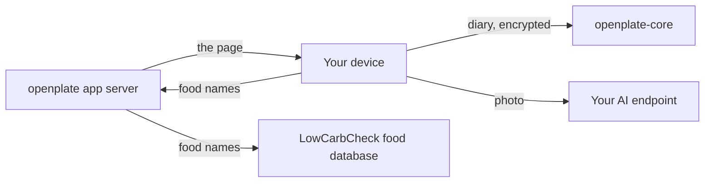

# Architecture

Three programs, one product and two optional attachments, plus one outside service that answers
food names. This page explains what each one holds, and which one stands in the path of your
data.

The drawing below is the whole system in five arrows. Your device holds the diary and the
plate photo. The diary leaves encrypted, for openplate-core. The photo leaves for whichever AI
endpoint you configured. The app server sends the page, and it passes the names of the foods
you look up on to a food database. It stands on neither the diary path nor the photo path.

Three things fit behind "your AI endpoint": a cloud provider you hold a key with, an
openplate-inference box on your own hardware, or, on a managed instance, the sync server
itself, which forwards the photo and counts it against your allowance.
[topologies.md](topologies.md) draws all four ways to run openplate, one small picture each.

## The client is the product

Everything a user owns (food logs, weights, personal foods, goals, the AI settings) is
written to the browser's IndexedDB on the device it was entered on (`app/lib/local-store/`).
It is stored in the clear there, because it is *your* device, and it never leaves it except
in two forms you choose: a JSON export you download, or an encrypted sync blob.

The app server is a single stateless container. No database, no ORM, no migrations, and no
secret it needs in order to boot. It can hold exactly one optional secret, the operator's key
for the food database, described [below](#the-food-database-is-a-lookup-by-name-through-the-app-server).
Destroying the container loses nothing. That is not thrift, it is the whole promise: see
[ADR-0006](../.adr/0006-the-app-server-holds-no-accounts.md).

## Sync is identity, beside the photo path and never inside it

openplate-core moves a diary between devices. It is the only service in openplate that holds
accounts at all. It is a separate deployable with its own image, database and secret, and the
browser talks to it directly. The app server proxies nothing on its behalf and serves no sync
route.

**The diary is encrypted before it leaves the device.** The client serializes the local store,
gzips it, encrypts it with AES-256-GCM under a random data key, and uploads the result as one
opaque blob. The data key is wrapped under a key derived from your passphrase: the passphrase
is stretched with Argon2id and split by HKDF into independent branches. Two of them stay on
the device and unwrap what is yours, and a third is sent as the login credential. They are
siblings, not parent and child, so holding the credential reveals nothing about the key.

**The operator holds a recovery key.** At signup the app generates a recovery code and wraps
the data key under it. It sends the code to openplate-core, which seals it under its own
secret. That is what lets a mailed password reset return your diary instead of an empty
account. It also means the operator of an instance can restore, and in principle read, a diary
on it. On an instance you host yourself, you are that operator.
[sync.md](sync.md#encryption-and-what-the-operator-holds) states the trade in full.

What the server sees beside the ciphertext is stated plainly in
[PROTOCOL.md §9](https://github.com/LowCarbCheck/openplate-core/blob/main/PROTOCOL.md):
an email address, blob size, write frequency and timing, version numbers, and KDF parameters.

The optional study console keeps its own, separate accounts on the same server.
[Sync](sync.md#the-research-console-study) says when it is on, and
[ADR-0008](../.adr/0008-the-study-console-lives-in-openplate.md) says why it lives in the app.

## Inference is compute, and the photo goes to it directly

A plate photo is read in the browser and posted straight to whichever OpenAI-compatible
endpoint you configured. **The openplate server is never in that request.** It is not
uploaded here, not written to disk, not logged. Only the resulting numbers are saved, into
the device's local store; the photo stays on the device that took it, excluded from JSON
exports and from sync payloads alike.

That endpoint is either a cloud provider you pay (the BYOK path) or your own
openplate-inference container. In the self-hosted case the model names the foods on the plate
and estimates grams, and then the **macros are looked up, not invented**: carbs, protein, fat and
kcal are resolved by name against the configured food source, by default a bundled extract of USDA
FoodData Central (8,041 generic foods shipped inside the image, no network call, public domain).
The language model never authors a macro number.

Because the browser makes that call, the endpoint must be an address a **browser** can reach.
A compose hostname like `http://inference:8300/v1` will not work even though the two
containers can reach each other that way. Use the host's LAN address, a tailnet name, or a
hostname on your reverse proxy.

## The food database is a lookup by name, through the app server

A cloud or managed model returns its own macro estimate for each food it finds. The app then
checks those foods against a curated database. The browser sends only the names the model found
to the app server's `/api/food-matches`. The server looks up each name at
[LowCarbCheck](https://lowcarbcheck.org) (`FOOD_DB_API_URL`). A match can replace the model's
guess on the confirm screen. The search on the **Add** screen and the reference values on the
**Nutrients** screen come through the same server-side lookup.

This is the one path the app server stands on, and it is narrow by construction:

- It carries food names, nutrient names and the language of the screen. Never a photo, never
  your AI key, never a diary entry.
- LowCarbCheck sees the app server's address and the instance's key, never your address. Every
  person on an instance shares that key and its allowance.
- The server caches answers, and only a lookup that misses the cache counts against a
  per-address rate limit.
- It fails open. If the database is unreachable, refuses the key, or runs out of allowance, the
  scan still completes with the model's own numbers, and the screen says so.
- `FOOD_DB_API_URL=""` turns it off, and then no food name leaves your server.
- With `FOOD_DB_BACKFILL=true` it also carries proposals: the names of a food a person saved
  from an AI answer, in every app language, and for a food with no match its macros per 100 g.
  Never a name the person typed, never a photo or a diary entry. See
  [configuration.md](configuration.md#proposals-to-the-food-database).

It runs on the server rather than in the browser. This keeps the key off the page, and lets the
operator's setting decide whether names leave at all. The key is `FOOD_DB_API_KEY`. Without one
the instance uses LowCarbCheck's anonymous tier;
[configuration.md](configuration.md#the-food-database-key) lists the tiers.

## The sync server is tenancy, and it sits in front of the compute on a managed instance

An instance can set `INSTANCE_MODE=managed` (see
[configuration.md](configuration.md#managed-instances)). That declares one thing: **an
organization runs this instance, invites its people by email, and gives each one a daily AI
allowance.** openplate-core is what carries that, the account it already holds for sync also
holds the allowance, so there is no second connection step and no second credential.

To the browser it is unchanged: a signed-in account with an allowance scans through the AI
proxy openplate-core exposes, the same service the client already talks to for sync. To the
thing behind it, openplate-core is a client: it points at either a cloud provider or your own
openplate-inference container. **Inference is the compute layer, openplate-core is the
tenancy layer on a managed instance, and they compose**: the sync server carries no model and
answers no scan itself.

It is on the photo path, which is the honest cost of it, and the mitigation is a property of
the code rather than a setting: the logger's field type admits primitives only, so a body
cannot reach a log line, and upstream error strings are scrubbed before they are logged or
returned. Members of an organization share spend, not data; a plate photo that reaches the
proxy is read once and not stored.

The allowance counts requests, not currency. An operator can also cap the whole instance per
day (`AI_INSTANCE_DAILY_LIMIT`), and a spend cap on the upstream key at the provider is still
required.

An administrator runs the instance from `/admin` in the app: people and their allowances,
invitations, activity, reported estimates, and which reference values the **Nutrients**
screen quotes.

### History

From August to September 2026, this was a separate service, openplate-gateway: a small
OpenAI-compatible proxy holding one upstream key and issuing each member an `opk_…` token
with its own daily quota. M192 (September 2026) merged it into openplate-core: one account
now carries both the diary and the allowance, so there is no second service, no second
invite link, and no second credential to hand out.

## What else openplate-core can carry

Each feature below is off by default, and each one changes what the server holds.
openplate-core's [README](https://github.com/LowCarbCheck/openplate-core#readme) describes
each one.

- **Sharing a diary with a clinician** (`SYNC_SHARING=true`). The owner wraps the data key a
  third time, under the clinician's public key, and the server stores that wrapped key. The
  clinician's browser unwraps it and reads the diary at `/shared`. The share gives the server
  nothing new to open.
- **Research contributions** (`SYNC_RESEARCH=true`). A person enrols in a study from a link and
  sends daily totals under a pseudonym. The totals are sealed for the study, but the server
  learns which account contributes to which study.
- **Reported estimates** (`SYNC_FEEDBACK=true`). "Report a wrong estimate" sends the photo, the
  numbers and a consent record to the server, where an administrator reviews them at `/admin`.
  Unlike a scan, that photo is stored.
- **The pulse** needs no operator setting: each person turns it on under **Settings, Sharing**.
  It sends rounded counts. A meal counts once with its calories rounded to 50 and its protein
  to 5 g. A scan counts once, and a running fast sends a heartbeat. The home screen shows the
  instance total for today. The server keeps day totals and a record of who contributed on each
  day, for 30 days.
- **Push notifications** (`VAPID_PUBLIC_KEY`, `VAPID_PRIVATE_KEY`, `VAPID_SUBJECT`). The server
  stores one subscription per device: the browser's push address and its keys, a time zone, a
  language and the reminder settings. It sends each device at most two notifications a day, and
  each one carries only its kind, never text about you. Your browser's push service delivers
  it.
- **Paid plans** (`PLANS_UPSTREAM_URL`, `PLANS_UPSTREAM_SECRET`). openplate-core forwards
  `/v1/plans/*` to one plans service the operator runs, with the account id and email address.
  The app shows **Settings, Plan** only when the server says plans are on.

## BYOK is the zero-server path

With no inference container at all, the browser calls a cloud provider directly with a key
you entered on that device. The key is stored in the device's local store, excluded from the
JSON export, and never sent to the openplate server: there is no server-side copy, encrypted
or otherwise, and no server-side proxy of the call.

The production Content-Security-Policy is part of that promise rather than decoration: the
`connect-src` allowlist is derived from the provider registry, and it is what stops an
injected script exfiltrating a key that lives in the page. See
[configuration.md](configuration.md#the-content-security-policy).

## Who holds what

| Component | What it stores | What it sees in transit |
| --- | --- | --- |
| **Your browser** | The whole diary, in the clear, in IndexedDB. Your AI key. Cached plate photos. | Everything. It is your device. |
| **openplate app server** | No database, no accounts, no diary. At most one secret: the operator's key for the food database. | Page requests, and the names of the foods you look up or scan, which it forwards to the food database. Never a photo, never your AI key, never a diary entry, never a sync blob. |
| **openplate-core** (optional) | An email address, an authentication verifier, KDF parameters, the diary as ciphertext, and the escrowed recovery code that can unwrap it. On a managed instance, also each account's daily allowance and usage count. With the features above turned on, also what each of them lists. | Blob size, write timing, session metadata. On a managed instance, also the photo forwarded to the AI proxy, for as long as it takes to forward it, read once, not stored. |
| **openplate-inference** (optional) | Nothing per user: no accounts, no sessions, no cookies. Model weights and a food dataset. | The photo you sent it, for as long as the request takes. With the default food source it makes no outbound call except the one-time weight download. With `FOOD_SOURCE=lcc` or `off` it sends food names out, never the photo. |
| **LowCarbCheck food database** (on unless turned off) | A usage count per key, or per network address for a caller without one. | Food names and a language, from the app server, with the instance's key. Never a photo, and never who you are. |
| **Cloud AI provider** (BYOK path) | Whatever their policy says. | The photo, and your key. Their terms apply, not ours. |
