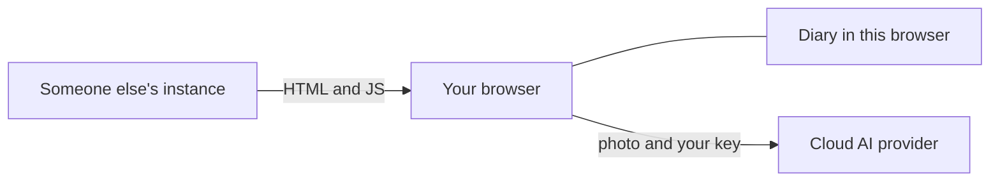
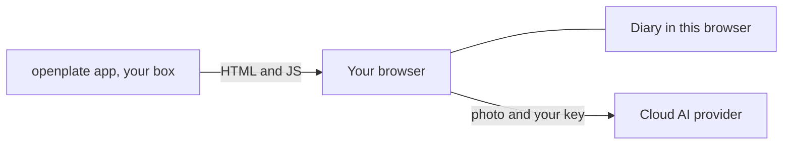
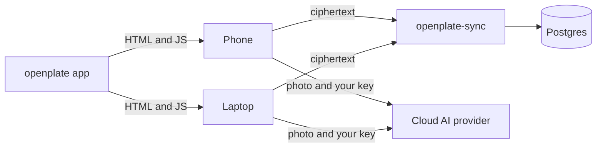
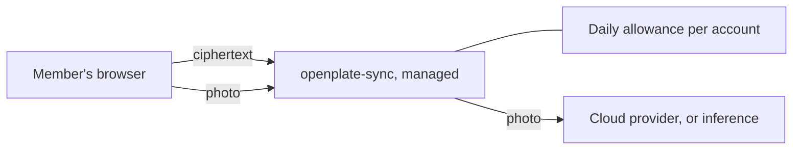
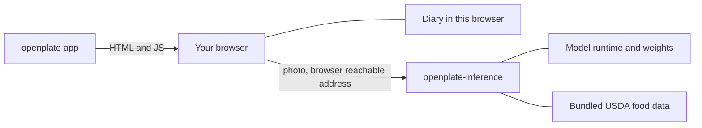
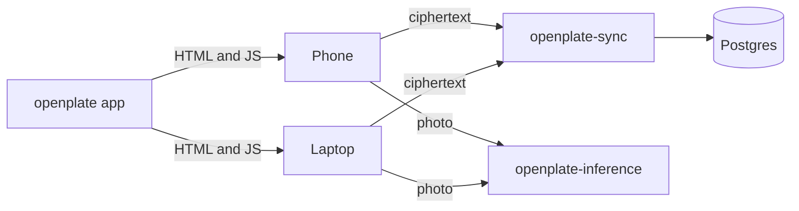

# What should I run?

Four rungs. Each one adds a capability and adds something you now have to operate. Start at
the bottom and stop as soon as you have what you need: most people stop at rung 0 or 1.

| Rung | You get | You operate | Compose file |
| --- | --- | --- | --- |
| 0 | Plate tracking + AI scans | Nothing | none |
| 1 | The same, on your own box | One stateless container | `docker/compose.yml` |
| 2 | Your diary on two devices, and, on a managed instance, a shared AI bill for a household or org | + a database and one secret | `docker/topologies/compose.sync.yml` |
| 3 | Scans on your own hardware | + a model runtime | `docker/topologies/compose.inference.yml` |
| 4 | All of it | All of it | `docker/topologies/compose.full.yml` |

Every compose file is annotated line by line;
[`docker/topologies/README.md`](../docker/topologies/README.md) is the same map from the
compose side.

---

## Rung 0: run nothing

Open an existing instance, such as <https://openplate.lowcarbcheck.org>, and paste your own
provider key into **Settings → AI**. There is no sign-up. Your diary lives in that browser's
storage and never reaches the instance's server, so "using someone else's instance" gives
that operator far less than the phrase suggests: see [architecture.md](architecture.md).

Nothing on this rung is yours to run. The browser holds the diary, the browser calls the
provider with the key you pasted into it, and the operator's server only sends the page.



**You gain:** the whole product, in one minute, for the cost of your own AI usage.
**You operate:** nothing.

The honest catch: a public demo instance carries no uptime promise and nothing there is
backed up for you. Your diary is in that browser, and clearing the browser clears it. Take
the JSON export from **Profile → Your data** regularly, or move to rung 1.

## Rung 1: the app on your own box

```bash
curl -O https://raw.githubusercontent.com/LowCarbCheck/openplate/main/docker/compose.yml
docker compose -f compose.yml up -d
```

Rung 1 changes one box. The page comes from a container you run, and the photo path is
exactly the one above.



**You gain:** the app on hardware you control, upgradeable on your schedule, with no
dependence on anyone else's instance.
**You operate:** one container. No database, no `.env` step, no secret to generate, nothing
to migrate on upgrade. If it dies, nothing is lost, because it stores nothing.
**Compose file:** [`docker/compose.yml`](../docker/compose.yml).

This is the recommended stopping point. Everything below adds real operational work.

Full walkthrough, including HTTPS (which you need for PWA install and for camera capture),
is in [self-hosting.md](self-hosting.md).

## Rung 2: add sync

**You gain:** one diary across your devices. The honest way to sell this is **one person, two
devices**: a phone and a laptop that stay in agreement. Families are the *second* use, and a
weaker one: sync is per account, so two people sharing one account share one diary rather
than getting one each. Two people who want separate diaries want two accounts, or simply two
rung-1 devices and no sync at all.

Rung 2 adds a second server and a database behind it. Each device pushes the same encrypted
blob and pulls the other device's, and the photo still leaves each device for the provider.



**You operate:** the app, an account service, and a Postgres. That is a real step up: an
account service has a database worth backing up, a `SERVER_SECRET` worth keeping, and users
who can lock themselves out. Read
[openplate-sync's README](https://github.com/LowCarbCheck/openplate-sync#readme) before you
put it on the public internet.
**Compose file:** [`docker/topologies/compose.sync.yml`](../docker/topologies/compose.sync.yml).

```bash
curl -O https://raw.githubusercontent.com/LowCarbCheck/openplate/main/docker/topologies/compose.sync.yml
echo "SERVER_SECRET=$(openssl rand -hex 32)" >> .env
echo "PUBLIC_APP_URL=https://openplate.example.com"  >> .env
echo "PUBLIC_SYNC_URL=https://sync.example.com"      >> .env
docker compose -f compose.sync.yml up -d
```

The service cannot read a single entry, which also means it cannot recover one on its own: a
forgotten password is reset by a mailed link, and the server holds an escrowed recovery code
that unwraps the data key after the reset. [sync.md](sync.md) states that trade-off in full,
and so does the app before you finish setting sync up.

**The same server also carries a shared AI bill, if you turn it on.** Set
`INSTANCE_MODE=managed` and the instance becomes one an administrator runs for a household or
an organization: they invite people by email from `/admin` (or the sync-api CLI), give each
account a daily allowance, and every signed-in scan runs through the sync server's own AI
proxy: no separate service, no separate invite link. See
[configuration.md#managed-instances](configuration.md#managed-instances) and
[family-setup.md](family-setup.md) for when this is worth turning on instead of provider
sub-keys.

On a managed instance that same server also carries the scan. A signed-in member posts the
photo to the AI proxy, the server counts it against that account's daily allowance, and it
forwards the request to whatever the operator pointed it at.



## Rung 3: add self-hosted inference

Rung 3 moves the scan onto your hardware. The photo goes from the browser to the inference
container, which is why that container needs an address your browsers can resolve. The model
names the foods and estimates grams; the macros are read out of the bundled dataset.



**You gain:** plate scans with no cloud AI account, no per-scan cost, and no photo leaving
your network. Macros come from a bundled USDA FoodData Central extract, so they are looked up
rather than invented.
**You operate:** a model runtime and a few gigabytes of weights, plus whatever it takes to
make the endpoint reachable **from your browsers** (the photo goes device → endpoint, so a
compose hostname does not work here).
**Compose file:** [`docker/topologies/compose.inference.yml`](../docker/topologies/compose.inference.yml).

This rung is for two kinds of people:

- **You own the hardware.** A GPU box, or a reasonably strong CPU one.
- **You already run a model runtime.** If you have llama.cpp, Ollama, or vLLM-on-GPU up
  today, set `MODEL_PROFILE=external` and `MODEL_RUNTIME_URL`: openplate-inference then
  downloads nothing and starts no second model, and just wraps what you have. Check the
  [support matrix](https://github.com/LowCarbCheck/openplate-inference/blob/main/docs/runtimes.md#support-matrix)
  first; vLLM's **CPU** build cannot run this.

**Hardware honesty.** The small `lite` profile is 2.0 GiB of weights and wants **8+ modern
cores with AVX2 and 4 GB of free RAM** on a CPU-only box; the larger `quality` profile is
5.8 GiB of weights and a 5.8 GiB VRAM floor. CPU scans take seconds to minutes, and
throughput does not improve with concurrency: plan capacity as if the box were serial. The
measured numbers, per profile, are in
[openplate-inference's docs/hardware.md](https://github.com/LowCarbCheck/openplate-inference/blob/main/docs/hardware.md).
Read it before you buy anything.

Once it is running, you can either hand each person a key (**Settings → AI →
OpenAI-compatible**) or set `DEFAULT_INFERENCE_BASE_URL` and friends so every visitor gets a
one-tap connect, with the caveat that `DEFAULT_INFERENCE_API_KEY` is embedded in the page
and readable by anyone who can open the app. See
[configuration.md](configuration.md#instance-provided-ai).

### The sync server and inference are different layers

They are easy to confuse and they compose.

- **openplate-inference is the compute layer.** It answers the question *what is on this
  plate*. It carries a model runtime and weights, and it wants hardware.
- **openplate-sync, on a managed instance, is the tenancy layer.** It answers *who is allowed
  to spend, how much, and how do I take it away*. It carries no model and forwards everything.

Point a managed instance's AI proxy at your inference box (openplate-sync's
`UPSTREAM_BASE_URL`, with `UPSTREAM_API_KEY` left empty) and you get both: scans on your own hardware, with per-account
allowances in front of them. Point it at a cloud provider instead and you get shared spend
with no hardware. Either way, the same sync server also carries the diary: sync and the AI
proxy are one service now, not two ([architecture.md](architecture.md)).

## Rung 4: everything

Rung 4 is the two rungs above, drawn together. Nothing new appears on it.



**You gain:** rung 2 and rung 3 together (your diary on every device, scanned on your own
hardware, with nothing going to any third party).
**You operate:** all of it. App, sync service, Postgres, model runtime, and browser-reachable
addresses for two of them.
**Compose file:** [`docker/topologies/compose.full.yml`](../docker/topologies/compose.full.yml).

There is nothing new to learn at this rung. It is the union of the two above, with the same
`SERVER_SECRET`, the same backup obligation, and the same hardware floor.

---

## Sharing a bill instead of a server

If your reason for climbing this ladder was "my household needs more than one AI key", the
first answer is not a rung at all. It is solved at the provider, with per-person keys and
per-person spend limits, and it needs no extra software.
[family-setup.md](family-setup.md) has the steps, and, when your provider will not issue
capped sub-keys, a managed sync server as the fallback (rung 2, with `INSTANCE_MODE=managed`).
